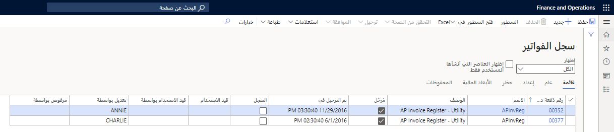
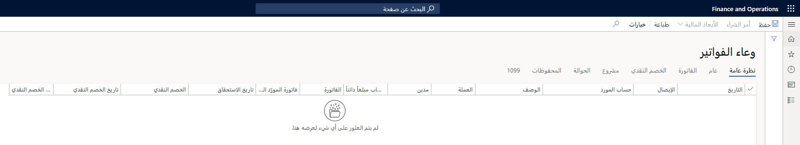
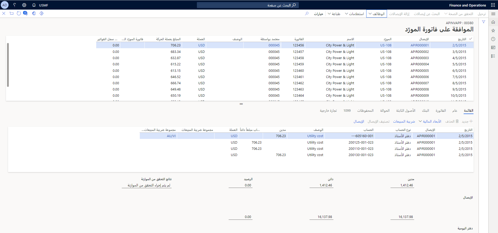
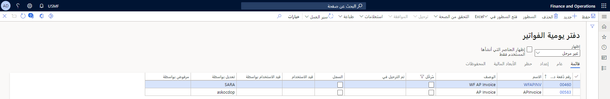
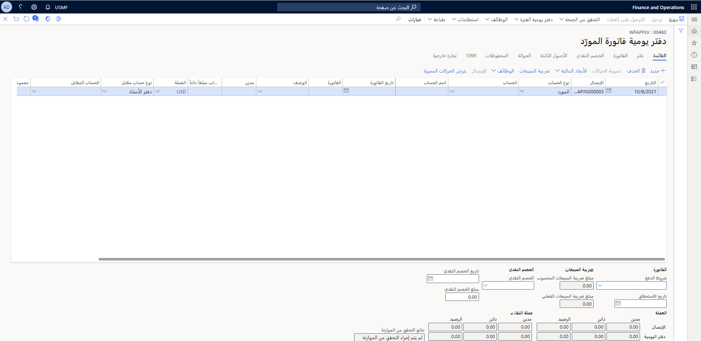
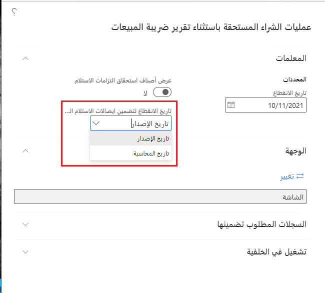

يختلف إجراء معالجة الفواتير الواردة من شركة إلى أخرى، اعتماداً على حجم الشركة وهيكلها وتنظيمها. عادةً ما تكون الفواتير بإحدى الحالات التالية.

- مسجلة
- تمت الموافقة عليها
- مدفوعة

يدعم Dynamics 365 Finance عدة أساليب لإدارة الفواتير الواردة لتلبية إجراءات الشركة المختلفة. يحتوي النظام على دفتر يومية فواتير مختلف وفقاً لاحتياجات الشركة.
تتوفر الأنواع التالية من الفواتير.

- تسجيل الفاتورة والموافقة عليها 
- دفتر يومية الفواتير
- فواتير المورّد

دعنا نراجع كل نوع من أنواع الفواتير. 

## سجل الفواتير 

الغرض من دفتر يومية سجل الفواتير هو التسجيل المسبق للفواتير عند وصولها إلى الشركة وتحويلها إلى مجموعة فواتير للموافقة عليها. في دفتر يومية سجل الفواتير، يقوم الموظف بتسجيل المعلومات التالية.

- حساب المورد
- رقم الفاتورة
- المبلغ
- الشخص الذي وافق على الفاتورة 

يقوم نفس الموظف بالتحقق من صحة دفتر اليومية وإرساله إلى الحسابات المحددة في ملف تعريف الترحيل. عادةً ما تكون الحسابات معلقة حيث تتطلب المبالغ الموافقة اليدوية وإعادة التصنيف من قِبل الشخص المحدد في بند دفتر اليومية.

لأسباب أمنية، يمكن لمستخدم واحد فقط في كل مرة إدخال بنود في دفتر يومية. 

بعد إدخال جميع بنود دفتر يومية الفاتورة، انقر على زر **ترحيل** لترحيل دفترة يومية الفاتورة. للوصول إلى صفحة **سجل الفواتير** انتقل إلى **الحسابات الدائنة > الفواتير > سجل الفواتير**.

تتوفر خيارات الترحيل التالية عند التعامل مع سجلات الفواتير في التطبيق.

- **الترحيل والنقل** – قم بترحيل البنود التي لا تحتوي على أخطاء، وانقل البنود التي بها أخطاء إلى دفتر يومية جديد.
- **ترحيل** - قم بترحيل البنود المحددة. في حالة وجود خطأ، لا يتم ترحيل أي بنود ويتم عرض رسالة خطأ.

عند ترحيل بنود دفتر اليومية، فإنك تقوم بنقلها إلى وعاء فواتير. في دفتر يومية الموافقة على الفواتير، يمكنك نقلها من وعاء الفواتير إلى دفتر يومية الموافقة على الفواتير.

## وعاء الفواتير ودفتر يومية الموافقة 

بعد ترحيل بنود سجل الفواتير، يتم عرض الترحيلات في وعاء الفواتير.

لعرض الترحيلات في وعاء الفواتير، انتقل إلى **الحسابات الدائنة > الفواتير > وعاء الفواتير**.

يعرض وعاء الفواتير المعلومات المرتبطة بالفواتير في انتظار الموافقة.

### السيناريو

في أبريل، يقوم موظف الحسابات الدائنة بتسجيل فاتورة وارده في سجل الفواتير وترحيل التسجيل. يرسل أبريل الفاتورة الفعلية إلى فيليس، مدير الحسابات، للموافقة عليها. يوافق فيليس على الفاتورة بتوقيع أو ختم ويعيد الفاتورة إلى أبريل. يقوم أبريل بتسجيل الموافقة وترحيلها في دفتر يومية الموافقة على الفواتير. الفاتورة جاهزه الآن ليتم دفعها.

يحتفظ وعاء الفواتير بالفواتير الناشئة من أمر الشراء والتي تنشأ بدورها من سجل الفواتير. انتقل إلى **الحسابات الدائنة > الفواتير > وعاء الفواتير** ثم حدد زر **أمر الشراء** لتحديد أوامر الشراء والموافقة عليها.
 

يمكنك استخدام **الحسابات الدائنة > الفواتير > الموافقة على الفواتير** لمشاهدة جميع الفواتير المسجلة المعينة لك، ثم حدد فاتورة واحدة أو فواتير متعددة أو كل الفواتير لإضافتها إلى دفتر يومية الموافقة على الفواتير. 

يجب عليك بعد ذلك التحقق من حسابات المصروفات لكل إيصال ثم ترحيل دفتر اليومية.

من خلال القيام بذلك، يعكس Finance الحركات في تجمع الفواتير، ثم يقوم بتحديث حساب ملخص البائع، الذي تم تعيينه في ملف تعريف الترحيل لحساب المورّد الذي تم تعيينه لإيصال مسجل.

## دفتر يومية الفواتير 

يمكنك إدخال الفواتير مباشرة في دفتر يومية الفاتورة. بشكل افتراضي، يوافق المستخدم الذي قام بتسجيل الدخول والذي يقوم بإدخال بنود دفتر اليومية على الفواتير. 

تم تصميم دفتر يومية الفواتير للمستخدمين لإدخال الفواتير التي يتلقونها من الموردين غير المرتبطين بأوامر الشراء. ستكون هذه عادةً للسلع باهظة الثمن وغير المخزنة. بمجرد أن يقوم المستخدم بإدخال الفواتير الواردة، يمكن للمستخدم الترحيل. يمكنك عرض واستخدام دفتر يومية الفاتورة بالانتقال إلى **الحسابات الدائنة > الفواتير > دفتر يومية الفواتير**

### السيناريو

يقوم أبريل، موظف الحسابات الدائنة في Contoso، بفدخال الفاتورة مباشرةً في دفتر يومية جديد للفواتير، ثم يوافق على دفتر اليومية ويقوم بترحيله. الفاتورة جاهزه الآن ليتم دفعها.

يمكنك معرفة المزيد حول كيفية استخدام دفتر يومية الفواتير في هذا الفيديو.
&nbsp;
> [!VIDEO https://www.microsoft.com/videoplayer/embed/RE3ZYKR]

## عمليات الشراء المستحقة باستثناء تقرير ضريبة المبيعات
يعرض تقرير **المشتريات المستحقة** تفاصيل حول إيصالات استلام المنتج التي تم إدخالها وترحيلها، ولكن لم يتم تحرير فواتير بها، اعتباراً من تاريخ الانقطاع الذي تحدده. يحتوي التقرير على البيانات التي يمكنك استخدامها لتسوية واحد أو أكثر من حسابات الشراء المستحقة. 

يتم عرض تفاصيل الفاتورة في التقرير عندما يكون أحد الشروط التالية صحيحاً:

- يكون تاريخ حركة الاستلام قبل أو يساوي تاريخ الانقطاع، ويكون تاريخ حركة الفاتورة بعد تاريخ الانقطاع.
- يكون تاريخ حركة الفاتورة قبل أو يساوي تاريخ الانقطاع، ويكون تاريخ حركة الإيصال بعد تاريخ الانقطاع.

يُمكّنك حقل **تاريخ الانقطاع لتضمين الإيصالات المصححة** لإنشاء التقرير بناءً على تاريخ المحاسبة أو تاريخ الإصدار. تتيح هذه المرونة لموظفي الحسابات الدائنة تسوية وحساب معلومات المشتريات المستحقة بشكل أفضل.

