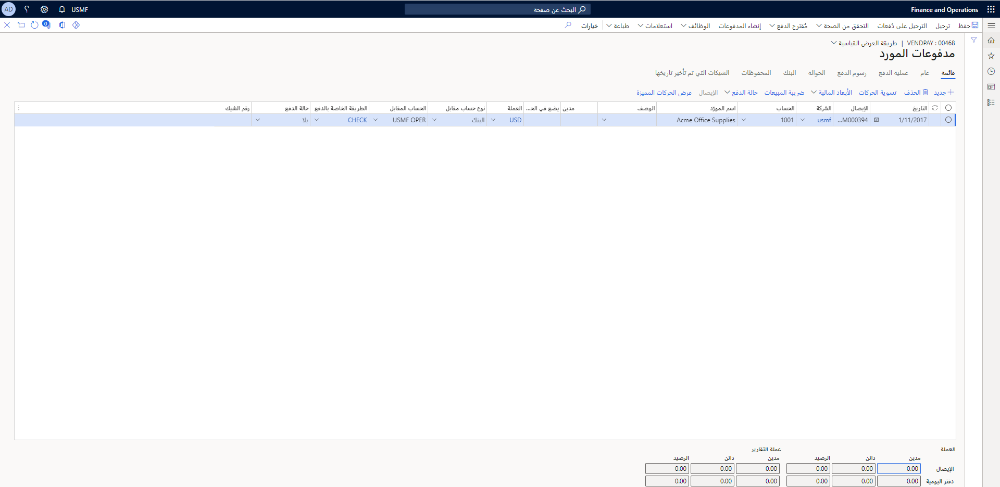

بعد تسجيل الفاتورة والموافقة عليها وترحيلها، حان وقت دفع الفاتورة. ستستخدم دفاتر يومية الدفع ومقترحات الدفع لهذه المهمة.

## دفاتر يومية المدفوعات 

باستخدام دفاتر يومية الدفع، يمكنك القيام بالمهام التالية.

- إنشاء المدفوعات من خلال دفتر اليومية الدفع.
- استخدم دفتر يوميات الدفع لإدخال المدفوعات وترحيلها. سداد المدفوعات وإدخالها وفقاً لشروط الدفع المعمول بها مع الموردين. 

في دفتر يوميات الدفع، لديك عدة طرق لإنشاء بنود الدفع.

- انقر على **مقترح دفع**.
- انقر على **الوظائف** وحدد **تسوية**.
- قم بإنشاء بند دفتر يومية وأدخل تفاصيل الدفع يدوياً.

يمكنك اختيار إحدى طريقتين لتحديد الفواتير للدفع من خلال دفتر يومية الدفع.

- يقوم خيار **مقترح الدفع** بالبحث عن بنود الفاتورة التي تستوفي معايير البحث المحددة.
- استخدم خيار **التسوية** لتحديد بنود الفاتورة المحددة للدفع.

بعد إنشاء جميع بنود الدفع، استخدم أمر **إنشاء المدفوعات** في قائمة **الوظائف** لإنشاء الدفع. هذه هي طريقة الدفع المختارة وضوابط الإعداد إذا كان يجب على النظام، على سبيل المثال، طباعة الشيكات أو إنشاء ملف دفع.

لعرض دفاتر يومية مدفوعات المورد وإدارتها، انتقل إلى **حسابات المدفوعات > المدفوعات > دفتر يومية دفع المورد**.

## سير عمل دفتر يومية الدفع
إذا كان سير العمل نشطاً لترحيل دفتر يومية الدفع، فيمكنك التحقق من صحة الحساب البنكي للمورد قبل الإرسال إلى سير العمل.  وتساعد خطوة التحقق من الصحة على توفير الوقت لأنه يقوم بالتحقق من عدم وجود أي مشكلة في الحساب البنكي قيد الاستخدام في دفتر يومية الدفع وسيتم إيقاف عملية سير العمل في حالة مواجهة أي خطأ.  في حالة مواجهة خطأ أثناء خطوة التحقق من الصحة، يجب أن يقوم المستخدم بتصحيح المشكلة وإعادة إرسال الدفع إلى سير العمل للاعتماد.

## اقتراح الدفع 

تقوم بترحيل المدفوعات التي تم إجراؤها إلى الموردين للتأكد من تطابق دفتر الأستاذ الفرعي لحسابات المدفوعات مع دفتر الأستاذ العام. تبحث ميزة مقترح الدفع عن بنود الدفع المستحقة أو التي لها تاريخ أقصى لتلقي خصم نقدي. كما تتحقق من حركات الموردين المفتوحة والموافقة عليها.

يشمل Finance فقط الحركات إما بتاريخ استحقاق أو تاريخ خصم نقدي في البحث. بمجرد إنشاء بنود الدفع، يمكنك تحريرها في دفتر يوميات الدفع.

حدد نوع مقترح الدفع المطلوب إنشاؤه في حقل **نوع المقترح**. حدد من الخيارات التالية:

- **تاريخ الاستحقاق** - تحويل مجموعة مدفوعات الموردين للفواتير المستحقة.
- **تاريخ الخصم النقدي** - تحويل مجموعة مدفوعات الموردين التي تفي بمعايير الحصول على خصم نقدي.
- **تاريخ الاستحقاق وتاريخ الخصم النقدي** - تحويل مجموعة مدفوعات الموردين التي تفي بمعايير الحصول على خصم نقدي، وبعد ذلك، تحويل حركات الموردين المقترحة بعد تاريخ الاستحقاق.

    
