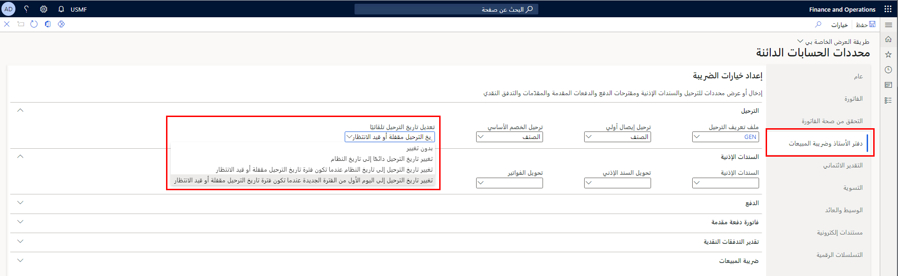

توفر هذه الوحدة معلومات عامة حول فواتير المورّد. فواتير المورّد هي طلبات للدفع مقابل المنتجات والخدمات التي تتلقاها مؤسستك. يمكن أن تمثل فواتير المورّد فاتورة في مقابل خدمات مستمرة، أو يمكنها أن تستند إلى أوامر شراء لأصناف وخدمات معينة.

## فواتير المورّد 

يتم إنتاج فاتورة المورّد من أمر شراء عند تلقي المنتجات أو الخدمات وفقاً لأمر شراء تم وضعه مع أحد المورّدين. وتحتوي فاتورة المورّد على رأس، وبند واحد أو أكثر للأصناف أو الخدمات. وتُكمل فاتورة المورد الدورة من أمر الشراء حتى إيصال استلام المنتجات حتى فاتورة المورّد.

على الرغم من أن بعض فواتير المورّد تتصل بأمر شراء، إلا أن فواتير المورّد يمكنها أن تتضمن أيضاً البنود التي لا تتوافق مع بنود أمر الشراء. كما يمكنك إنشاء فواتير المورد غير المرتبطة بأي أمر شراء. قد تمثل فواتير المورّد هذه الخدمات الجارية، كفاتورة مرافق، ولا يتعين عليك الرجوع إلى أمر شراء عند إضافتها.

فيما يلي عدة طرق لإدخال فاتورة مورّد:

- يتيح لك سجل فواتير المورّد إمكانية إدخال الفواتير التي لا تشير إلى أمر شراء بسرعة، بحيث يمكنك استحقاق المصروفات. وباستخدام دفتر يومية اعتماد فواتير المورّد، يمكنك تحديد هذه الفواتير وترحيلها إلى رصيد المورّد لإلغاء الاستحقاق.
- يتيح لك دفتر يومية فاتورة المورّد إدخال الفواتير التي لا تشير إلى أمر شراء بسرعة، في خطوة واحدة.
- مع وعاء فواتير المورّد، يتيح لك سجل فواتير المورّد إدخال الفواتير لاستحقاق المصروفات بشكل سريع. ويمكنك فتح أوامر الشراء المرتبطة لاحقاً لترحيل الفاتورة في مقابل حساب المصروفات.
- تتيح لك الصفحتين **فواتير المورّد المفتوحة** و **فواتير المورّد المعلقة** إنشاء فواتير المورّد من أوامر الشراء المؤكدة.

شاهد هذا الفيديو للتعرّف على كيفية استخدام فواتير المورّد.

 > [!VIDEO https://www.microsoft.com/videoplayer/embed/RE3ZOxn]

## العمل مع العديد من الفواتير 

يمكنك العمل على فواتير متعددة في الوقت نفسه وترحيلها جميعاً في الوقت نفسه. 

إذا احتجت إلى إنشاء فواتير متعددة، فاستخدم أيضاً صفحة **فواتير المورّد المعلقة**. على الرغم من أن صفحة **فواتير المورّد المعلقة** تعرض جميع فواتير المورّد التي لا يمكن ترحيلها بسبب بعض المشكلات، إلا أنه يمكن استخدامها في حالات الاستيراد المجمع إذا كان لديك تكامل مع أنظمة أخرى.

تتوفر طريقة أخرى لترحيل فواتير متعددة تم تسجيلها بالفعل في Finance وهي استخدام دفتر يومية الفاتورة. للقيام بذلك، استخدم صفحة **دفتر يومية اعتماد الفواتير**. في صفحة **دفتر يومية اعتماد الفواتير**، انقر على **البحث عن إيصالات**، وحدد حساب المصروفات، ثم قم بالترحيل.

## ضبط تاريخ الترحيل لفواتير المورد
قد تكون هناك أوقات لا تزال فيها فاتورة المورد معلقة بعد تاريخ إغلاق فترة معينة. عندما تكون الفواتير جاهزة للنشر، لا يمكن استخدام تاريخ الترحيل الأصلي منذ إغلاق الفترة. في هذا السيناريو، يجب عليك تغيير كافة تواريخ الترحيل في الفواتير غير المعتمدة إلى فترة الفتح الأحدث. لتجنب هذا العمل الإضافي، يمكنك تمكين تغيير تاريخ ترحيل الفاتورة تلقائياً وفقاً لاحتياجات عملك.

لتمكين هذه الوظيفة، ستنتقل إلى صفحة **معلمات الحسابات الدائنة**، وحدد علامة التبويب **دفتر الأستاذ وضريبة المبيعات** هنا يمكنك تحديد الطريقة التي يريد بها نشاطك التجاري تعديل تاريخ النشر في حقل **ضبط تاريخ النشر تلقائياً**. 

## الحركات العمومية 

في صفحة قائمة **حركات المورّد**، سترى ميزة **الحركات العمومية**. تتيح لك هذه الميزة عرض جميع الحركات الخاصة بالمورّد عبر جميع الكيانات القانونية. تعرض صفحة القائمة **حركات المورّد** الحركات للكيانات القانونية التي يمكنك الوصول إليها فقط، بناءً على إعدادات الأمان الخاصة بك.

وستعرض صفحة القائمة جميع الحركات للمورّدين الذين لديهم نفس معرّف الطرف مثل المورّد الذي بدأت معه. على سبيل المثال، إذا كان المورّد US-001 في كيان قانوني واحد لديه نفس معرّف الطرف مثل المورّد DE-001 في كيان قانوني آخر، فسيتم عرض جميع الحركات لكل من معرّفات المورّدين.

تختلف القوائم الموجودة في صفحة قائمة **حركات المورّد** بناءً على الكيان القانوني للحركة. على سبيل المثال، إذا كانت ميزة ما متاحة فقط للكيانات القانونية السويسرية، فإن خيارات القائمة لهذه الميزة لا تظهر إلا عند تحديد حركة سويسرية.

للوصول إلى الحركات العمومية، اتبع الخطوات التالية.

1. انتقل إلى **الحسابات الدائنة > الموردين > جميع الموردين**.
2. حدد مورّد ثم، في جزء الإجراءات، في علامة التبويب **المورّد**، في مجموعة **الحركات**، حدد **الحركات العمومية**.

    

