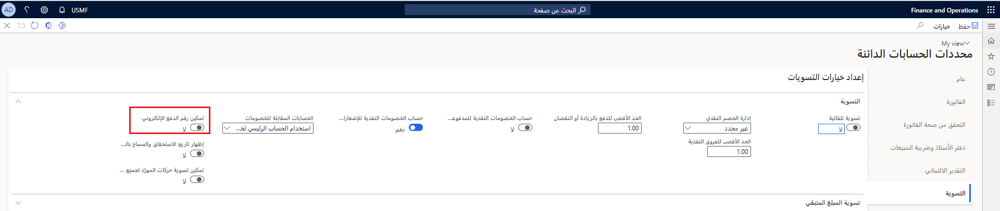

في صفحة قائمة **حركات المورد**، يمكنك تحديث تواريخ الاستحقاق وتواريخ الخصم لحركات المورد المفتوحة. بالنقر فوق تاريخ الاستحقاق في صفحة قائمة **حركات المورد**، يمكنك أيضاً تغيير شروط الدفع وشروط الخصم النقدي في مربع الحوار **تحديث تاريخ الاستحقاق وتواريخ الخصم النقدي**.

## قم بتنشيط الميزة *إظهار تاريخ الاستحقاق والسماح بالتحرير* 

لإضافة تواريخ استحقاق إلى صفحة قائمة **حركات المورد** وتغيير إعدادات الدفع لحركة باستخدام مربع الحوار **تحديث تاريخ الاستحقاق وتواريخ الخصم النقدي**، اتبع الخطوات التالية.

1. حدد **حسابات دائنة> الإعداد > محددات الحسابات الدائنة**.
2. في علامة التبويب **التسويات**، قم بتعيين خيار **إظهار تاريخ الاستحقاق والسماح بالتحرير** إلى **نعم**.

    *تتطلب الميزة **إظهار تاريخ الاستحقاق والسماح بالتحرير** حفظ معلومات دفع إضافية لكل حركة. إذا قمت بترحيل حركة جديدة أو فتح حركة موجودة، فستتم إضافة المعلومات الإضافية إلى الحركة.*
 
    

1. يظهر مربع الحوار **تحديث معلومات الدفع**. لتحديث الحركات الموجودة فوراً، حدد **تحديث جميع الحركات الموجودة**. وبدلاً من ذلك، لملء الحقول فقط للحركات الجديدة، حدد **المتابعة دون تحديث**.

    *يتم الآن إضافة تاريخ الاستحقاق إلى صفحة قائمة **حركات المورد**، لذا يمكنك تعديل تاريخ الاستحقاق وتواريخ الخصم النقدي للحركات بسهولة.*

## تعديل إعدادات الدفع 

تعرض صفحة قائمة **حركات المورد** جميع الحركات لأحد الموردين. عند تحديد تاريخ الاستحقاق لإحدى الحركات، يظهر مربع حوار. يُظهر مربع الحوار هذا التاريخ الأساسي لتاريخ الاستحقاق وحسابات الخصم، وتاريخ الاستحقاق، وشروط الدفع، وشروط الخصم النقدي، وتواريخ الخصم النقدي.

ويكون لكل حقل تأثير مختلف على الحركة عند تحريره.

- **تحرير التاريخ الأساسي** - يتم تغيير تاريخ الاستحقاق وتواريخ الخصم كما لو كان التاريخ الأساسي تاريخَ المستند.
- **تحرير تاريخ الاستحقاق** - يتم تغيير تاريخ الاستحقاق فقط.
- **تحرير تواريخ الخصم** - يتم تغيير تواريخ الخصم فقط.
- **تحرير شروط الدفع** - يتم تغيير تاريخ الاستحقاق، استناداً إلى التاريخ الأساسي وشروط الدفع.
- **تحرير شروط الخصم النقدي** - تتغير الخصومات النقدية، استناداً إلى التاريخ الأساسي وشروط الخصم النقدي.

عند الانتهاء من تحرير إعدادات الدفع، حدد **إغلاق** لحفظ التغييرات التي أجريتها.

