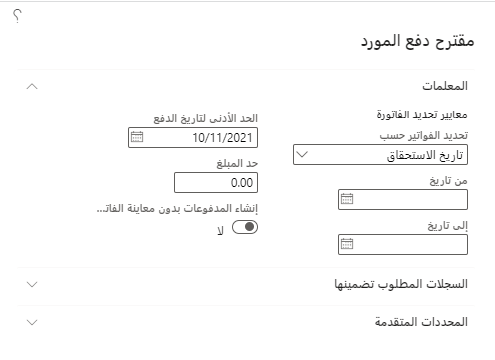
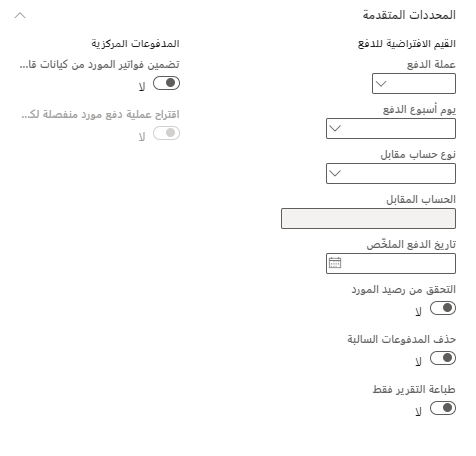

توفر هذه الوحدة نظرة عامة على خيارات اقتراح الدفع وتتضمن أمثلة توضح كيفية عمل عروض الدفع. كما تغطي أيضاً ما يحدث عند الدفع بالزيادة أو النقصان لمورد.

## اقتراحات الدفع 

يتم استخدام اقتراحات الدفع غالباً لإنشاء مدفوعات المورد، حيث يمكن استخدام الاستعلام لتحديد فواتير المورّد بشكل أسرع من أجل الدفع، استناداً إلى معايير مثل تاريخ الاستحقاق والخصم النقدي.

شاهد هذا الفيديو للتعرف على كيفية دفع فواتير المورّد واستخدام اقتراحات الدفع:

 > [!VIDEO https://www.microsoft.com/videoplayer/embed/RE3ZyHF]

يحتوي استعلام اقتراح الدفع على علامات تبويب مختلفة، يحتوي كل منها على خيارات مختلفة لتحديد الفواتير المراد دفعها. 

انتقل إلى **الحسابات الدائنة > المدفوعات > دفتر يومية دفع المورد > البنود > اقتراح الدفع**.

- تحتوي علامة التبويب **المعلمات** على الخيارات التي تستخدمها معظم المؤسسات بشكل متكرر. 
- من علامة التبويب **السجلات المطلوب تضمينها**، يمكنك تحديد الفواتير أو الموردين المراد تضمينهم للدفع عن طريق تحديد نطاقات للخصائص المختلفة. إذا كنت ترغب في دفع نطاق محدد من الموردين فقط، فيمكنك تحديد عامل تصفية لنطاق المورد. غالباً ما تُستخدم هذه الوظيفة لتحديد الفواتير لطريقة دفع معينة. 
    - على سبيل المثال، إذا حددت عامل تصفية حيث **طريقه الدفع" = شيك**، فسيتم تحديد الفواتير التي تحتوي على طريقة الدفع هذه فقط للدفع، بشرط أن تفي أيضاً بالمعايير الأخرى المحددة في الاستعلام. 
- تحتوي علامة التبويب **المعلمات المتقدمة** على خيارات إضافية، قد لا يكون بعضها مناسباً لمؤسستك. 
    - على سبيل المثال، يحتوي على خيارات دفع فواتير المدفوعات المركزية.

## المعلمات 

فيما يلي نظرة عامة على المعلمات في صفحة **اقتراح الدفع الخاصة بالمورد**.

- **تحديد الفواتير حسب** -يمكن تحديد الفواتير داخل نطاق التاريخ المحدد من خلال الحقلين **من تاريخ** و **إلى تاريخ** حسب تاريخ الاستحقاق أو تاريخ الخصم النقدي أو كليهما. 
    - إذا كنت تستخدم تاريخ الخصم النقدي، يبحث Finance أولاً عن الفواتير التي لها تاريخ خصم نقدي بين **من تاريخ** و **إلى تاريخ**. يحدد Finance بعد ذلك ما إذا كانت الفاتورة مؤهلة للخصم النقدي باستخدام تاريخ الجلسة للتأكد من أن تاريخ الخصم النقدي لم يمر بالفعل.
- **من تاريخ** و **إلى تاريخ** – يتم تحديد الفواتير التي لها تاريخ استحقاق أو تاريخ خصم نقدي ضمن نطاق التاريخ هذا للدفع.
- **الحد الأدنى لتاريخ الدفع** – أدخل الحد الأدنى لتاريخ الدفع. 
    - علي سبيل المثال، يحدد حقلا **من تاريخ** و **إلى تاريخ** نطاقاً من 1 سبتمبر إلى 10 سبتمبر، والحد الأدنى لتاريخ الدفع هو 5 سبتمبر. في هذه الحالة، يكون تاريخ الدفع لجميع الفواتير التي لها تاريخ استحقاق من 1 سبتمبر إلى 5 سبتمبر 5 سبتمبر. ومع ذلك، فإن جميع الفواتير التي لها تاريخ استحقاق من 5 سبتمبر إلى 10 سبتمبر لها تاريخ دفع يساوي تاريخ استحقاق كل فاتورة.
- **حد المبلغ** – أدخل الحد الأقصى للمبلغ الإجمالي لكافة المدفوعات.
- **إنشاء مدفوعات بدون معاينة الفاتورة** -إذا تم تعيين هذا الخيار على **نعم**، فسيتم إنشاء المدفوعات فوراً في صفحة **مدفوعات المورد**. سيتم تخطي صفحة **اقتراح الدفع**؛ لذلك، سيتم إنشاء المدفوعات بشكل أسرع.  لا يزال بالإمكان تعديل المدفوعات من صفحة **مدفوعات المورد** أو يمكنك العودة إلى صفحة **اقتراح الدفع** عن طريق استخدام الزر **تحرير الفواتير للدفع المحدد**.

    

## المعلمات المتقدمة 

فيما يلي نظرة عامة على **المعلمات المتقدمة** لصفحة **اقتراح الدفع للمورّد**.

- **التحقق من رصيد المورد** - في حالة تعيين هذا الخيار على **نعم**، سيتحقق النظام من أن المورد ليس لديه رصيد مدين قبل دفع أي فاتورة. إذا كان لدى المورد رصيد مدين، فلن يتم إنشاء دفع. 
    - على سبيل المثال، قد يكون لدى المورد مذكرات دائنة أو مدفوعات تم ترحيلها ولكن لم تتم تسويتها بعد. في هذه الحالات، يجب ألا يتم دفع المورد. وبدلاً من ذلك، يجب تسوية المذكرات الدائنة أو المدفوعات مقابل الفواتير المستحقة.
- **حذف المدفوعات السالبة** – يعمل هذا الخيار بشكل مختلف، اعتماداً على ما إذا كانت المدفوعات يتم سدادها لفواتير فردية أو لمجموع الفواتير التي تفي بمعايير الدفع. يتم تحديد هذا السلوك في طريقة الدفع.
    - **الدفع لكل فاتورة** – إذا تم تعيين الخيار **حذف المدفوعات السالبة** إلى **نعم** وكانت هناك فاتورة ودفع غير مستقران للمورد، يتم تحديد الفاتورة للدفع فقط. لم تتم تسوية الدفع الموجود مقابل الفاتورة. 
    إذا تم تعيين الخيار **حذف المدفوعات السالبة** إلى **لا** ولم تتم تسوية الفاتورة والدفع، فسيتم تحديد كل من الفاتورة والدفع لإجراء الدفع.
    - **الدفع لمجموع الفواتير** – إذا تم تعيين الخيار **حذف المدفوعات السالبة** إلى **نعم** وتوجد فاتورة وعملية دفع لم تتم تسويتهما للمورد، فسيتم تحديد كل من الفاتورة والدفع اللذين لم تتم تسويتهما، وإضافة المبلغين معاً لإنتاج مبلغ الدفع الإجمالي. يحدث الاستثناء الوحيد إذا كان المجموع ينتج عنه مبلغ مسترد. في هذه الحالة، لا يتم تحديد الفاتورة أو الدفع. 
    إذا تم تعيين الخيار **حذف الدفعات السالبة** إلى **لا**، ولم تتم تسوية فاتورة وعملية دفع، فسيتم تحديد كل من الفاتورة وعملية الدفع للدفع وإضافة كلا المبلغين معاً لإنتاج إجمالي مبلغ الدفع.
- **طباعة التقرير فقط** – قم بتعيين هذا الخيار إلى **نعم** لعرض نتائج اقتراح الدفع في تقرير، ولكن بدون إنشاء أي مدفوعات.
- **تضمين فواتير المورّد من الكيانات القانونية الأخرى** – إذا كانت مؤسستك لديها عملية مركزية للدفع، ويجب أن يتضمن عرض الدفع فواتير من كيانات قانونية أخرى مدرجة في معايير البحث، فقم بتعيين هذا الخيار إلى **نعم‏‎**.
- **اقتراح دفعة منفصلة للمورد لكل كيان قانوني** – إذا تم تعيين هذا الخيار إلى **نعم**، فسيتم إنشاء عملية دفع منفصلة لكل كيان قانوني لكل مورد. يكون المورد في الدفع هو المورد من الفاتورة بكل كيان قانوني. إذا تم تعيين هذا الخيار إلى **لا**، وكان لدى نفس المورد فواتير في كيانات قانونية متعددة، فسيتم إنشاء دفعة واحدة للمبلغ الإجمالي للفواتير المحددة. يكون المورد في الدفع هو المورد في الكيان القانوني الحالي. إذا لم يكن حساب المورّد موجوداً في الكيان القانوني الحالي، فسيتم استخدام حساب المورّد للفاتورة الأولى التي يجب دفعها.
- **عملة الدفع** - يحدد هذا الحقل العملة التي تم إنشاء جميع المدفوعات بها. إذا لم يتم تحديد العملة، فسيتم دفع كل فاتورة بعملة الفاتورة.
- **يوم أسبوع الدفع** – أدخل يوم الأسبوع الذي يجب إجراء الدفع فيه. يتم استخدام هذا الحقل فقط إذا تم إعداد طريقة الدفع لإجمالي فواتير الدفع في يوم معين من الأسبوع.
- **نوع الحساب المقابل** و **الحساب المقابل** – قم بتعيين هذين الحقلين لتحديد نوع حساب معين (مثل دفتر الأستاذ أو البنك) والحساب المقابل (مثل حساب بنكي معين) . يحدد أسلوب دفع الفاتورة نوع الحساب المقابل الافتراضي والحساب المقابل، ولكن يمكنك استخدام هذين الحقلين لتجاوز القيم الافتراضية.
- **تاريخ الدفع الملخّص** – يُستخدم هذا فقط عند تعيين حقل **الفترة** في طريقة الدفع إلى **الإجمالي**. إذا تم تحديد تاريخ، فسيتم إنشاء كافة المدفوعات في هذا التاريخ. يتم تجاهل الحقل **الحد الأدنى لتاريخ الدفع**.
- **عوامل التصفية الإضافية** - في علامة التبويب **السجلات المطلوب تضمينها**، يمكنك تحديد نطاقات إضافية للمعايير. على سبيل المثال، إذا كنت ترغب في دفع نطاق محدد من الموردين فقط، فيمكنك تحديد عامل تصفية لنطاق المورد. غالباً ما تُستخدم هذه الوظيفة لتحديد الفواتير لطريقة دفع معينة. على سبيل المثال، إذا حددت عامل تصفية حيث **طريقه الدفع" = شيك**، فسيتم تحديد الفواتير التي تحتوي على طريقة الدفع هذه فقط للدفع، بشرط أن تفي أيضاً بالمعايير الأخرى المحددة في الاستعلام.
 
    

## المدفوعات الجزئية

قد تقوم بإجراء دفع جزئي حيث يكون المبلغ الذي لا يزال بالإمكان تسويته صغيراً. على سبيل المثال، تبلغ فاتورة المورد 1،000.00، وأنت تقوم بدفع 999.90. إذا كان المبلغ المتبقي أقل من المبلغ المحدد للمدفوعات الزائدة أو المدفوعات الناقصة في صفحة **معلمات الحسابات الدائنة**، فسيتم ترحيل الفرق تلقائياً إلى حساب دفتر أستاذ الدفع بالزيادة/النقصان.

