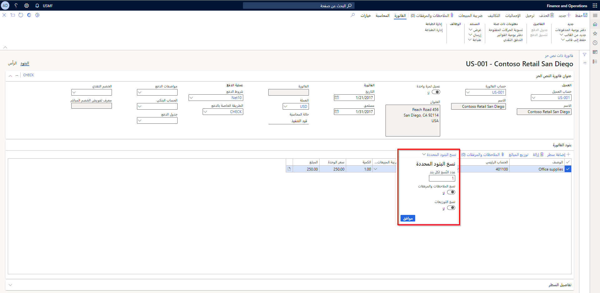
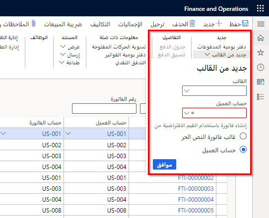
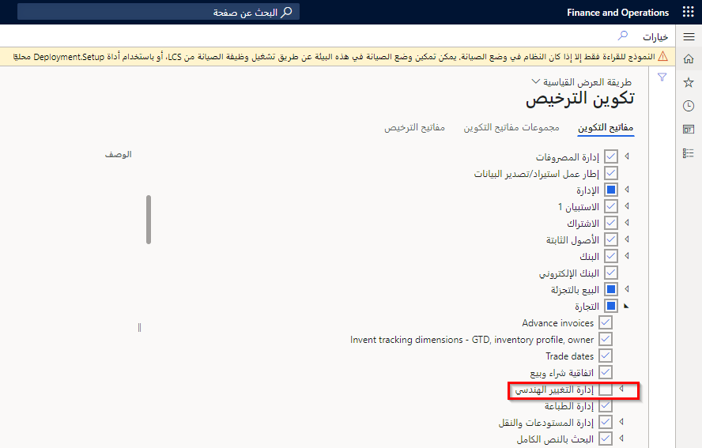
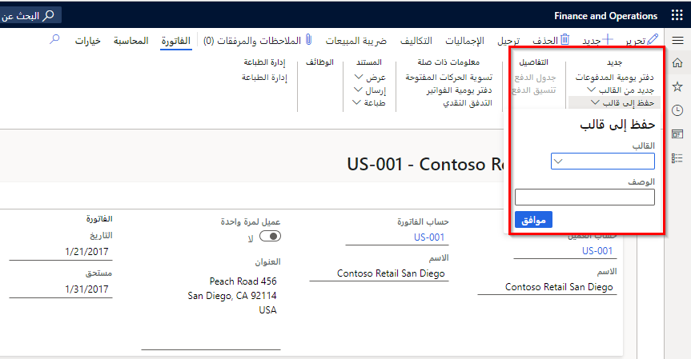

توضح هذه الوحدة عمليات معالجة الأوامر وتسجيل الفواتير ومعالجة المدفوعات لتوضيح عملية الفاتورة إلى النقدية.

يتم توضيح الفرق بين الفاتورة ذات النص الحر والفاتورة القياسية في الأقسام التالية.

### فاتورة أمر المبيعات
تختلف فاتورة أمر المبيعات عن الفواتير ذات النص الحر بالطرق التالية:
-   يحدد المستخدم رقم الصنف، ويقوم النظام بترحيل الحركات المتعلقة بالصنف في دفتر الأستاذ. يمكن للمستخدمين أيضاً إنشاء أوامر مبيعات بأصناف غير مخزون.
-   يقوم أمر المبيعات بإجراء حركات المخزون، ولكن لا تستخدم فاتورة النص الحر مخزون الأصناف مطلقاً لأنها لا تنشئ حركات المخزون. في كثير من الأحيان، تُستخدم الفواتير ذات النص الحر لبيع الأصول الثابتة لأن الفواتير ذات النص الحر تحسب التكاليف أو الدخل عندما تستهلك الأصل وتبيعه. راجع كتيبات التدريب على الأصول الثابتة لمعرفة المزيد حول موضوع الأصول الثابتة.

### فاتورة ذات نص حر 
تختلف الفواتير ذات النص الحر عن فاتورة أمر المبيعات بالطرق التالية:
-   لم يتم تحديد أرقام الأصناف من قِبل المستخدم.
-   يقوم المستخدم بتحديد حساب دفتر الأستاذ للبيع، والذي يتم عرضه في كل بند أمر. يقوم النظام بترحيل رصيد العميل إلى حساب دفتر الأستاذ الملخص لملف تعريف الترحيل الموروث من العميل، ما لم يحدد المستخدم ملف تعريف ترحيل مختلف في فاتورة ذات نص حر.

## فواتير ذات نص حر 

استخدم الفواتير ذات النص الحر لإنشاء فاتورة مبيعات مع بنود أوامر تتضمن، على سبيل المثال لا الحصر، العناصر التالية:

-   حسابات دفتر الأستاذ
-   أوصاف النص الحر
-   إدخال مبلغ المبيعات

لا يمكنك إدخال رقم صنف في هذا النوع من الفاتورة ؛ ومع ذلك، يمكنك إدخال معلومات ضريبة المبيعات المناسبة.

في كثير من الأحيان، يمكن استخدام بند الفاتورة ذات النص الحر لبيع كمية من بعض أنواع السلع أو الخدمات أو الحقوق. لهذا السبب، قد يكون من الضروري تمكين تحديد الكمية على البند. وبالمثل، إذا كان للسلعة أو الخدمة أو الحق سعر وحدة، فمن المهم الحصول على هذه المعلومات في بند الفاتورة ذات النص الحر. يساعد توفير هذه المعلومات للمستخدم وحساب المبلغ الأساسي في تحديد التكاليف وشرحها للعملاء.

يمكنك إدخال الكمية وسعر الوحدة لحساب المبلغ تلقائياً ؛ ومع ذلك، إذا كان لديك سعر وحدة وقمت بتعديل حقل **المبلغ**، يتم حذف قيمة سعر الوحدة، بغض النظر عن القيمة في حقل **الكمية**. وبالتالي، سيكون لديك مبلغ إجمالي للكمية المشار إليها في البند.

### نسخ البنود 

لنسخ بنود في فاتورة ذات نص حر، حدد بنداً واحداً أو أكثر ثم حدد  **نسخ البنود المحددة**. يمكنك تحديد عدد النسخ لعملها، ثم نسخ الملاحظات والمرفقات. يمكنك إما نسخ التوزيعات أو السماح بإعادة إنشائها عند الترحيل.

**حسابات المقبوضات > الفواتير > جميع الفواتير ذات النص الحر‬‏‫**

بعد نسخ البنود، يمكنك تحرير المعلومات على النحو الذي تطلبه.

### إنشاء فاتورة ذات نص حر من قالب 

يمكنك إنشاء فاتورة ذات نص حر من قالب. عند تحديد  **جديد من القالب** في علامة التبويب  **الفاتورة** ، يمكنك تحديد اسم القالب وحساب العميل للفاتورة ذات النص الحر الجديدة. يمكن للعميل ملء القيم الافتراضية، مثل شروط الدفع وطريقة الدفع، أو يمكنك استخدام القيم التي تم حفظها في القالب.

نتيجة لذلك، يتم إنشاء فاتورة ذات نص حر جديدة، ويمكنك تحرير القيم كما تريد.

### التوزيعات المحاسبية 

يمكنك استخدام الأزرار التالية في صفحة **الفاتورة ذات النص الحر** لعرض، وربما تغيير، التوزيعات المحاسبية لكل مبلغ في الفاتورة ذات النص الحر.

-   **توزيع المبالغ** - عرض وتغيير التوزيعات المحاسبية لبند فردي وأي بنود فرعية، مثل الضرائب أو التكاليف. يمكنك أيضاً عرض وتغيير التوزيعات المحاسبية للبند الفرعي مباشرةً من صفحة **حركات ضريبة المبيعات** أو صفحة **حركات التكاليف**.
    -   قم بتغيير مبالغ رأس الفاتورة ذات النص الحر، مثل التكاليف أو مبالغ تقريب العملة.
    -   قم بتغيير مبالغ بنود الفاتورة ذات النص الحر.
-   **عرض التوزيعات** - عرض التوزيعات المحاسبية لجميع البنود في المستند. لا يمكنك تغيير التوزيعات المحاسبية من طريقة العرض هذه.
    -   عرض مبالغ الرؤوس.
    -   عرض مبالغ البنود.

### توزيع الضرائب 

لا يمكن إنشاء التوزيعات المحاسبية للضرائب حتى يتم حساب الضرائب. لحساب ضرائب المبيعات، أكمل إحدى المهام التالية في صفحة **الفاتورة ذات النص الحر**:

-   عرض ضريبة المبيعات
-   عرض إجمالي الفاتورة
-   عرض التدفق النقدي
-   عرض التوزيعات المحاسبية للفاتورة ذات النص الحر بالكامل
-   عرض دفتر يومية دفتر الأستاذ الفرعي

### التوزيعات المحاسبية وإدخالات دفتر اليومية بدفتر الأستاذ الفرعي للفواتير ذات النص الحر 

تُستخدم التوزيعات المحاسبية لتحديد كيفية حساب المبلغ، مثل كيفية احتساب الإيرادات أو الضرائب أو التكاليف في فاتورة ذات نص حر. سيكون لكل مبلغ يجب احتسابه عند تسجيل الفاتورة ذات النص حر في دفتر اليومية توزيع محاسبي واحد أو أكثر.

### تصحيح فاتورة ذات نص حر

أدخل التصحيحات لتعديل الفاتورة ذات النص الحر التي تم ترحيلها.
عندما تقوم بتصحيح فاتورة تم ترحيلها، يتم إنشاء فاتورة مصححة حيث يمكنك تعديل الفاتورة وترحيلها بالقيم الجديدة. عندما تقوم بترحيل الفاتورة المصححة، يتم إنشاء فاتورة إلغاء، مما يجعل الرصيد المجمع للفاتورة الأصلية وفاتورة الإلغاء يساوي مبلغ صفر.

على سبيل المثال، إذا قمت بتصحيح فاتورة أصلية مرحّلة بها رصيد 500.00، فسيتم إنشاء فاتورة مصححة برصيد 500.00. يمكنك تغيير معلومات الفاتورة ثم ترحيلها. عندما يتم ترحيل الفاتورة المصححة، سيتم إنشاء فاتورة إلغاء برصيد -500.00. تؤدي هذه العملية إلى رفع الرصيد المجمع للفواتير الأصلية والفواتير الملغاة إلى 0.00.

لتصحيح فاتورة ذات نص حر تم ترحيلها بالفعل، افتح الفاتورة ذات النص الحر المُرحلة. في صفحة  **الفاتورة** ، حدد  **إلغاء**، ثم حدد  **تصحيح فاتورة**. حدد رمز سبب، وأضف تعليقات، وحدد تاريخ فاتورة جديدة مصححة. يمكنك تعديل الفاتورة المصححة وترحيلها.

عندما تقوم بترحيل الفاتورة المصححة، يتم إنشاء فاتورة إلغاء لمبلغ دائن يساوي مبلغ الفاتورة الأصلية. لذلك، فإن الرصيد المجمع للفاتورة الأصلية وفاتورة الإلغاء يساوي 0 (صفر). تتم تسوية فاتورة الإلغاء مقابل الفاتورة الأصلية.

بعد ترحيل الفاتورة المصححة، ستكون لديك ثلاث فواتير:

-   **الفاتورة الأصلية** - الفاتورة التي تتضمن المعلومات التي تقوم بتصحيحها.
-   **فاتورة الإلغاء** - الفاتورة الائتمانية التي تم إنشاؤها بواسطة النظام والتي تم إنشاؤها لإلغاء الفاتورة التي تم تصحيحها مؤخراً.
-   **الفاتورة المصححة** - الفاتورة التي تحتوي على معلومات الفاتورة المصححة.

يمكنك تحديد إلغاء وتصحيح الفواتير بطريقتين:

-   تشتمل صفحة  **جميع الفواتير ذات النص الحر** على عمود  **تصحيح** ، حيث يمكنك عرض الفواتير التي تقوم بإلغاء الفواتير والفواتير المصححة.
-   يُظهر رأس الفاتورة ذات النص الحر حالة  **فاتورة الإلغاء "[رقم الفاتورة]"** أو  **الفاتورة المصححة "[رقم الفاتورة]"**.

لا تتوفر هذه الميزة إلا في حالة تحديد مفتاح تكوين  **تصحيح الفواتير ذات النص الحر** .

**إدارة النظام > الإعداد > تكوين التراخيص**

### حفظ فاتورة ذات نص حر كقالب

يمكنك أيضاً حفظ فاتورة ذات نص حر موجودة كقالب. عند تحديد **حفظ إلى قالب** من علامة التبويب **الفاتورة**، أدخل اسماً ووصفاً للقالب. إذا كان هناك قالب بالاسم موجود بالفعل، فسترى إخطاراً بوجود قالب بهذا الاسم بالفعل. لا يزال بإمكانك تحديد **موافق** لاستبداله.

