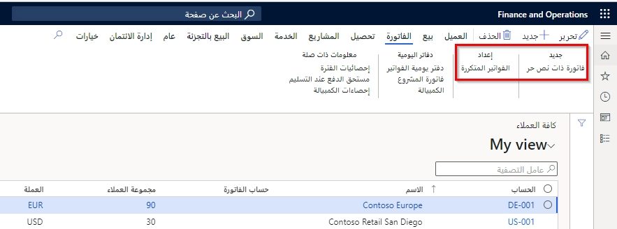
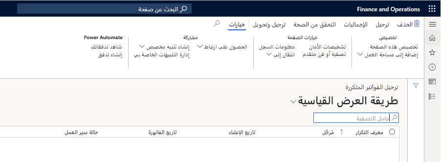

## إعداد ومعالجة الفواتير المتكررة 

يتم استخدام الفواتير المتكررة ذات النص الحر عندما تتم محاسبة العميل على أساس متكرر.

لإنشاء فاتورة ذات نص حر متكرر، اتبع الخطوات التالية:

1.  إنشاء قالب فاتورة نص حر.
2.  تعيين القالب إلى عميل.
3.  إنشاء وترحيل الفاتورة المتكررة.

يمكنك استخدام الفواتير المتكررة إذا كنت تقوم بفوترة العملاء بنفس المبلغ على أساس منتظم.

## إنشاء قالب فاتورة ذات نص حر

لفوترة العملاء لنفس الخدمات بشكل منتظم، يتعين عليك تحديد قالب فاتورة ذات نص حر يمكن إعادة استخدامه لإنشاء الفواتير. يحتوي هذا القالب على المعلومات التالية:

-   معلومات العنوان، مثل مجموعات الضرائب، وشروط الدفع، وطريقة الدفع
-   معلومات البند، مثل وصف الخدمة وحسابات الإيراد وسعر الوحدة ومبلغ الفاتورة
-   تكاليف الشحن أو المعالجة
-   التوزيعات المحاسبية، مع معلومات البعد المالي، مثل مراكز التكلفة ووحدات الأعمال

بشكل أساسي، تقوم بإنشاء فاتورة بأكملها وتحفظها كقالب. يمكنك إعداد القوالب باستخدام صفحة  **إنشاء فواتير متكررة** .

## إنشاء الفواتير المتكررة

تحتوي صفحة  **إنشاء الفواتير المتكررة** على مهمة تعالج قوالب الفواتير المتكررة، حيث يمكنك تحديد تاريخ الفاتورة والقالب لإنشاء الفواتير منها. سيتم إنشاء الفواتير وتعيين رقم معرف تكرار فردي لكل مجموعة من مجموعات الفواتير التي تمت معالجتها.

## ‏‫تعيين قالب فاتورة ذات نص حر إلى عميل وإدخال تفاصيل التكرار

بعد إنشاء القالب، تحتاج إلى تعيين القالب إلى العملاء الذين ترغب في فوترتهم. بالإضافة إلى ذلك، يجب تحديد متى وعدد المرات التي سيتم فيها استخدام الفاتورة. يمكنك تعيين القوالب في علامة التبويب  **الفاتورة** في صفحة  **العملاء** . أضف القالب إلى القائمة، ثم قم بتحديث المعلومات التالية:

-   تاريخ البدء، واختياريأً، تاريخ الانتهاء للفوترة المتكررة
-   تكرار الفاتورة المتكررة (على سبيل المثال، كل يوم أو مرة كل شهر)
-   الحد الأقصى لمبلغ الفوترة (إذا كانت هذه المعلومات مطلوبة)

يمكن أن يكون للعميل قوالب متعددة لها تكرارات مختلفة.

## ترحيل الفواتير ذات النص الحر والمتكررة

بعد إنشاء الفواتير المتكررة، تظهر معرفات تكرار الفاتورة في مهمة ترحيل في صفحة  **الفواتير المتكررة** .

يمكنك عرض جميع الفواتير الخاصة بمعرف التكرار عن طريق تحديد الارتباط.
أثناء مراجعه الفواتير الخاصة بمعرف التكرار، يمكن حذف الفواتير الفردية. ستتم إعادة تعيين إعدادات تكرار العميل لهذا القالب بحيث يمكن إعادة إنشائها لاحقاً. يمكنك ترحيل فاتورة واحدة أو عدد من الفواتير أو كلها لمعرف التكرار. في حالة تمكين مهام سير العمل، حدد  **إرسال** قبل ترحيل الفواتير.

## طباعة الفواتير ذات النص الحر والمتكررة

بعد ترحيل الفواتير المتكررة، يمكنك طباعه الفواتير من قائمة **الفواتير ذات النص الحر**. يمكنك طباعة الفواتير التي تم تحديدها، أو يمكنك تحديد مجموعة من الفواتير لطباعتها.

## دفاتر يومية دفتر الأستاذ الفرعي للفواتير ذات النص الحر 

قبل أن تقوم بترحيل فاتورة ذات نص حر، يمكنك عرض الإدخال المحاسبي الكامل للفاتورة، والذي يتضمن الخصومات والائتمانات، للتحقق من ترحيل الفاتورة إلى الحسابات الصحيحة. يُطلق على طريقة العرض هذه للإدخال المحاسبي الكامل اسم دفتر يومية دفتر الأستاذ الفرعي.

إذا كان إدخال دفتر اليومية في دفتر الأستاذ الفرعي غير صحيح عند معاينته قبل تسجيل الفاتورة ذات النص الحر في دفتر اليومية، فلا يمكنك تغيير إدخال دفتر اليومية في دفتر الأستاذ الفرعي. بدلاً من ذلك، يجب عليك تغيير التوزيعات المحاسبية أو ملف تعريف الترحيل. تستخدم التوزيعات المحاسبية لتحديد جانب واحد من الإدخال المحاسبي، الخصم والائتمان. يتم إنشاء مقاصة إدخال حساب دفتر اليومية لدفتر الأستاذ الفرعي من ملفات تعريف الترحيل، مثل من حساب العميل أو الضريبة.
