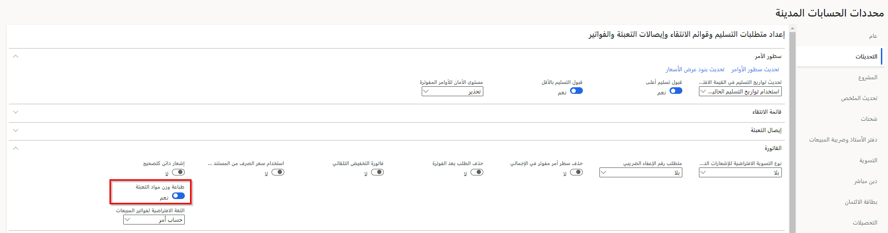

 *فاتورة عميل لأمر مبيعات‬‏‫* هي فاتورة ترتبط بعملية بيع وتعطيها مؤسسة لعميل.‬ ويتم إنشاء هذا النوع من فواتير العملاء بناءً على أمر مبيعات يتضمن بنود الأوامر وأرقام الأصناف. وتُحَدَّد أرقام الأصناف وتُرحّل في دفتر الأستاذ.
ولا تتوفر إدخالات دفتر اليومية في دفتر الأستاذ الفرعي لفاتورة عميل لأمر مبيعات.‬

 *الفاتورة المبدئية* هي فاتورة يتم إعدادها كتقدير لمبالغ الفاتورة الفعلية قبل ترحيل الفاتورة. ويمكنك طباعة فاتورة مبدئية لفاتورة عميل خاصة بأمر مبيعات أو لفاتورة ذات نص حر.

## ترحيل الفواتير الفردية للعملاء وطباعتها استناداً إلى أوامر المبيعات 

عندما تقوم بترحيل فاتورة، يتم تحديث كمية **باقي الفاتورة** لكل صنف من خلال إجمالي الكميات التي تمت فوترتها من أمر الشراء المحدد. وإذا كان كلُّ من كمية **باقي الفاتورة** وكمية **تسليم الباقي** لجميع الأصناف في أمر المبيعات تساوي 0 (صفر)، فستتغير حالة أمر المبيعات إلى **مفوتر**. وإذا كانت كمية **باقي الفاتورة** لا تساوي 0 (صفر)، فإن حالة أمر المبيعات تبقى دون تغيير، ويمكن إدخال الفواتير الإضافية لها.

ويمكنك عرض حالة أوامر المبيعات في صفحة قائمة **كل أوامر المبيعات** . استخدم صفحة قائمة **فواتير العملاء المفتوحة** لعرض الفواتير التي قمت بترحيلها.

## مراجع إلى الفواتير الأصلية في الإشعارات الدائنة
بالنسبة لبعض البلدان والمناطق، يعد طباعة مراجع الفاتورة الأصلية على الإشعارات الدائنة مطلباً قانونياً. تُعد ميزة **تخطيط فواتير الائتمان للمبيعات وتقارير فواتير المشاريع** ميزة اختيارية يتم تمكينها في مساحة عمل **إدارة الميزات**. 

لم يعد يتم التحكم في إيداع الفاتورة بواسطة سياق البلد عند تمكين هذه الميزة. يعني هذا أنه يمكن استخدام رصيد الفاتورة عبر جميع الكيانات القانونية. ينطبق على الوثائق التالية:

- إشعار دائن بنص حر
- إشعار ائتمان العميل
- إشعار ائتمان المشروع

يجب تكوين إدارة الطباعة بالتنسيقات القابلة للطباعة لكل مستند. 

للتحكم في مرجع الفاتورة في الإشعارات الدائنة ذات الصلة، اتبع الخطوات التالية:

1.  انتقل إلى **الحسابات المدينة > إعداد > معلمات الحسابات المدينة**.
2.  في علامة التبويب **تحديثات**، في علامة التبويب السريعة **فاتورة**، قم بتعيين خيار **تطبيق تخطيط فواتير الائتمان في تقارير فواتير المبيعات والمشاريع** إلى **نعم**.

 
لمعرفة المزيد حول كيفية الاطلاع على المراجع إلى الفاتورة الأصلية في الفواتير ذات النص الحر وإشعارات ائتمان العميل وائتمانات المشاريع، راجع[مراجع إلى الفواتير الأصلية في الإشعارات الدائنة‬](/dynamics365/finance/accounts-receivable/original-invoice-numbers-credit-notes/?azure-portal=true).

## ترحيل وطباعة فواتير عملاء استناداً إلى إيصالات التعبئة والتاريخ 

تستند فاتورة العميل إلى إيصالات التعبئة وتعكس الكميات الموجودة بها. وتعتمد المعلومات المالية للفاتورة على المعلومات التي يتم إدخالها عند ترحيل الفاتورة.

يمكنك إنشاء فاتورة عميل بناءً على أصناف بنود إيصالات التعبئة التي تم شحنها حتى تاريخه، حتى وإن لم يتم شحن كل الأصناف الخاصة بأمر مبيعات معين بعدُ. على سبيل المثال، قد تستخدم هذه الطريقة في حالة قيام كيانك القانوني بإصدار فاتورة واحدة لكل عميل في كل شهر لتغطية كل عمليات التسليم التي تشحنها في أثناء هذا الشهر.
ويمثل كل إيصال تعبئة عملية تسليم جزئية أو مكتملة للأصناف الموجودة في أمر المبيعات.

عند ترحيل الفاتورة، يتم تحديث كمية **باقي الفاتورة** لكل صنف من الأصناف بإجمالي الكميات التي تم تسليمها من إيصالات التعبئة المحددة. وإذا كان كلُّ من كمية **باقي الفاتورة** وكمية **تسليم الباقي** لجميع الأصناف في أمر المبيعات تساوي 0 (صفر)، فستتغير حالة أمر المبيعات إلى **مفوتر**. وإذا كانت كمية **باقي الفاتورة** لا تساوي 0 (صفر)، فإن حالة أمر المبيعات تبقى دون تغيير، ويمكن إدخال الفواتير الإضافية لها.

ونتيجة لذلك، يتم تحديث حركات المخزون برقم الفاتورة، وتُغيَّر الحالة في حقل **حالة البند** في أمر المبيعات إلى **مفوتر**.

ويمكنك عرض حالة أوامر المبيعات في صفحة قائمة **كل أوامر المبيعات** .

## تجميع أوامر المبيعات أو إيصالات التعبئة للترحيل 

استخدم عملية *تجميع أوامر المبيعات أو إيصالات التعبئة للترحيل* عندما يكون أمر مبيعات واحد أو أكثر جاهزاً للفوترة، وتريد دمجها في فاتورة واحدة.

ويمكنك تحديد فواتير متعددة في صفحة قائمة **أمر المبيعات** ، ثم استخدام **إنشاء الفواتير** لتجميعها. وفي صفحة **ترحيل الفاتورة** ، يمكنك تغيير إعداد **ملخص الأمر** للتلخيص حسب رقم الأمر (حيث توجد إيصالات تعبئة متعددة لأمر مبيعات واحد) أو حسب حساب الفاتورة (حيث توجد أوامر مبيعات متعددة لحساب فاتورة واحدة). استخدم الزر **ترتيب** لتجميع أوامر المبيعات في فاتورة واحدة، استناداً إلى إعدادات **ملخص الأمر**.

## الإعدادات الإضافية التي تُغيِّر سلوك الترحيل 

تُغيّر الحقول التالية سلوك عملية الترحيل:

- **الكمية** - حدد الكميات التي سيتأسس عليها ترحيل المستند. وتختلف الخيارات المتاحة تبعاً لنوع المستند الذي تقوم بترحيله، مثل إيصال تعبئة أو فاتورة:
    - **التسليم الآن** - حدد كل الكميات التي تم إدخالها في حقل **التسليم الآن**. استخدم هذا الخيار لتأكيد أمر جزئي أو تسليمه.
    - **منتقاة** – حدد كل الكميات التي تم انتقاؤها.
    - **الكل** – حدد جميع الكميات الموجودة في أمر المبيعات التي لم يتم تحديثها بعد بواسطة نوع المستند الحالي.
    - **إيصال التعبئة** – حدد كل الكميات التي تم تحديثها بحسب إيصال التعبئة.
    - **الكمية المنتقاة والمنتجات غير المخزّنة** – حدد جميع الكميات المنتقاة وجميع كميات المنتجات غير المخزّنة.
-  **الترحيل** - حدد هذا الخيار لتسجيل دفتر يومية أمر المبيعات أو قم بإلغاء تحديد هذا الخيار لطباعة أمر مبيعات مبدئي. 
    > [!NOTE]
    > وإذا قمت بعمل اتفاقية لجدول دفع، لا يظهر جدول الدفع في أمر المبيعات المبدئي. وتظهر جداول الدفع فقط في أوامر المبيعات الفعلية.
    
- **التحديد لاحقاً** - حدد هذا الخيار لتقديم الاستعلام المحدد لاحقاً. يُستخدم هذا الخيار للوظائف الدفعية. ويتم تشغيل الاستعلام عند تشغيل الوظيفة الدفعية. 
- **خفض الكمية** - حدد هذا الخيار لخفض الكمية التي تم تسليمها تلقائياً عندما يتم ترحيل المستند، بحيث تساوي الكمية التي تم تسليمها المخزون المتاح. 
- **طباعة** - حدد وقت طباعة المستندات:
    - **حالياً** – اطبع المستندات بعد تحديث كل فاتورة.
    - **بعد** – اطبع المستندات بعد تحديث جميع الفواتير.
    > [!NOTE]
    > يتوفر حقل **الطباعة** فقط، إذا قمت بتحديد خيارات **طباعة الفاتورة** أو **تأكيد الطباعة** أو **طباعة قائمة الانتقاء** أو **طباعة إيصال التعبئة**. على سبيل المثال، في صفحة **فرز النماذج**، قمتَ بإعداد النظام لفرز المعلومات بواسطة حساب الفاتورة. ويمكنك بعد ذلك تحديد **بعد** لطباعة المستندات الموجودة في دُفعة تم فرزها حسب حساب الفاتورة. وبخلاف ذلك، تُطبَع المستندات قبل اكتمال المعالجة، ولا تُفرَز المستندات بالترتيب المحدد في صفحة **فرز النماذج**. 

- **طباعة الفاتورة** - حدد هذا الخيار لطباعة الفاتورة. وإذا تم إيقاف تشغيل هذا الخيار، فيمكنك ترحيل فاتورة دون طباعتها. 
- **إرسال بريد إلكتروني** - حدد هذا الخيار لإرسال فاتورة أمر مبيعات للعميل كمرفق بريد إلكتروني بعد ترحيل الفاتورة. ويتم إرسال المرفقات كملفات PDF وXML. ويتوفر هذا الخيار فقط إذا قمت بتحديد **تمكين CFD (الفواتير الإلكترونية)** في صفحة **معلمات الفاتورة الإلكترونية**. 
    > [!NOTE]
    > (المكسيك) لا يتوفر عنصر التحكم هذا إلا للكيانات القانونية الذي يوجد عنوانها الرئيسي في المكسيك. 

- **استخدام وجهة إدارة الطباعة** - حدد هذا الخيار لاستخدام إعدادات الطباعة المحددة للحركة أو المستند أو الوحدة في صفحة **إعداد إدارة الطباعة**. 
- **فحص حد الائتمان** - حدد المعلومات التي يجب تحليلها عند فحص حد الائتمان.
    - **لا شيء** – لا توجد متطلبات تتعلق بفحص حد الائتمان.
    - **الرصيد** - يتم التحقق من حد الائتمان في مقابل رصيد العميل.
    - **الرصيد + إيصال التعبئة أو إيصال استلام المنتجات** – يتم التحقق من حد الائتمان في مقابل رصيد العميل وعمليات التسليم.
    - **الرصيد+الكل** – يتم التحقق من حد الائتمان في مقابل رصيد العميل وعمليات التسليم والأوامر المفتوحة.
- **تصحيح الائتمان** - حدد هذا الخيار لعرض إشعار الدائن على أنه قيمة مدينة في حركات الإيصالات. 
- **الكمية الدائنة المتبقية** - إذا كنت تعمل على ترحيل إشعار دائن، فحدد هذا الخيار للاحتفاظ بالكمية المتبقية في الأمر. أما في حالة إلغاء تحديد هذا الخيار، فإنه يتم تعيين الكمية المتبقية إلى 0 (صفر).
- **تحديث ملخص لـ** - حدد الطريقة التي ينبغي بها تلخيص أوامر المبيعات المتعددة.
    - **لا شيء** – عدم تلخيص أوامر المبيعات. على سبيل المثال، سيتم إنشاء فاتورة منفصلة لكل أمر مبيعات.
    - **حساب الفاتورة** – يقوم حساب الفاتورة بتجميع وتلخيص الطلبات المحددة بواسطة رقم حساب الفاتورة ويتم إعدادها في صفحة **معلمات تحديث الملخص**.
    - **أمر** – يسمح خيار "أمر" بتلخيص الأوامر في أمر وفاتورة واحدة حسب رقم أمر المبيعات. ويتم تلخيص الأوامر وفقاً للمعايير التي تم إعدادها في صفحة **معلمات تحديث الملخص**. وإذا قمت بتحديد هذا الخيار، فيجب عليك تحديد حقل **أمر المبيعات**.
    - **الملخص التلقائي** – يقوم إعداد الفواتير الملخصة تلقائياً بتجميع وتلخيص ترحيلات الفاتورة اليومية في فاتورة ملخصة واحدة، مما يقلل من عدد الفواتير المستلمة شهرياً. في حالة تحديد تحديثات الملخص في صفحة **تحديث الملخص**، يتم تلخيص جميع الأوامر المحددة، استناداً إلى المعايير التي أُعِدَّت في صفحة **معلمات تحديث الملخص**. وإذا لم يتم تحديد تحديثات الملخص، فيتم ترحيل الأمر بشكل منفصل.
    - **إيصال التعبئة** – لَخِّص مجموعة محددة من الأوامر في فاتورة واحدة لكل إيصال تعبئة. لا يتوفر هذا الخيار إلا إذا تم تحديد **إيصال التعبئة** في حقل **الكمية**.

## مقترح الدفع 

يجب عليك، عند إجراء العملاء لعمليات الدفع، إنشاء دفتر يومية المدفوعات وترحيله، وذلك لتسجيل المدفوعات في حسابات العميل وأيضاً للتأكد من أنك تستطيع تسوية معلومات حسابات المقبوضات‬ مع معلومات دفتر الأستاذ العام. استخدم مقترح الدفع كطريقة فعالة لتحديد سجلات الدفع وإنشاء دفتر يومية الدفع. يقوم مقترح الدفع بما يلي:

-   البحث عن بنود الدفع المستحقة أو التي تتضمن حداً أقصى لتاريخ تلقي خصم نقدي.
-   مراجعة الحركات المفتوحة والمعتمدة للعملاء.

لا يتضمن البحث إلا الحركات التي لها تاريخ استحقاق أو تاريخ خصم نقدي. يمكنك تحرير بنود الدفع في دفتر يومية الدفع عند إنشاء النظام لها.

## صفحة إدخال مدفوعات العميل 

يستخدم أحد بدائل الإنشاء اليدوي لسطور دفتر يومية الدفع وظيفة **إدخال مدفوعات العميل**. استخدم هذه الصفحة لإدخال مدفوعات العميل وتسويتها وحفظها.

يمكنك تحديد **الحركات** استناداً إلى الحقول التالية:

-   معلومات حساب العميل
-   معلومات فاتورة العميل، بما في ذلك:
    -   الفاتورة المفتوحة
    -   إشعار الدائن
    -   خطاب التحصيل

يمكنك أيضاً عرض سجلات حركات العميل على نطاق شركات متعددة وتحديد الجوانب الأخرى لبند الدفع، مثل طريقة الدفع ونوع الحساب المقابل وغير ذلك.

إذا كان المبلغ الموجود في حقل **المبلغ** بصفحة **إدخال مدفوعات العميل** لا يساوي إجمالي الحركات التي تم وضع علامة عليها، فستعرض الصفحة تحذيراً يفيد بأنه لم تتم تسوية الدفع بشكل كامل. قم بتسوية الحركات التي تم وضع علامة عليها أو المبلغ وفقاً لذلك. إذا أجريت تحويل المدفوعات إلى دفتر اليومية دون تسوية، فتُطبق القواعد المعتادة لترحيل الدفع بالزيادة أو النقصان.

لمسح أي حركات محددة للدفع في صفحة **إدخال مدفوعات العميل**، حدد زر **مسح**.

شاهد مقاطع الفيديو التالية لمعرفة طريقة إنشاء فاتورة واستلام مدفوعات باستخدام فاتورة ذات نص حر:

 > [!VIDEO https://www.microsoft.com/videoplayer/embed/RE45bhY]

 > [!VIDEO https://www.microsoft.com/videoplayer/embed/RE45bhW]
