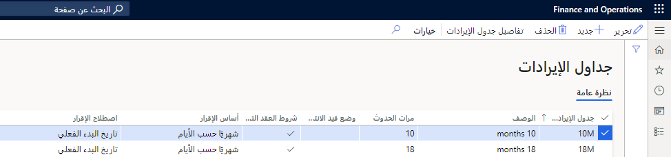
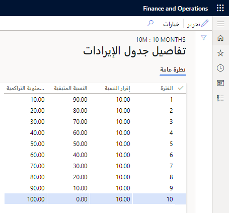

يجب إنشاء جدول إيرادات لكل مرة يمكن تأجيل الإيرادات فيها. 

على سبيل المثال، إذا كانت مؤسستك تقدم الدعم لفترات عبر سته أشهر و12 شهرًا و18 شهرًا و24 شهرًا، يجب إنشاء جدول إيرادات لكل فترة. يحدد إعداد جدول الإيرادات كيفية توزيع سعر الإيرادات خلال عدد الفترات التي تحددها. كما يحدد أيضًا التواريخ الافتراضية التي يتم إدخالها لجدول الإيرادات الذي يتم إنشاؤه عند ترحيل الفاتورة.

في حالة إقرار الإيرادات بواسطة حدث رئيسي، نوصي بإنشاء جدول إقرار إيرادات لعدد الأحداث الرئيسية، بغض النظر عن تواريخ الإقرار. بعد إنشاء الجداول، يمكنك تحريرها بحيث تعرض تواريخ الأحداث الرئيسية المتوقعة. يمكن وضع هذه السجلات قيد الانتظار حتى يتم إبلاغك أنه تم استيفاء الحدث الرئيسي ويمكن إقرار الإيرادات.

يمكنك إنشاء جداول الإيرادات في صفحة **جداول الإيرادات** (**إقرار الإيرادات > الإعداد > جداول الإيرادات**).

في حقلي **جدول الإيرادات** و **الوصف**، يمكنك إدخال قيم وصفية. تساعدك الإعدادات الإضافية التالية في إنشاء جدول الإيرادات عند ترحيل الفاتورة.

- **مرات الحدوث** – أدخل عدد الأشهر أو مرات حدوث تأجيل الإيرادات.
- **الانتظار التلقائي** – حدد خانة الاختيار هذه إذا كان يجب وضع جميع سطور جدول الإيرادات قيد الانتظار تلقائياً عند ترحيل الفاتورة. ويجب إزالة الانتظار يدوياً من كل سطر من سطور الجدول قبل إمكانية إقرار الإيرادات المؤجلة للسطر.
- **شروط العقد التلقائية** – حدد خانة الاختيار هذه في حالة وجوب تعيين تواريخ بدء العقد وانتهائه تلقائياً. يتم إعداد هذه التواريخ تلقائياً للمنتجات الصادرة من نوع الإيرادات دعم ترحيل العقد. يتم تعيين تاريخ بدء العقد تلقائياً إلى تاريخ الشحن المطلوب لسطر أمر المبيعات، ويتم تعيين تاريخ انتهاء العقد تلقائياً إلى تاريخ البدء بالإضافة إلى عدد الشهور أو عدد مرات الحدوث المحددة في إعداد جدول الإيرادات. على سبيل المثال، تكون مدة ضمان المنتج الموجود في سطر أمر المبيعات عاماً واحداً. جدول الإيرادات الافتراضي هو 12M ‏(12 شهراً)، ويتم تحديد خانة اختيار **شروط العقد التلقائية** لجدول الإيرادات هذا. إذا كان تاريخ الشحن المطلوب لسطر أمر المبيعات هو 16 ديسمبر 2019، يكون تاريخ بدء العقد الافتراضي هو 16 ديسمبر 2019، وتاريخ انتهاء العقد الافتراضي هو 15 ديسمبر 2020.
- **أساس الإقرار** – يحدد كيفية توزيع سعر الإيرادات عبر مرات الحدوث.
    - **شهريًا حسب التواريخ** – يتم توزيع المبلغ استنادًا إلى الأيام الفعلية في كل شهر.
    - **شهريًا** – يتم توزيع المبلغ بالتساوي عبر عدد الشهور المحددة في مرات الحدوث.
    - **مرات الحدوث** – يتم توزيع المبلغ بالتساوي عبر مرات الحدوث، ولكنه قد يتضمن فترة إضافية في حالة تحديد **وقت البدء الفعلي** كاتفاق الإقرار.
    
- **اتفاق الإقرار** التعرف – يحدد اتفاق الإقرار التواريخ الافتراضية التي يتم تعيينها في جدول الإيرادات للفاتورة.
    - **تاريخ البدء الفعلي** – يتم إنشاء الجدول باستخدام تاريخ بدء العقد (لدعم ترحيل العقد [PCS] الأصناف) أو تاريخ الفاتورة (للأصناف الأساسية وغير الأساسية).
    - **اليوم الأول من الشهر** – التاريخ الموجود في سطر الجدول الأول هو تاريخ بدء العقد (أو تاريخ الفاتورة). ولكن، يتم إنشاء جميع الجداول اللاحقة باليوم الأول من الشهر.
    - **تقسيم منتصف الشهر** – يعتمد التاريخ في سطر الجدول الأول على تاريخ الفاتورة. في حالة ترحيل الفاتورة إلى اليوم الأول حتى اليوم الخامس عشر من الشهر، يتم إنشاء جدول الإيرادات باستخدام اليوم الأول من الشهر. في حالة ترحيل الفاتورة في اليوم السادس عشر أو بعده، يتم إنشاء جدول الإيرادات باستخدام اليوم الأول من الشهر التالي.
    - **اليوم الأول من الشهر التالي** – التاريخ الموجود في الجدول هو اليوم الأول من الشهر التالي.

حدد الزر **تفاصيل جدول الإيرادات** لعرض الفترات العامة والنسب المئوية التي يتم إقرارها في كل فترة. يتم تقسيم قيمة **النسبة المئوية للإقرار** على عدد الفترات بالتساوي. في حالة تعيين أساس الإقرار على القيمة **شهريًا** أو **مرات الحدوث**، يمكن تغيير النسبة المئوية للإقرار. وعند تغيير النسبة المئوية للإقرار، تعلمك رسالة تحذير أن الإجمالي لا يساوي 100 بالمائة. في حالة تلقي الرسالة، يمكنك الاستمرار في تحرير البنود. ولكن يجب أن يكون إجمالي النسبة المئوية يساوي 100 قبل إغلاق الصفحة.

## تحديد جدول الإيرادات

يتم تأجيل الإيرادات الموجود في سطر أمر المبيعات في حالة تحديد جدول إيرادات للمنتج الصادر واستخدامها في سطر أمر المبيعات بصورة افتراضية. إذا كان يجب استخدام الإعداد افتراضياً للمنتج، فيمكنك تحديد جدول الإيرادات في علامة التبويب السريعة **إقرار الإيرادات** في صفحة **مجموعة الأصناف** (**إقرار الإيرادات > الإعداد > المخزون وإعداد المنتجات > مجموعة الأصناف**). يمكنك أيضاً تحديد إعداد المنتج الصادر في علامة التبويب السريعة **إقرار الإيرادات** بصفحة **المنتجات الصادرة** (**إقرار الإيرادات > الإعداد > إعداد المخزون > المنتجات الصادرة**).

في حقل **جدول الإيرادات**، حدد جدول الإيرادات الذي يمثل الفترة التي يجب تأجيل الإيرادات خلالها. يتم إدخال جدول الإيرادات في سطر أمر المبيعات تلقائياً، ويتم إنشاء تفاصيل الجدول عند ترحيل فاتورة أمر المبيعات.
