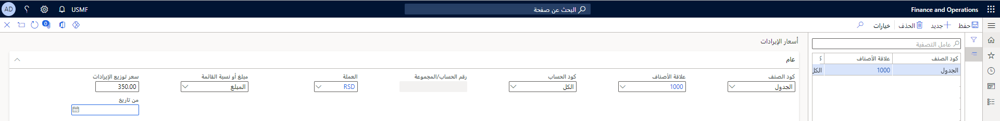

## تحديد سعر الإيرادات

يمكن إعداد مجموعات الأصناف والمنتجات الصادرة باستخدام طريقة السعر المتوسط أو طريقة توزيع الخصم. تتطلب كلتا الطريقتين إعدادات متنوعة في صفحة **المنتجات الصادرة**:

- **هل توزيع الإيرادات نشط** – عيِّن هذا الخيار على القيمة **نعم** لتضمين المنتج الصادر في حساب توزيع الإيرادات. في حالة تعيين هذا الخيار على القيمة **لا**، يستخدم المنتج الصادر طريقة السعر المتوسط في حالة تحديد السعر المتوسط. في حالة عدم تحديد السعر المتوسط، يتم استخدام سعر الوحدة الموجود في بند أمر المبيعات للترحيل إلى الإيرادات أو الإيرادات المؤجلة.
- **نوع الإيرادات** – حدد نوع الإيرادات الذي يحدد المنتج الصادر:
    - **أساسي** – الصنف هو مصدر أساسي لإيرادات المؤسسة. تكون هذه القيمة هي الإعداد الافتراضي.
    - **غير أساسي** – لا يعد الصنف مصدراً أساسياً لإيرادات المؤسسة. عند استخدام إعدادات السعر المتوسط، يتم "اقتطاع" السعر إلى السعر المتوسط ثم توزيعه. على سبيل المثال، يوجد سعر ثابت للصنف الأساسي يجب إقراره للإيرادات. وفي حالة وجود خصم، قد يتم اقتطاع الخصم من إيرادات الصنف الأساسي، ولكن حتى مبلغ السعر الثابت فقط. يتم تنفيذ باقي الخصم على إيرادات الأصناف غير الأساسية. وبدلاً من ذلك، قد لا يتم اقتطاع الخصم من إيراد الصنف الأساسي.
    - **دعم ترحيل العقد** – يدعم الصنف العناصر الأخرى المضمنة في عملية البيع إلى العميل. يتم توزيع سعر الإيرادات على المنتجات الأساسية وغير الأساسية التي يتم تضمينها في عملية البيع. استنادًا إلى الإعداد، قد لا تتطلب أصناف دعم ترحيل العقد تحديد تواريخ بدء العقد وانتهائه في بند أمر المبيعات.
- **استبعاد من الاقتطاع** – عيِّن هذا الخيار على القيمة **نعم** للإشارة إلى عدم إمكانية تعديل سعر الصنف المتوسط لأقل من الحد الأدنى للنسبة المئوية المحددة أو أعلى من الحد الأقصى للنسبة المئوية. سيتم اشتقاق أي سعر إيرادات من سعر إيرادات منتج صادر آخر مضمن في أمر المبيعات. في حالة تعيين هذا الخيار على القيمة **لا**، يمكن تعديل سعر الصنف المتوسط أو اقتطاعه. إذا قمت ببيع أكثر من صنف واحد يتم إعداده كسعر متوسط، يجب إعداد منتج صادر على الأقل حيث يتم تعيين خيار **استبعاد من الاقتطاع** على القيمة **لا**. وبالتالي، يوجد صنف واحد على الأقل يمكن توزيع أي فروق في سعر الإيرادات له.
- **السعر المتوسط** – قم بتعيين هذا الخيار عل القيمة **نعم** للإشارة إلى وجوب تعديل سعر إيرادات الصنف بحيث يساوي السعر المتوسط إذا ما كان أقل من الحد الأدنى للتفاوت المتوسط الذي حددته أو أعلى من الحد الأقصى للتفاوت، ويجب توزيع مبلغ الاقتطاع على البنود التي لها منتجات تم تعيين خيار **استبعاد من الاقتطاع** لها على القيمة **لا**.
    - **الحد الأقصى للتفاوت** – أدخل النسبة المئوية خلال السعر المتوسط المسموح به.
    - **الحد الأدنى للتفاوت** – أدخل النسبة المئوية أقل من السعر المتوسط المسموح به.

بعد الانتهاء من تكوين الإعدادات الخاصة بالمنتج الصادر، يجب تحديد سعر الإيرادات يدوياً من خلال إدخال سعر القيمة المقبولة أو السعر المتوسط (إذا كنت تستخدم طريقة السعر المتوسط) في صفحة **أسعار الإيرادات** (انتقل إلى **إقرار الإيرادات > الإعداد > إعداد المخزون > المنتجات الصادرة** ثم في جزء الإجراءات، ضمن علامة التبويب **بيع**، في مجموعة **إقرار الإيرادات**، حدد **أسعار الإيرادات**).

يستخدم سعر الإيرادات المحدد يدوياً في هذه الصفحة لتحديد توزيع سعر الإيرادات في كل أمر مبيعات، وذلك وفقاً للمعايير المحددة. ويتطابق كل معيار مع بند أمر المبيعات لتحديد سعر الإيرادات الذي يجب استخدامه في عمليه التوزيع.

- **كود الصنف** و **علاقة الصنف** – يمكن تحديد سعر الإيراد لمنتج واحد أو مجموعة منتجات. في حالة تحديد **جدول** في حقل **كود الصنف**، حدد المنتج الصادر في حقل **علاقة الصنف**. في حالة تحديد **مجموعة** في حقل **كود الصنف**، حدد مجموعة الأصناف في حقل **علاقة الصنف**.
- **كود الحساب** و **رقم الحساب/المجموعة** – يمكن تحديد سعر الإيرادات لكافة العملاء أو عميل فردي أو مجموعة من العملاء. إذا قمت بتحديد **الكل** في حقل **كود الحساب**، سيتم استخدام السعر لكافة العملاء. في حالة تحديد **جدول** في حقل **كود الحساب**، حدد العميل في حقل **رقم الحساب/المجموعة**. في حالة تحديد **مجموعة** في حقل **كود الحساب**، حدد مجموعة العملاء في حقل **رقم الحساب/المجموعة**.
- **العملة** – يجب إدخال سعر إيرادات منفصل لكل عملة تقوم بإدخال أمر مبيعات بها. على سبيل المثال، إذا قمت في الوقت الحالي بالبيع بالدولار الأمريكي والدولار الكندي واليورو، يجب عليك تحديد سعر إيرادات بالعملات الثلاث جميعاً. ولا يتم تحويل سعر الإيرادات من إحدى العملات، مثل عملة المحاسبة، إلى أي عملة من عملات الحركات الأخرى التي تستخدمها.
- **المبلغ أو النسبة المئوية للقائمة** – تحديد ما إذا كان قد تم إعداد سعر الإيرادات كمبلغ أم كنسبه مئوية لسعر القائمة. في حالة تحديد **النسبة المئوية للقائمة**، يمكن للمستخدمين إدخال السعر المتوسط كنسبة مئوية لسعر القائمة بدلاً من إدخال مبلغ. لا يتم استخدام قيمة **النسبة المئوية للقائمة** إلا للمنتجات الصادرة والتي يتم إعدادها كأصناف دعم ترحيل العقد.
- **سعر توزيع الإيرادات** – حسب القيمة التي حددتها في حقل **المبلغ أو النسبة المئوية للقائمة**، أدخل إما مبلغًا أو نسبة مئوية لسعر الإيرادات المستخدم لتوزيع الإيرادات عبر العناصر في أمر المبيعات.
- **من تاريخ** و **إلى تاريخ** – أدخل نطاق التاريخ الذي يكون سعر الإيرادات نشطًا فيه. هذه الحقول اختيارية.

في حالة تعيين خيار **تمكين طريقة توزيع الخصم** في صفحة **محددات دفتر الأستاذ العام** على القيمة **نعم**، وفي حالة تعيين حقل **نوع الإيرادات** للمنتجات الصادرة على **دعم ترحيل العقد**، يجب أيضاً تحديد الأصناف التي يتم دعمها بواسطة المنتج الصادر. يتم إجراء هذا الإعداد في صفحة **أساسيات الإعداد** (انتقل إلى **إقرار الإيرادات > الإعداد > إعداد المخزون > المنتجات الصادرة**، ثم في جزء الإجراءات، في علامة التبويب **بيع**، في مجموعة **إقرار الإيرادات**، حدد **أساسيات الإعداد**).

في صفحة **أساسيات الإعداد**، قم بإضافة سجلاً لكل مجموعة أصناف يدعمها الصنف. عند حدوث توزيع الإيرادات، سيتم توزيع سعر الإيرادات على الأجزاء الأساسية وغير الأساسية لأصناف دعم ترحيل العقد.
