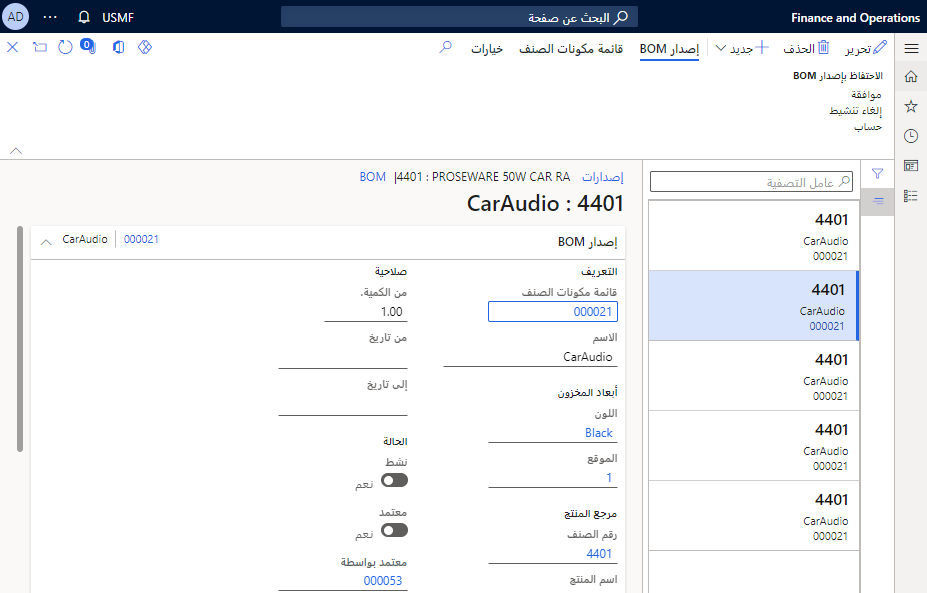

أصناف المجموعات هي المنتجات الفريدة الصادرة التي تم إعدادها لتضمين مكونات. يتم إجراء هذا الإعداد باستخدام قائمة مكونات الصنف (BOM). عند إدخال صنف مجموعة في أمر مبيعات، يتم استخدام المكونات الفردية لتحديد أسعار الإيرادات وجداول الإيرادات. ولكن المستندات المطبوعة الخاصة بالعميل، مثل أمر المبيعات والفاتورة، تعرض صنف المجموعة.

### مكونات المجموعة

يجب إعداد المكونات المضمنة في المجموعة في صفحة **المنتجات الصادرة** (**إقرار الإيرادات > الإعداد > المخزون وإعداد المنتجات > المنتجات الصادرة**). هذه المكونات عبارة عن منتجات صادرة ويجب إعدادها بنفس الطريقة التي يتم بها إعداد المنتجات المضمنة في قائمة مكونات الصنف. على سبيل المثال، يمكن أن يكون المنتج الصادر صنفًا من النوع **صنف** أو النوع **خدمة**، ولكن يجب تعيينه لمجموعة نماذج أصناف يتم فيها تعيين خيار **المنتج المخزن** على القيمة **نعم**. لمزيد من المعلومات، راجع وثائق إعداد أصناف BOM.

يجب أيضًا إعداد المكونات لإقرار الإيرادات، تمامًا مثل المنتجات التي يمكن بيعها بشكل فردي في أمر مبيعات. على سبيل المثال، تأكد من تحديد سعر الإيرادات الصحيح لكل مكون وإعداد أساس السعر لأصناف دعم ترحيل العقد.

### أصناف المجموعات

عند إعداد صنف مجموعة، يجب تعيين حقلين في صفحة **المنتجات الصادرة** (**إقرار الإيرادات > الإعداد > المخزون وإعداد المنتجات > المنتجات الصادرة**):

- في علامة التبويب السريعة **المهندس**، في حقل **نوع الإنتاج**، يجب إعداد الصنف كصنف BOM.
- ضمن علامة التبويب السريعة **عام**، في حقل **مجموعة**، يجب تمييز الصنف كصنف مجموعة.

ثم، يجب تعيين المكونات بعد ذلك إلى الصنف الأصلي للمجموعة/قائمة مكونات الصنف في صفحة **إصدارات BOM** (انتقل إلى **إقرار الإيرادات > الإعداد > المخزون وإعداد المنتجات > المنتجات الصادرة**، ثم في جزء إجراء، في علامة التبويب **هندسة**، في مجموعة **BOM**، حدد **إصدارات BOM**). لمزيد من المعلومات، راجع وثائق إعداد BOM.

في حالة تعيين الصنف الرئيسي للمجموعة ومكونات المجموعة على التوزيع، سيتم توزيع سعر إيرادات المجموعة على المكونات، استناداً إلى النسب المئوية لمساهمة إيراداتها.
