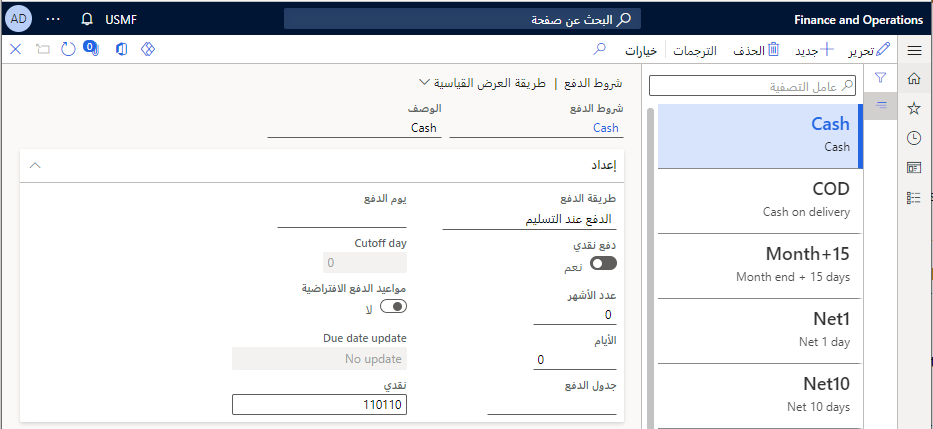

استخدم صفحة **شروط الدفع** لتحديد جميع شروط الدفع المستخدمة من قِبل الشركة ومورديها. استخدم شرط الدفع لحساب تاريخ الاستحقاق استناداً إلى تاريخ الفاتورة.

حدد شروط الدفع لكل مما يلي:

- المورد في صفحة **الموردين**.
- العميل في صفحة **العملاء**.
- أمر الشراء في صفحة **أمر الشراء**.
- أمر المبيعات في صفحة **أمر المبيعات**.

تأمل السيناريو التالي؛ تتمتع Adventure Works Cycles بمدة دفع قياسية للمورد وهي 30 يوماً. إذا قامت فاتورة بمدة دفع صافية تبلغ 30 يوماً بشحن البضائع في 15 سبتمبر، وكانت الفاتورة مؤرخة في 15 نوفمبر، يكون الدفع مستحقاً في 15 ديسمبر. مع تسوية صافي لمدة 30 يوماً، يجب على Adventure Works Cycles دفع صافي المستحق في غضون 30 يوماً من تاريخ الفاتورة، وفقاً للتسوية. بعد هذا التاريخ، إذا لم تكتمل الدفعة، يمكن إضافة رسوم فائدة بنسبة مئوية محددة لكل شهر إلى الفاتورة. قد يتم تطبيق رسوم خدمات أخرى.

إذا كانت شروط الدفع مرتبطة بجدول الدفع، يتم استخدام القواعد الموضوعة في شروط الدفع لحساب تاريخ استحقاق القسط الأول. يتم استخدام القواعد المحددة في جدول الدفع لحساب تاريخ استحقاق الأقساط التالية.

إذا تم تحديد طريقة الدفع نقداً عند الاستلام (COD) وتم تمكين **الدفع النقدي**، فهذا يشير إلى أن الدفعات يجب أن تتم نقداً وليس بشيك. ولذلك، في منطقة **ترحيل دفتر الأستاذ** في حقل **النقد**، تحتاج إلى تحديد حساب رئيسي لتسوية الفواتير التي سيتم استخدامها للدفع النقدي.

انتقل إلى **الحسابات الدائنة > إعداد الدفع > شروط الدفع**.
 

 
## أيام الدفع 

استخدم أيام الدفع لتحديد يوم الدفع المستخدم لحساب تاريخ الاستحقاق. يتم دائماً تقريب تاريخ الاستحقاق إلى أقرب تاريخ محدد. يمكن تحديد يوم الدفع إما ليوم في الأسبوع أو في الشهر.

**الحسابات الدائنة > إعداد الدفع > أيام الدفع**
 

