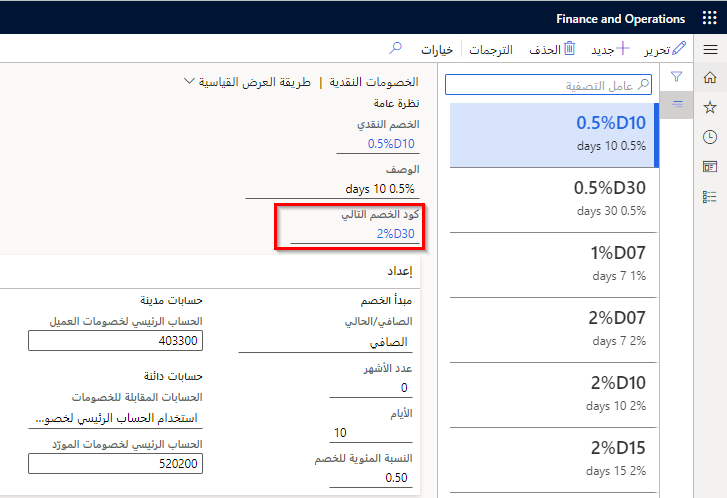
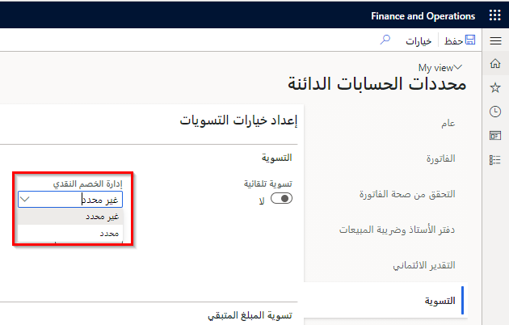
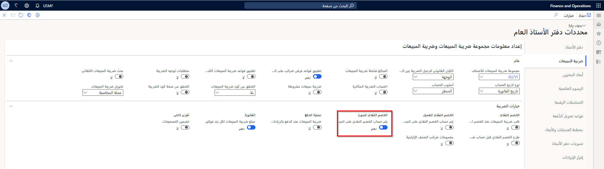

شاهد هذا الفيديو للتعرف على كيفية تكوين الخصومات النقدية.

> [!VIDEO https://www.microsoft.com/videoplayer/embed/RE43VfZ]

## السيناريو 

تحصل USMF على خصم نقدي إذا كانت تسدد فواتير المورّد خلال مواعيد محددة. تقوم USMF بإعداد الأكواد التالية:

- 5D10% - خصم نقدي بنسبة 10 بالمائة عند دفع المبلغ خلال خمسة أيام.
- 10D5% - خصم نقدي بنسبة 5 بالمائة عند دفع المبلغ خلال عشرة أيام.
- 14D2% - خصم نقدي بنسبة 2 بالمائة عند دفع المبلغ خلال 14 يوماً.

تتم الخصومات النقدية الثلاثة بشكل متسلسل عندما يقترب موعد الخصم النقدي. ومع ذلك، يُمنح خصم نقدي واحد فقط.

- لتحديد الخصومات النقدية التي تلي الكود 5D10%، يتم تحديد الكود 10D5% في قائمة **كود الخصم التالي**. 
- في الكود 10D5%، يتم تحديد الكود 14D2% في قائمة **كود الخصم التالي**. 
- وبالنسبة للكود 14D2%، تُترك قائمة **كود الخصم التالي** فارغة. يمكنك تعيين خصومات نقدية للموردين أو دفاتر اليومية أو أوامر الشراء.

**الحسابات الدائنة > إعداد المدفوعات > الخصومات النقدية**.
 

## إعداد حقل إدارة الخصم النقدي 

انتقل إلى صفحة **الحسابات الدائنة > إعداد > محددات الحسابات الدائنة**، في علامة تبويب **التسوية** في حقل **إدارة الخصم النقدي**، وحدد ما ترغب في القيام به مع الدفع بالزيادة أو بالنقصان في حاله عدم اقتطاع الخصم النقدي. يجب إعداد محددة الحسابات الدائنة‏‎ هذه بشكل صحيح قبل تسوية الفاتورة. 

في حالة اختيار **غير محدد**، يتم ترحيل مبلغ الدفع بالنقصان إلى حساب الخصم النقدي للمورِّد. إذا تم ترحيل الخصم النقدي القابل للتطبيق في نفس الشركة التي يوجد بها الدفع بالزيادة، فسوف تقوم إدارة الشؤون المالية بتعديل الخصم النقدي. 

إذا لم يتم ترحيل الخصم النقدي القابل للتطبيق في نفس الشركة التي يوجد بها الدفع بالزيادة، فسيتم ترحيله إلى حساب الخصم النقدي للنظام. إذا كانت هناك خصومات نقدية متعددة بحيث تمت تسوية دفع المبلغ بالزيادة مقابل فواتير متعددة، فسيتم تعديل الخصم من الفاتورة الأخيرة إلى الخصم الأول.
 

في حالة اختيار **محدد**، يتم ترحيل مبلغ الدفع بالزيادة أو النقصان إلى حساب الخصم النقدي للمورد.

لفهم هذين الخيارين بشكل أفضل، يمكنك النظر في المثال التالي:

يبلغ إجمالي فاتورة مورد 105.00 دولارات أمريكية، والخصم النقدي الذي يمكن الحصول عليه هو 10.50 دولارات أمريكية. مع الأخذ في الاعتبار الخصم النقدي، سيدفع المورد 94.50 دولاراً أمريكياً (105-10.50).

ومع ذلك، فإن المبلغ المدفوع بالفعل للمورد هو 95.00 دولاراً أمريكياً.

في حالة تعيين معلمة **إدارة الخصم النقدي** على **غير محدد**، تتم تسوية الفاتورة، ويتم ترحيل فرق 0.50 دولار أمريكي إلى حساب دفتر الأستاذ المحدد لفروق الخصم النقدي.

في حالة تعيين معلمة **إدارة الخصم النقدي** إلى **محدد**، تتم تسوية الفاتورة وترحيل فرق 0.50 دولار أمريكي إلى حساب الخصم النقدي للمورِّد.

لتحديد أنه يتم حساب الخصم النقدي استناداً إلى المبلغ مضافاً إليه ضريبة المبيعات، انتقل إلى صفحة **دفتر الأستاذ العام > الإعداد > محددات دفتر الأستاذ العام**، وحدد علامة تبويب **ضريبة المبيعات**، ثم قم بتوسيع علامة التبويب السريعة **خيارات الضريبة**. 

تحتاج إلى تمكين خيار **احتساب الخصم النقدي المفروض على المبلغ متضمناً ضريبة المبيعات** في منطقة **الخصم النقدي للمورد**. 

