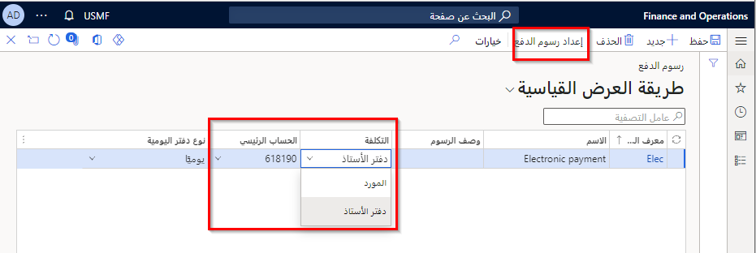
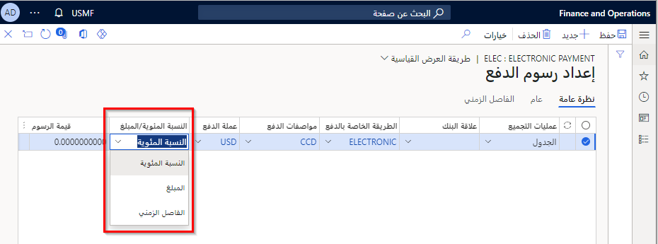

استخدم رسوم الدفع للقيام بالمهام التالية:

- حدد ما إذا كانت ستتم إضافة أي مصاريف إضافية إلى فاتورة المورد. على سبيل المثال، قد يُضيف أحد الموردين رسوماً لإصدار سند إذني، أو قد تتحمل شركة رسوم حوالة بنكية لأحد الموردين.
- قم بتحديد تعريفات الرسوم وتحديد علاقات البنك وتحديد كيفية إنشاء الرسوم.

لإنشاء رسوم دفع، انتقل إلى **الحسابات الدائنة > إعداد الدفع > رسوم الدفع**، وقم بإنشاء سجل جديد. وعليك تحديد ما إذا كان سيتم تحميل التكلفة على **المورد** أم **دفتر الأستاذ** لاستخدام تكلفه مالية للرسوم في حقل **التكلفة**. في حالة تحديد **دفتر الأستاذ**، حدد حساباً في حقل **الحساب الرئيسي** للترحيل في دفتر الأستاذ. كما يجب أيضاً تحديد قيمة لحقل **نوع دفتر اليومية** الذي تكون الرسوم صالحة له في حقل **نوع دفتر اليومية**. وعادة ما يكون نوع دفتر اليومية هذا **حوالة المورد البنكية**.
 

يمكنك تحديد رسوم دفع لإعداد السطور لكل رسوم مستخدمة للبنوك المختلفة وطرق الدفع وأنواع الحوالات ومواصفات الدفع والعملات والفترات الزمنية وفترات المبالغ.

في حالة اتفاق الشركة مع البنك على تحديد الدفع، حدد مواصفات الدفع في حقل **مواصفات الدفع** وحدد العملة التي تتيح الرسوم في حقل **عملة الرسوم**. يمكن للحركات التي تحتوي على هذه العملة فقط أن تتيح الرسوم. في حالة ترك هذا الحقل فارغاً، تقوم جميع العملات بتمكين الرسوم. حدد ما إذا كانت المواصفات نسبة مئوية أم مبلغاً مطلقاً في حقل **النسبة المئوية/المبلغ**.
 

وفي حالة حساب ضريبة المبيعات، يتم ترحيل صافي المبلغ إلى حساب دفتر الأستاذ، ويتم ترحيل مبلغ ضريبة المبيعات إلى حساب ضريبة مبيعات. يمكنك أيضاً إدخال الرسوم لسطر إعداد رسوم الدفع المحدد الذي يعتمد على الفترة بين الحوالة وتواريخ الاستحقاق.

## السيناريو 

تنقل Adventure Works Cycles إلكترونياً مبالغ الفاتورة (المستحقة إلى المورد) للبنك. ثم ينقل البنك بعدئذٍ الأموال مباشرة إلى الحساب البنكي المعيَّن للمورد. 

وبعد تحويل مبلغ الفاتورة، يتم إرسال فاتورة حوالة ورقية تلقائياً إلى كل مورد، توضِّح الحساب المحدد الذي يتم ترحيل الدفع إليه، ومبلغ الدفع الذي تم إصداره. لإدارة رسوم الدفع من البنك، تقرر Adventure Works Cycles إعداد رسوم الدفع لفواتير المورّد. 

