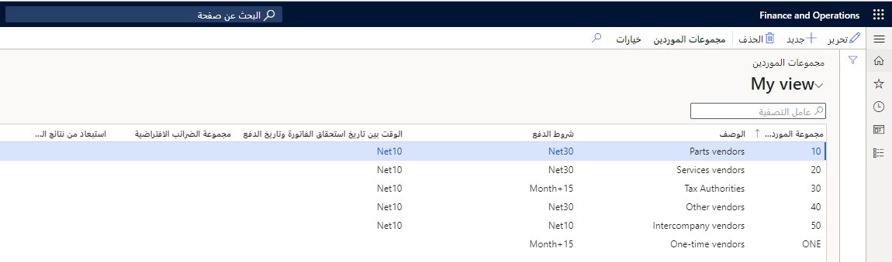

يمكنك إعداد المعلومات التي تكون دائماً هي المعلومات الافتراضية عند إدخال مورد جديد من خلال تجميع الموردين استناداً إلى الخصائص المتشابهة، مثل مشاركة نفس شروط الدفع أو مجموعة ضريبة المبيعات.

يمكنك استخدام مجموعة مورّدين لإعداد الترحيل التلقائي إلى حسابات دفتر الأستاذ العام للاستهلاك الذي تم إنشاؤه بواسطة حركات المورد. كما يمكن أيضاً استخدام مجموعات الموردين في الاتفاقيات التجارية. 

في **الحسابات الدائنة > الموردين > مجموعات الموردين >** ستقوم بإعداد مجموعات الموردين. يلزم إعداد مجموعة مورّدين واحدة على الأقل، لأنه يجب تحديد مجموعة مورّدين عند إنشاء مورّد جديد.

## السيناريو

لدى Adventure Works Cycles العديد من الموردين الذين يتعين عليها مراقبتهم. لتبسيط مهام إدارة الموردين، أنشأت Adventure Works Cycles العديد من مجموعات الموردين للقيام بما يلي:

- حدد ترحيل دفتر الأستاذ لكل مجموعة مورّدين لتحديد حسابات لكل مجموعة مورّدين. يمكنك تحديد الحسابات، أي لديون المورد أو حساب وصول لمورد لديه حساب مقابل مطابق أو حساب استلام أو حساب استهلاك صنف أو حساب خصومات صنف المورد.
- تسجيل موازنات المبيعات لكل مجموعة موردين. 
- إنشاء الإحصائيات التجارية لكل مجموعة موردين لإنشاء إحصائيات المبيعات، علىسبيل المثال، عرض الاستهلاك الشهري لكل مجموعة موردين.

**الحسابات الدائنة > الموردين > مجموعات الموردين**
 

## مثال 

يتم استخدام شرط السداد لتغطية دفع المورد استنادً إلى موازنة مشتريات واحدة لكل مجموعة موردين. إذا تم إعداد موازنة مشتريات لمجموعة المورّدين X وتم وضع ميزانية شراء بقيمة 10000 دولار أمريكي في 15 يونيو، فسيتم تحديد شرط دفع ليتوافق مع الشهر الحالي + 30 يوماً. على هذا الأساس، يتم ترتيب التغطية بحيث يكون سعر الصنف المدرج بالموازنة والذي يبلغ 10000 دولار أمريكي مستحقاً للدفع في 30 يوليو.
 
## إعداد قواعد الترحيل العامة 

لإعداد قواعد الترحيل العامة لكافة الأصناف والحسابات وأكواد ضرائب المبيعات، انتقل إلى **‎الحسابات الدائنة > الموردين > مجموعات الموردين**، في **مجموعات الموردين** جزء الإجراء، حدد زر **الترحيل**.

من خلال تحديد **الجدول**، سينطبق الترحيل الموجود في دفتر الأستاذ على رقم صنف معين فقط.. إذا اخترت **المجموعة**، سيتم تطبيق الترحيل في دفتر الأستاذ على مجموعة أصناف واحدة فقط.

من خلال تحديد **الكل**، سيتم ترحيل كل حركة لكافة أرقام الأصناف الموجودة في نفس الحساب بدفتر الأستاذ. يتم تحديد الأمر حسب **الجدول، المجموعة**، ثم **الكل** للعثور على الحساب المطابق المستخدم للترحيل.

الخيار الأخير هو **الفئة**. يمكنك تحديد قيمه للفئة من القائمة المنسدلة **علاقة الفئة**. يتم ترحيل قيمة علاقة الفئة لكل حركة لجميع أرقام الأصناف المرتبطة بالفئة في نفس الحساب بدفتر الأستاذ.
 

