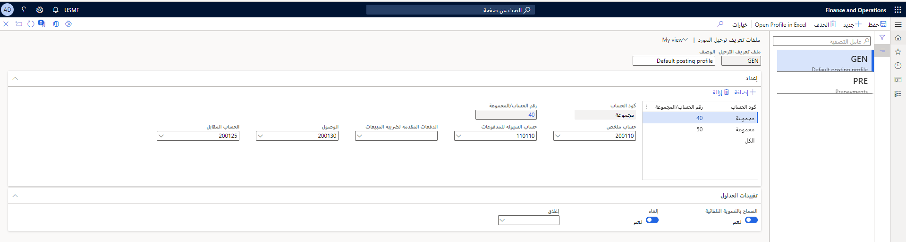

تعد ملفات تعريف الترحيل شائعة في جميع الوحدات النمطية في Finance.

في ملفات تعريف ترحيل الحسابات الدائنة، يتم تحديد الحسابات الملخصة للموردين. تُعد الحسابات الموجزة حسابات مؤقتة حيث يتم ترحيل جميع الفواتير إليها وتسويتها عند الدفع للمورد. يمكنك تعيين ملفات تعريف الترحيل إلى ما يلي:

- مورد واحد
- مجموعات موردين
- كافة الموردين

عندما تقوم بترحيل حركة مورد تلقائياً، يبحث Finance عن حسابات دفتر الأستاذ المعروضة في الأمر السابق. 

تأمل الأمثلة التالية:

- يوجد بند ملف تعريف الترحيل للمورد؛ وهو يستخدم هذا البند.
- لا يوجد بند ملف تعريف الترحيل للمورد، ومع ذلك، يتم استخدام البند المحدد لمجموعة الموردين المرفق بها المورد.
- لا يوجد أي منهما، يتم استخدام بند ملف تعريف الترحيل لجميع الموردين.

في صفحة **ملفات تعريف ترحيل المورد**، يمكن إعداد العديد من ملفات تعريف ترحيل المورد. إذا تمت معالجة جميع حركات المورد معاً، فأنت تقوم بإعداد ملف تعريف ترحيل واحد فقط لجميع الموردين.

**الحسابات الدائنة > إعداد > ملفات تعريف ترحيل المورد**
 

إذا كنت تستخدم سجل فواتير ودفتر يومية الموافقة على الفواتير، فسيتم تسجيل جميع فواتير المورّد باعتبارها قد وصلت ولكن لم تتم الموافقة عليها بعد ويتم ترحيلها في حساب **حركات الوصول** وحساب **مقابل حركات الوصول**. عند الموافقة على هذه الفواتير، يتم تحويل الدين إلى حساب **ملخص المورد**. إذا كانت شركتك لا تستخدم سجل فواتير ودفتر يومية موافقة على الفواتير، فسيتم تحديث كافة فواتير المورّد مباشرةً في حساب **ملخص المورد**. 

لمزيد من المعلومات، راجع [تنفيذ الإجراءات اليومية للحسابات الدائنة في Dynamics 365 Finance](/training/modules/accounts-payable-daily-procedures-dyn365-finance/?azure-portal=true).

بعد إنشاء ملفات تعريف الترحيل، تحتاج إلى تعيين ملف تعريف ترحيل افتراضي في **الحسابات الدائنة > إعداد > معلمات الحسابات الدائنة**. حدد علامة التبويب **دفتر الأستاذ وضريبة المبيعات** ثم حدد قيمة من أجل **ملف تعريف الترحيل**. يجب تحديد ملف تعريف الترحيل لكل تحديث لحركة المورد.
