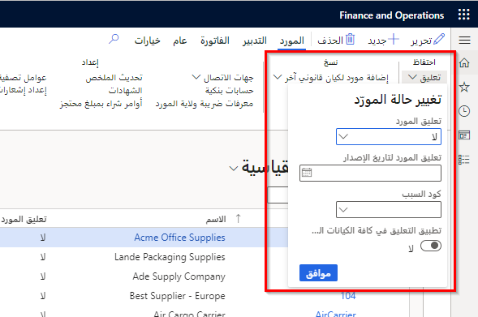
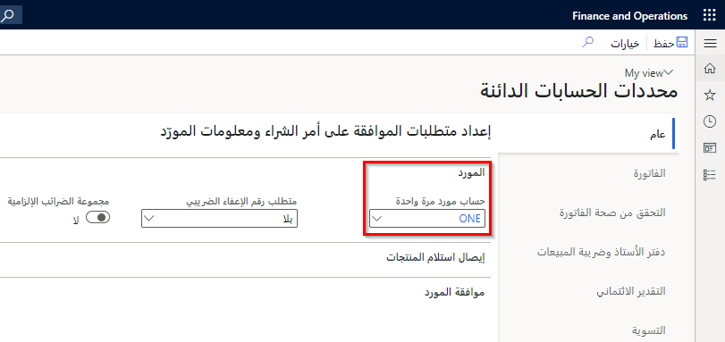

شاهد هذا الفيديو للتعرف على كيفية إنشاء مجموعات الموردين وشروط الدفع وجداول الدفع وأيام الدفع والموردين.

> [!VIDEO https://www.microsoft.com/videoplayer/embed/RE43FAc]

تقوم الشركة بشراء السلع والخدمات من الموردين. يجب ربط كل حركة حسابات دائنة بمورد. استخدم صفحة **الموردون** لإنشاء الموردين والاحتفاظ بهم والاستعلام عنهم.

أدخل دائماً أكبر قدر ممكن من البيانات عند إعداد Finance لأن هذه البيانات ستُستخدم في جميع أنحاء النظام من أجل الفواتير والمدفوعات والتقارير.

تظهر البيانات الأساسية تلقائياً على أنها البيانات الافتراضية لجميع الحركات التي تشمل المورد؛ إلا أنه بإمكانك دائماً تغيير المعلومات الافتراضية إذا احتجت إلى تجاوزها.

نوصي بإعداد لغة افتراضية للكيان القانوني، بحيث تتالي في جميع الوحدات النمطية. يرجع السبب في ذلك إلى أنه سيُطلب منك رمز اللغة عند قيامك بإنشاء مستندات خارجية، مثل أوامر الشراء.

إذا كانت عناوين التسليم البديلة في الولايات أو البلدان/المناطق المختلفة، فتأكد من إدخال مجموعة الضريبة المناسبة لكل عنوان بديل. تحتاج إلى إقران مجموعات الضرائب بعنوان التسليم.

أدخل الحد الأقصى للمبلغ المستحق المسموح به في رصيد حساب المورد في حقل **حد الائتمان**. يتم تحديد هذا المبلغ دائماً بعملة المحاسبة.

## عمليات تعليق المورد 

لتطبيق عمليات تعليق المورد، حدد علامة التبويب **المورد**، ثم حدد الزر **قيد الانتظار** في مجموعة **الاحتفاظ** بجزء الإجراء.

انتقل إلى **الحسابات الدائنة > الموردين > جميع الموردين**.
 

تتوفر أنواع عمليات التعليق التالية:

- **لا** - لا توجد عمليات تعليق لدى المورد. يتم السماح بكافة أنواع الحركات.
- **الفاتورة** - لا يمكن إنشاء أي فواتير أو ترحيلها لهذا المورد.
- **الكل** - كافة الحركات الخاصة بهذا المورد قيد الانتظار.
- **الدفع** - لا يمكن إنشاء أي مدفوعات لهذا المورد. لا يزال من الممكن ترحيل المدفوعات التي تم إنشاؤها قبل تطبيق عملية التعليق.
- **الطلب** - لا يمكن إنشاء أي طلبات لهذا المورد.
- **أبداً** - منع وضع الموردين قيد الانتظار لعدم النشاط.

بعد تحديد نوع تعليق المورّد، حدد **تعليق المورد لتاريخ الإصدار** و **كود السبب** الخاص بتعليق المورد في نفس القائمة المنسدلة.

## مجموعة المشترين 

حدد مجموعة مشترين في قائمة **مجموعة المشتريين**. يترتب على التحديد إنشاء ارتباطات بين الموردين والموظفين والأصناف/ الأوامر المخططة عندما تقوم بإنشاء عمليات الشراء والإنتاج.

على سبيل المثال، استخدم مجموعات المشترين لكي تقوم بتحديد الموظفين المرتبطين بمجموعة المشتريين الحالية ولتغيير مجموعة المشتريين إذا قام الموظف بتغيير نطاق المسؤولية.
لمزيد من المعلومات حول العلاقات بين الشركات الشقيقة، راجع [تكوين التجارة بين الشركات الشقيقة واستخدامها في Dynamics 365 Supply Chain Management](/learn/modules/configure-use-intercompany-trade-dyn365-supply-chain-mgmt/?azure-portal=true)

## حساب العميل 
حدد رقم **حساب العميل** إذا كان المورد عميلاً أيضاً ويتم استخدامه في الحركات بين الشركات الشقيقة.
 

## موردو المرة الواحدة 

إذا كنت تستخدم مورد المرة الواحدة، فأنت بحاجة إلى إعداد تسلسل رقمي لموردي المرة الواحدة في صفحة **معلمات الحسابات الدائنة** في القسم **التسلسلات الرقمية**. 

في القسم **عام** من صفحة **معلمات الحسابات الدائنة**، حدد رقم حساب المورد الذي يمكن أن يكون بمثابة القالب الافتراضي لموردي المرة واحدة.

يتم نسخ المعلومات تلقائياً عند إنشاء مورد مرة واحدة في صفحة **الموردون**. يقوم Finance بإنشاء مورد المرة الواحدة عندما يتم إنشاء أمر شراء لمورد المرة الواحدة. 

باستثناء رقم المورد، يكتسب مورد المرة الواحدة جميع المعلومات الأساسية من رقم المورد المحدد في هذا الحقل. يجب تحديد التسلسل الرقمي لمورد المرة الواحدة في صفحة **التسلسلات الرقمية**. إذا لم يكن لديك أي من موردي المرة الواحدة، فاترك **رقم المورد الافتراضي** فارغاً.

