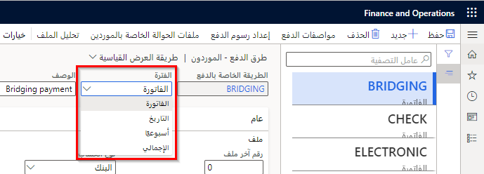
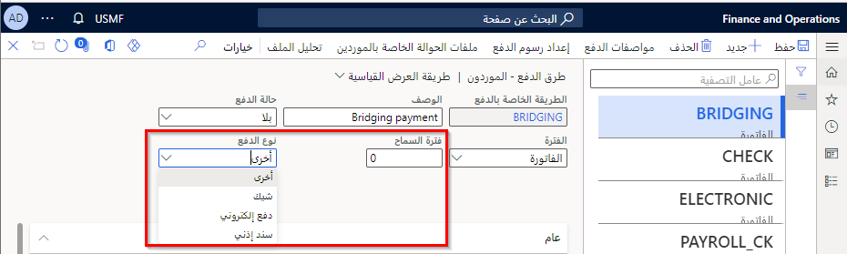
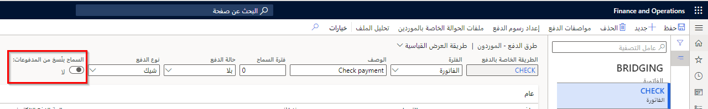
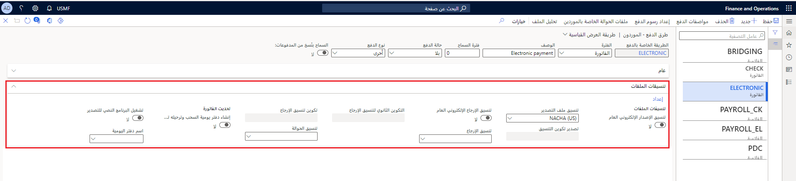

تقدم العديد من الشركات عدة طرق لدفع الفواتير المستحقة، مثل ما يلي:

- دائن‬
- الدفع نقداً مقدماً
- الكمبيالة 
- الشيكات والمدفوعات الإلكترونية

شاهد هذا الفيديو للتعرف على كيفية إنشاء طريقة دفع.

 > [!VIDEO https://www.microsoft.com/videoplayer/embed/RE43VfY]

باستخدام صفحة **طرق الدفع**، يمكنك تحديد جميع طرق الدفع التي تستخدمها شركتك للدفع للموردين. لكل طريقة دفع، أدخل المعلومات التي توضح كيفية تلخيص المدفوعات وترحيلها.

يمكن تعيين طرق الدفع للموردين ودفاتر اليومية وأوامر الشراء في وحدة **الحسابات الدائنة**.

في صفحة **طرق الدفع**، يمكنك تحديد ما إذا كان يجب على النظام تجميع إجمالي الفواتير في عرض الدفع التلقائي. 

انتقل إلى **الحسابات الدائنة > إعداد الدفع > طرق الدفع**.

تتوفر الخيارات التالية:

- **الفاتورة** - تنشئ تحويل دفع واحد لكل فاتورة.
- **التاريخ** - يجمع بين الدفع لجميع فواتير المورّدين المستحقة في نفس التاريخ.
- **الأسبوع** - يجمع بين مدفوعات جميع فواتير المورّدين بتاريخ استحقاق في نفس الأسبوع.
- **الإجمالي** - يجمع كافة الفواتير من الموردين لنفس الدفعة.

يمكنك أيضاً إدخال عدد الأيام التي تمت إضافتها إلى تاريخ الخصم النقدي أو تاريخ الاستحقاق لتحديد أوسع فترة زمنية يمكن خلالها الحصول على خصم نقدي. بمعنى آخر، يمكنك إدخال عدد الأيام التي يمنحها المورد لإجراء الدفع بعد طريقة الخصم المحددة، مع الاستمرار في تقديم خصم نقدي في حقل **فترة السماح**.
 

يمكنك تحديد نوع الدفع المسموح به في حقل نوع الدفع، حيث تتوفر الخيارات التالية:

- **أخرى** - طريقة الدفع ليست من بين الخيارات أو لم يتم تحديدها بعد. وتكون هذه هي القيمة الافتراضية.
- **الشيك** - عندما تكون طريقة الدفع هي الشيك.
- **الدفع الإلكتروني** - تكون طريقة الدفع إلكترونية، مثل التحويل النقدي الإلكتروني (EFT). عند استخدام هذا النوع من أنوع الدفع، يقوم النظام بإجراء عمليات التحقق البنكية التي يتم تخطيها إذا كنت تستخدم أنواع دفع أخرى.
- **السند الإذني** - تكون طريقة الدفع سند إذني. 

يجب تمكين حقل **السماح بنُسخ من المدفوعات** للسماح للمستخدمين بطباعة نسخ مدفوعات غير قابلة للتفاوض لطريقة الدفع المحددة. قد تحتاج إلى طباعة نسخ من المدفوعات لحل نزاعات الدفع، أو لإعلام الموردين بالفواتير التي تم دفعها في تاريخ معين.
 

تحتاج إلى تحديد التنسيق لتصدير الدفع، على سبيل المثال، الشيك الذي يُعلم الشؤون المالية بكيفية التواصل مع البنك. يسمي هذا الخيار **تنسيق التصدير**.

إذا كانت قائمه التنسيق فارغة، حدد الزر **إعداد** وحدد من التنسيقات المتوفرة للملفات

إذا كان البنك يدعم ملف الإرجاع الإلكتروني، فاختر تنسيقاً في **تنسيق الإرجاع** لإرجاع رسالة.  وأخيراً، يمكنك إدخال **تنسيق الحوالة** لأحد البنوك.

يمكنك تمكين خيار **تنسيق المرتجعات الإلكترونية العامة** للاستفادة من ميزات إعداد التقارير الإلكترونية في Finance، بدلاً من استخدام تنسيقات الإرجاع والحوالة والتصدير. يمكنك معرفة المزيد حول إعداد التقارير الإلكترونية في [تكوين التقارير الإلكترونية في Dynamics 365 Finance](/learn/modules/configure-electronic-reporting-finance-operations/?azure-portal=true).

