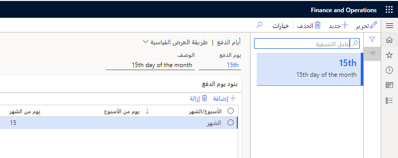

يتم تقاسم شروط الدفع لالحسابات المدينة والحسابات الدائنة. ويعني هذا أنه يمكن أيضاً استخدام شروط الدفع التي تم إنشاؤها في الحسابات المدينة في الحسابات الدائنة والعكس صحيح. استخدم صفحة **شروط الدفع** لتحديد جميع شروط الدفع المستخدمة من قِبل الشركة والعملاء. استخدم شرط الدفع لحساب تاريخ الاستحقاق استناداً إلى تاريخ الفاتورة.

حدد شروط الدفع لكل مما يلي:

-   العميل في صفحة **العملاء**
-   أمر المبيعات في صفحة **أمر المبيعات**

### السيناريو
تتمتع Adventure Works Cycles بمدة دفع قياسية للعميل تبلغ 30 يوماً. إذا قامت فاتورة بمدة دفع صافية تبلغ 30 يوماً بشحن البضائع في 15 سبتمبر، وكانت الفاتورة مؤرخة في 15 نوفمبر، يكون الدفع مستحقاً في 15 ديسمبر. مع تسوية لمدة 30 يوماً، يجب أن تتلقى Adventure Works Cycles المدفوعات في غضون 30 يوماً من تاريخ الفاتورة، وفقاً للتسوية. بعد هذا التاريخ، إذا لم تكتمل الدفعة، فقد تتم إضافة رسوم فائدة بنسبة مئوية محددة شهرياً إلى الفاتورة، ويجب على العميل دفع رسوم إضافية.
قد يتم تطبيق رسوم خدمات أخرى.

إذا كان شرط الدفع مرتبطاً بجدول الدفع، يتم استخدام القواعد التي تم إعدادها في شرط الدفع لحساب تاريخ استحقاق القسط الأول.

يتم استخدام القواعد التي تم إعدادها في جدول الدفع لحساب تاريخ استحقاق الأقساط التالية.

في حالة تحديد طريقة الدفع **COD** (**نقداً عند الاستلام**) وتمكين **الدفع النقدي**، فهذا يشير إلى أن الدفعات يجب أن تتم نقداً وليس بشيك. ولذلك، في منطقة **ترحيل دفتر الأستاذ** من حقل **النقد**، تحتاج إلى تحديد حساب رئيسي لتسوية الفواتير التي سيتم استخدامها للدفع النقدي.

## أيام الدفع 

يمكنك استخدام أيام الدفع لتحديد يوم الدفع المستخدم لحساب تاريخ الاستحقاق. يمكن تحديد يوم الدفع إما ليوم في الأسبوع أو في الشهر. يساعد هذا في اقتراح الدفع لاقتراح فواتير العملاء التي يجب إحضارها إلى دفتر يوميات دفع العميل للترحيل. يجب إدخال التاريخ كرقم رقمي، مثل **10**، بدلاً من رقم ترتيبي مثل العاشر.

**الحسابات المدينة > إعداد المدفوعات > أيام الدفع**

 

