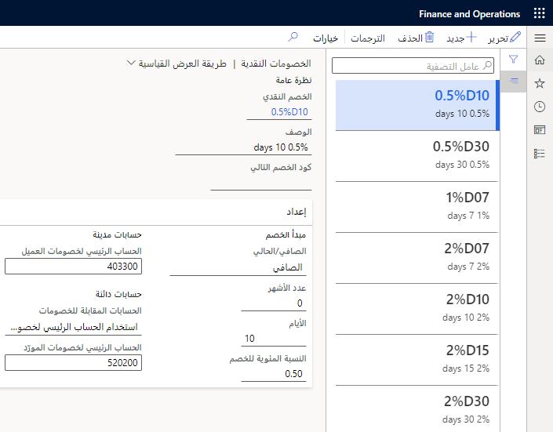
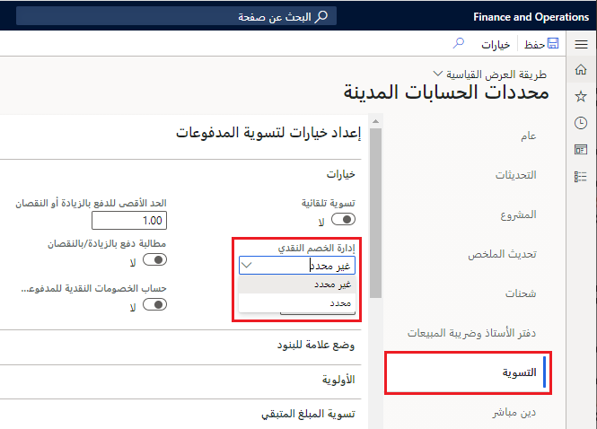
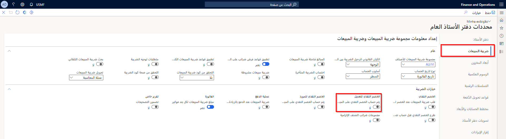

حسب الحالة، يمكنك القيام بما يلي بالخصومات النقدية:

-   الاستحقاق في حالة استيفاء عميل لشروط الدفع الخاصة بشركتك في الوقت المحدد، أو يتم منحه للعملاء عند دفع فواتيرهم في فترة زمنية محددة.
-   الربط بجداول **العميل** وجداول **المورّد**.
-   الترحيل إلى حساب دفتر الأستاذ المحدد للحصول على خصم نقدي تلقائياً إذا تمت تسوية فاتورة في الوقت المحدد.

ضع في الاعتبار السيناريو التالي:

تقدم Adventure Works Cycles خصماً نقدياً إذا كان العميل يسدد الفواتير خلال مواعيد محددة.

قامت Adventure Works Cycles بإعداد الأكواد التالية:

-   5D10% - خصم نقدي بنسبة 10 بالمائة عند دفع المبلغ خلال خمسة أيام.
-   10D5% - خصم نقدي بنسبة 5 بالمائة عند دفع المبلغ خلال عشرة أيام.
-   14D2% - خصم نقدي بنسبة 2 بالمائة عند دفع المبلغ خلال 14 يوماً.

تتم الخصومات النقدية الثلاثة بشكل متسلسل عندما يقترب موعد الخصم النقدي. ومع ذلك، يُمنح خصم نقدي واحد فقط.

لتحديد الخصومات النقدية التي تلي الكود 5D10%، يتم تحديد الكود 10D5% في قائمة **كود الخصم التالي**. في الكود 10D5%، يتم تحديد الكود 14D2% في قائمة **كود الخصم التالي**. وأخيراً، على الكود 14D2%، تُترك قائمة **كود** **الخصم التالي** فارغة. يمكنك تعيين خصومات نقدية للعملاء أو دفاتر اليومية أو أوامر المبيعات.

**الحسابات المدينة > إعداد المدفوعات > الخصومات النقدية**.

 

في حقل **إدارة الخصومات النقدية** في صفحة **الحسابات المدينة > الإعداد > محددات الحسابات المدينة** وعلامة تبويب **التسوية**، حدد ما يجب القيام به مع الدفع بالزيادة أو بالنقصان في حاله عدم اقتطاع الخصم النقدي عند تسويه الفاتورة.

في حالة اختيار **غير محدد**، يتم ترحيل مبلغ الدفع بالنقصان إلى حساب الخصم النقدي للعميل. إذا تم ترحيل الخصم النقدي القابل للتطبيق في نفس الشركة التي يوجد بها الدفع بالزيادة، فسوف تقوم إدارة الشؤون المالية بتعديل الخصم النقدي.

إذا لم يتم ترحيل الخصم النقدي القابل للتطبيق في نفس الشركة التي يوجد بها الدفع بالزيادة، فسيتم ترحيله إلى حساب الخصم النقدي للنظام. إذا كانت هناك خصومات نقدية متعددة بحيث تمت تسوية دفع المبلغ بالزيادة مقابل فواتير متعددة، فسيتم تعديل الخصم من الفاتورة الأخيرة إلى الخصم الأول.

علامة تبويب **الحسابات المدينة > إعداد > محددات الحسابات المدينة > تسوية**

 

في حالة اختيار **محدد**، يتم ترحيل مبلغ الدفع بالزيادة أو النقصان إلى حساب الخصم النقدي للعميل.

لفهم هذين الخيارين بشكل أفضل، يمكنك النظر في المثال التالي:

يبلغ إجمالي فاتورة العميل 105.00 دولارات أمريكية، والخصم النقدي الذي يمكن الحصول عليه هو 10.50 دولارات أمريكية. مع الأخذ في الاعتبار الخصم النقدي، سيدفع العميل 94.50 دولاراً أمريكياً (105-10.50).

ومع ذلك، فإن المبلغ الذي تتلقاه من العميل هو 95.00 دولاراً أمريكياً.

في حالة تعيين معلمة **إدارة الخصم النقدي** إلى **غير محدد**، تتم تسوية الفاتورة وترحيل فرق 0.50 دولار أمريكي إلى حساب دفتر الأستاذ الذي يتم تحديده لفروق الخصم النقدي.

في حالة تعيين معلمة **إدارة الخصم النقدي** إلى **محدد**، تتم تسوية الفاتورة وترحيل فرق 0.50 دولار أمريكي إلى حساب الخصم النقدي للعميل.

لتحديد أنه يتم حساب الخصم النقدي استناداً إلى المبلغ مضاف إليه ضريبة المبيعات، انتقل إلى صفحة **محددات دفتر الأستاذ العام**، وحدد علامة تبويب **ضريبة المبيعات**، ثم قم بتوسيع علامة التبويب السريعة **خيارات الضريبة**. في هذا القسم، ستحتاج إلى تمكين **احتساب الخصم النقدي المفروض على المبلغ متضمناً ضريبة المبيعات** في منطقة **الخصم النقدي للعميل**.

**دفتر الأستاذ العام > إعداد دفتر الأستاذ > محددات دفتر الأستاذ العام > ضريبة المبيعات**

