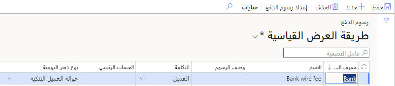
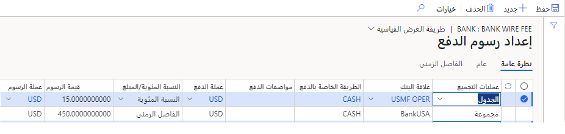
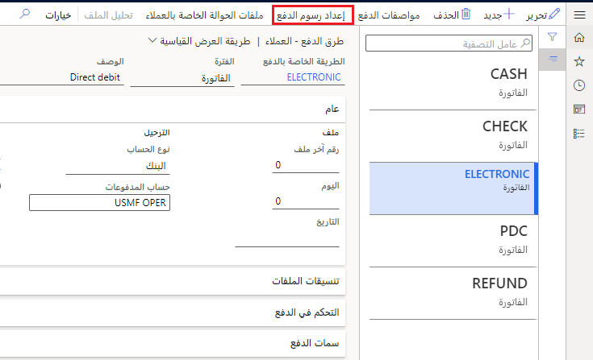

يمكنك استخدام رسوم الدفع للقيام بالمهام التالية:

-   حدد ما إذا كانت ستتم إضافة المزيد من المصاريف إلى فاتورة العميل. على سبيل المثال، قد يكون أحد العملاء مسؤولاً عن رسم لإصدار كمبيالة، أو قد يتحمل عميل رسوم حوالة بنكية.

-   قم بتحديد تعريفات الرسوم وتحديد علاقات البنك وتحديد كيفية إنشاء الرسوم.

لإنشاء رسوم دفع، انتقل إلى صفحة **حسابات مقبوضات > إعداد الدفع > رسوم الدفع**، ثم قم بإنشاء سجل جديد. تُضيف رسوم الدفع، كما توضح لقطة الشاشة أدناه، معرفاً أو اسماً أو وصفاً، أو ما إذا كان يتم تحميلها على عميل أو حساب دفتر الأستاذ، ونوع دفتر اليومية. يكون عادة نوع دفتر اليومية دفتر يومية **حوالة العميل البنكية**.  
 

بمجرد التعرف على الرسوم، تحدد بعد ذلك **إعداد رسوم الدفع** لتوفير مزيد من التفاصيل، كما هو موضح أدناه. يمكنك تحديد رسوم دفع لإعداد السطور لكل رسم مستخدم للبنوك المختلفة وطرق الدفع وأنواع الحوالات ومواصفات الدفع والعملات والفترات الزمنية وفترات المبالغ. في هذه الشاشة، يتم تحديد **علاقة البنك** استناداً إلى تحديد **عمليات التجميع**، والذي يمكن أن يكون **جدول** أو **مجموعة** أو **الكل**. ثم يتم تحديد **طريقة الدفع** التي تنطبق على الرسوم، بالإضافة إلى **عملة** الدفع والرسوم. ويمكن أن تكون **قيمة الرسوم** إما **نسبة مئوية** من الحركة أو **مبلغاً** ثابتاً.
 

بمجرد إعداد رسوم الدفع، يمكن استخدامها في صفحة **طريقة الدفع**. 

وفي حالة حساب ضريبة المبيعات، يتم ترحيل صافي المبلغ إلى حساب دفتر الأستاذ، ويتم ترحيل مبلغ ضريبة المبيعات إلى حساب ضريبة مبيعات. يمكنك أيضاً إدخال الرسوم لسطر إعداد رسوم الدفع المحدد الذي يعتمد على الفترة بين الحوالة وتواريخ الاستحقاق.

**حسابات مقبوضات > إعداد المدفوعات > طرق الدفع**

### السيناريو

تقبل Adventure Works Cycles إلكترونياً مدفوعات عميل (مستحقة لشركة Adventure Works Cycles) وتقوم بإيداعها للبنك. ثم يقوم بنك العميل بعد ذلك بتحويل الأموال مباشرة إلى حساب بنك خاص بشركة Adventure Works Cycles.

وبعد ترحيل الدفع إلى الحساب البنكي، ستتم تسوية الفاتورة والدفع. بشكل اختياري، يتم إرسال دفع حوالة ورقية تلقائياً من عميل يوضح الحساب المحدد الذي يتم ترحيل الدفع إليه ومبلغ الدفع الذي تم إصداره. لإدارة رسوم الدفع من البنك، تقرر Adventure Works Cycles إعداد رسوم الدفع لمدفوعات العميل.
