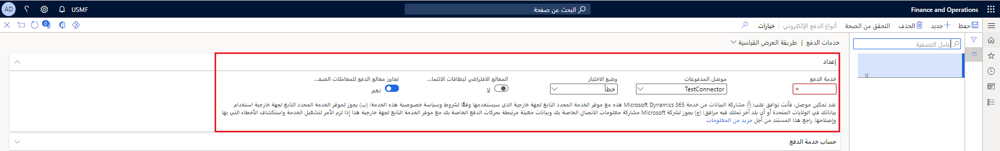

لاستخدام بطاقات الائتمان، يجب إعداد خدمة الدفع وتنشيطها في الصفحة **خدمات الدفع**. تعمل خدمة الدفع كجسر بين كيانك القانوني والبنك الذي يُعالج رسوم بطاقة الائتمان الخاصة بالعميل. يجب العمل باستخدام موفر بطاقة ائتمان مُدرج في الحقل **موصل المدفوعات** وإعداد حساب مع هذا الموفر.

**الحسابات المدينة > إعداد المدفوعات > خدمات الدفع**.

بعد ذلك، يجب عليك إعداد الخيارات الأخرى في صفحة **خدمات الدفع**. يمكنك إعداد أنواع بطاقات الائتمان للعديد من موفري بطاقات الائتمان بصفحة **أنواع بطاقات الائتمان** وتنشيط الموفر كموفر افتراضي. اتبع الخطوات التالية لإكمال الإعداد:

-   قم بالوصول عبر **الحسابات المدينة** ثم قم بإعداد صفحات **الإعداد**، 
-   في الصفحة **معلمات الحسابات المدينة**، حدد المعلمات لاستخدام تفويضات بطاقة الائتمان.
-   في الصفحة **شروط الدفع**، قم بإعداد شروط الدفع لبطاقات الائتمان. في الحقل **نوع الدفع**، حدد **بطاقة الائتمان.**
-   في الصفحة **بطاقات ائتمان العميل**، أدخل معلومات بطاقة الائتمان للعملاء.

## إضافة بطاقة ائتمان جديدة

يمكنك إنشاء سجلات بطاقة ائتمان جديدة في صفحة **العملاء** باستخدام **العميل > إعداد > بطاقة ائتمان**. يمكنك أيضاً إنشاء سجلات بطاقات الائتمان عند إدخال أوامر المبيعات في صفحة **أمر المبيعات**، وذلك باستخدام **إدارة >العميل > بطاقة الائتمان > التسجيل**.

## إضافة بطاقة ائتمان لأمر مبيعات

يمكنك إضافة بطاقة ائتمان إلى أمر مبيعات عن طريق تحديد بطاقة ائتمان في البحث عن بطاقة الائتمان في علامة التبويب السريعة **السعر والخصومات** في الصفحة **أمر المبيعات**. لبدء عملية التخويل، في جزء الإجراءات، في علامة التبويب **إدارة**، حدد **بطاقة الائتمان** ثم **تخويل**.

## تخويل بطاقة ائتمان

عندما يتم اعتماد بطاقة الائتمان، يتم التحقق من رقم البطاقة واسم حاملها، ويتم تأكيد الرصيد الائتماني المتاح. بشكل اختياري، يتم التحقق من صحة قيمه التحقق من البطاقة وعنوان حامل البطاقة.
يتم بعد ذلك تخفيض الرصيد الائتماني المتاح بواسطة العميل بمقدار مبلغ الفاتورة. تُرسل خدمة الدفع معلومات تفيد بأن بطاقة الائتمان قد تمت الموافقة عليها أو رفضها. عندما يتم إصدار فاتورة لأمر المبيعات، يتم خصم (تسجيل) مبلغ الفاتورة من بطاقة الائتمان.

## قيمة التحقق من البطاقة

يمكنك المطالبة بقيمه التحقق من البطاقة، والتي يُشار اليها أحياناً باسم كود الأمان الخاص بالبطاقة. يختلف ذلك فيما بين موفري بطاقات الائتمان، على سبيل المثال، تمتلك American Express قيمة مكونة من أربعة أرقام، بينما تتضمن Discover وMasterCard وVisa قيماً مكونة من ثلاثة أرقام.

## التحقق من العنوان

يتم دائما إرسال معلومات التحقق من العنوان إلى موفر الدفع.
يمكنك تحديد القدر المطلوب من المعلومات لقبول الحركة. تأكد من مراجعة الموفر الخاص بك لتحديد ما إذا كان سيقبل هذه المعلومات أم لا. فيما يلي الخيارات الخاصة بالتحقق من العنوان:

-   **قبول الحركة دائماً** - قبول الحركة، بغض النظر عن نتائج التحقق من العنوان.
-   **صاحب الحساب** - مقارنة اسم حامل البطاقة الموجود في الحركة بمعلومات شركة بطاقة الائتمان.
-   **عنوان الفوترة** - مقارنة اسم حامل البطاقة وعنوان إرسال الفواتير الموجودين في الحركة بمعلومات شركة بطاقة الائتمان.
-   **الرمز البريدي للفاتورة** - مقارنة اسم حامل البطاقة والرمز البريدي للفاتورة الموجودين في الحركة بمعلومات شركة بطاقة الائتمان.

## دعم البيانات

بالنسبة لكل نوع بطاقة ائتمان مدعوم، يمكنك تحديد مستوى دعم البيانات. يتحكم المستوي في مقدار المعلومات التي تتعلق حركة يتم تحويلها إلى خدمة الدفع. تأكد من مراجعة موفر الخدمة الخاص بك لتحديد ما إذا كان يمكنه تقديم هذه المعلومات أم لا. فيما يلي الخيارات الخاصة بمستوي دعم البيانات:

-   **المستوى 1** - تحويل تاريخ الحركة ومبلغ الحركة والوصف.
-   **المستوى 2** - تحويل كافة معلومات المستوي 1، بالإضافة إلى عناوين الشحن والتاجر والمعلومات الضريبية.
-   **المستوى 3** - تحويل كافة معلومات المستوي 2، بالإضافة إلى معلومات سطر الأمر.

## المدفوعات الجزئية

إذا قمت بشحن جزء من أمر، فسيتم تسجيل مبلغ الأمر الجزئي، وغلق التخويل (الذي كان موجودً بمبلغ الأمر بأكمله). يتم بعد ذلك إرسال تخويل جديد للمبلغ المتبقي من الأمر الذي لم يتم شحنه.

## إلغاء تخويل

لإلغاء تخويل بطاقة ائتمان، يمكنك تغيير أسلوب الدفع إلى أسلوب آخر لا يحتوي على نوع **بطاقة ائتمان**.
