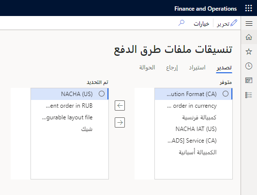
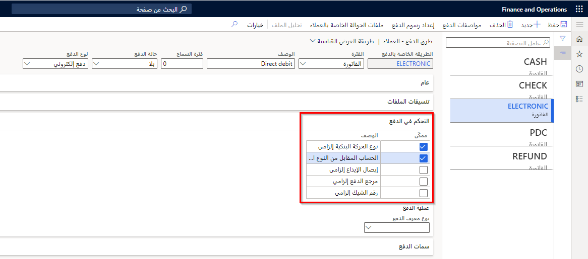

تقدم العديد من الشركات عدة طرق لدفع الفواتير المستحقة، مثل ما يلي:

-   دائن‬
-   الدفع نقداً مقدماً
-   الكمبيالة
-   الشيكات والمدفوعات الإلكترونية

في صفحة **أساليب الدفع**، يمكنك تحديد كافة أساليب الدفع التي تستخدمها الشركة لاستلام المدفوعات من عملائها. لكل طريقة دفع، أدخل المعلومات التي توضح كيفية تلخيص المدفوعات وترحيلها.

يمكن تعيين أساليب الدفع إلى:

-   العملاء 
-   دفاتر اليومية
-   أوامر المبيعات

## تنسيقات الملفات 

عند إعداد طرق الدفع للحسابات المدينة (أو الحسابات الدائنة)، يمكنك إما استخدام تنسيقات الملفات أو استخدام التقارير الإلكترونية، والتي تُعرف أيضاً باسم ER أو غالباً GER.

لإعداد تنسيق الملف، حدد الزر **إعداد** في صفحة **أساليب الدفع**، ثم حدد التنسيق المطلوب بحيث يمكن تحديده في الحقول المناسبة.

**‎الحسابات المدينة > إعداد المدفوعات> علامة التبويب السريعة طرق الدفع > تنسيقات الملفات** ثم **> إعداد‏‎**

يمكن لكل بنك استخدام معيار مختلف لقبول بياناتك المالية بتنسيق معين، وهذا هو سبب أهمية إعداد التنسيقات بشكل صحيح.

نوصيك باستخدام التقارير الإلكترونية في Finance بدلاً من تنسيقات الملفات لأن لديك العديد من القدرات. لمزيد من المعلومات حول إعداد التقارير الإلكترونية، راجع [تكوين التقارير الإلكترونية في Dynamics 365 Finance](/learn/modules/configure-electronic-reporting-finance-operations/?azure-portal=true).

يتم استخدام تنسيقات الملفات التالية في كل من الحسابات المدينة والحسابات الدائنة للتواصل مع البنوك إلكترونياً:

-   **تنسيق التصدير** - تحديد التنسيق المطلوب لتصدير الدفع الإلكتروني.
-   **تنسيق الاستيراد** - تحديد تنسيق الملف للتقرير البنكي بشأن المدفوعات الواردة من العملاء.
-   **تنسيق الإرجاع** - تحديد تنسيق لإرجاع رسالة من تنسيق التصدير إذا كان البنك يدعم ملف إرجاع إلكتروني.
-   **تنسيق الحوالة** - تحديد تنسيق الملف لإرسال الحوالات إلى بنك معين.

لاحظ أن جميع تنسيقات الملفات متوفرة في الحسابات الدائنة، باستثناء **تنسيق الاستيراد**.

إذا قمت بتمكين خيارات التقارير الإلكترونية العامة للتصدير أو الاستيراد، فسيتم تعطيل القوائم المنسدلة لأنك ستحتاج إلى تنسيق ملفات التكوين للتصدير والاستيراد بدلاً من ذلك.

## التحكم في الدفع 

إذا كنت ترغب في إجراء التحقق من الصحة أثناء استخدام طريقة الدفع في إدخال دفتر اليومية، فحدد التحقق الذي تريده من قسم التحكم في الدفع لطريقة الدفع. يتم إجراء التحقق من الصحة في دفاتر اليومية بمجرد الترحيل عند استخدام طريقة الدفع.

علامة التبويب السريعة **‎الحسابات المدينة > إعداد المدفوعات > أساليب الدفع > التحكم في الدفع**

حدد طريقة واحدة أو أكثر من طرق التحقق التالية:

-   **رقم الشيك إلزامي** - للتحقق من إدخال رقم الشيك.
-   **مرجع الدفع إلزامي** - للتحقق من إدخال مرجع الدفع.
-   **قسيمة الإيداع إلزامية** - للإشارة إلى وجوب تحديد خيار استخدام قسيمة الإيداع.
-   **الحساب المقابل من النوع البنكي** - للتحقق من من أن نوع الحساب المقابل المحدد هو **البنك**.
-   **نوع الحركة البنكية إلزامي** - للتحقق من تحديد نوع الحركة البنكية.
