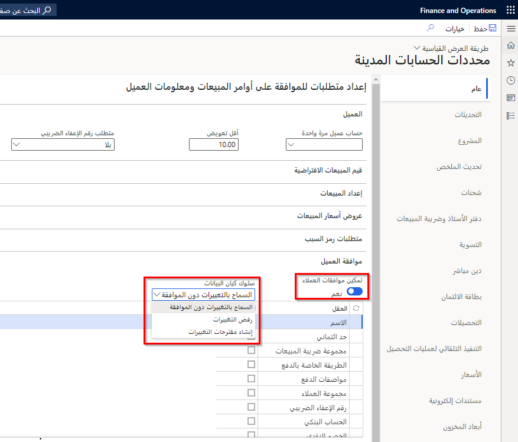
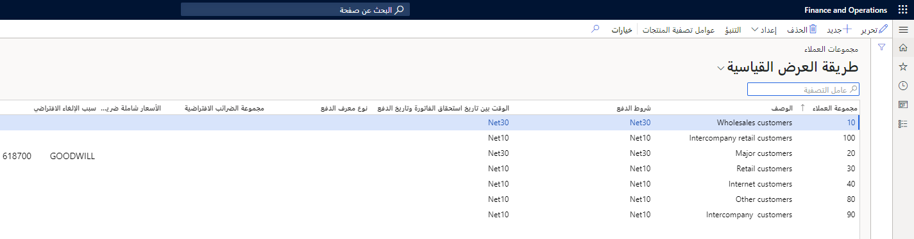
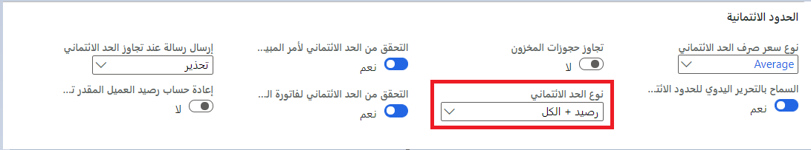

توضح هذه الوحدة كيفية إنشاء عميل والاحتفاظ به. 

## سير عمل العميل 

من خلال استخدام سير عمل العميل في Finance، يمكنك تغيير حقول محددة لعميل، ثم إرسال هذه التغييرات للموافقة عليها باستخدام سير العمل قبل إضافتها إلى العميل.

لإعداد سير عمل العميل، اتبع هذه الخطوات التالية:

1.  يجب عليك تمكين ميزة سير عمل العميل قبل أن تتمكن من استخدامها.
2.  انتقل إلى **الحسابات المدينة > إعداد > معلمات الحسابات المدينة**.
3.  في علامة التبويب **عام** ، بعلامة التبويب السريعة **الموافقة على العميل** ، قم بتعيين خيار **‎تمكين الموافقات على العملاء** إلى **نعم‏‎** لتمكين الميزة.
4.  في حقل **سلوك كيان البيانات** ، حدد السلوك الذي يجب أن تستخدمه كيانات البيانات عند استيراد البيانات:
    -  **السماح بالتغييرات دون موافقة** - يمكن لكيان تحديث سجل العميل دون معالجته من خلال سير العمل.
    - **رفض التغييرات** - لا يمكن إجراء تغييرات على سجل العميل. ستفشل عملية الاستيراد للحقول التي تم تمكينها لسير العمل.
    - **إنشاء مقترحات التغييرات** - سيتم تغيير جميع الحقول فيما عدا الحقول التي تم تمكينها لسير العمل. ستتم إضافة القيم الجديدة لهذه الحقول إلى العميل كمقترحات تغييرات، وسيبدأ تشغيل سير العمل تلقائياً.

        
5.  في قائمة حقول العميل، حدد خانة الاختيار **تمكين‏‎** لكل حقل يجب أن تتم الموافقة عليه قبل إجراء التغييرات.
6.  انتقل إلى **الحسابات المدينة > إعداد > عمليات سير عمل الحسابات المدينة**.
7.  حدد **جديد**.
8.  حدد **‎سير عمل تغيير العميل المقترح**.
9.  قم بإعداد سير العمل بحيث يتطابق مع عملية الموافقة الخاصة بك.
    

## تغيير معلومات العميل وإرسال التغييرات إلى سير العمل 

عندما تقوم بتغيير حقل تم تمكينه لسير العمل، تظهر صفحة **التغييرات المقترحة‎‏** . تعرض هذه الصفحة القيمة الأصلية للحقل والقيمة الجديدة التي قمت بإدخالها.

وفي كل مرة يتم فيها تغيير حقل تم تمكينه لسير العمل، تتم إضافة هذا الحقل إلى قائمة التغييرات المقترحة. لتجاهل القيمة المقترحة لأحد الحقول، استخدم الزر **تجاهل** الموجود بجوار الحقل في القائمة.. لتجاهل جميع التغييرات، استخدم الزر **تجاهل كل التغييرات** الموجود أسفل الصفحة. حدد **موافق** لإغلاق الصفحة.

بعد أن يتوفر لديك تغيير مقترح واحد على الأقل، تظهر قائمتان إضافيتان في الجزء الإجراء: **‎التغييرات المقترحة** و **سير العمل**.

1.  حدد **التغييرات المقترحة** لفتح صفحة **التغييرات المقترحة** وراجع التغييرات التي أجريتها.
2.  حدد **سير العمل > إرسال** لإرسال التغييرات إلى سير العمل.
    يتم تغيير الحالة على الصفحة إلى **التغييرات المعلقة للموافقة**.

يتبع سير العمل عملية سير العمل القياسية في التطبيق Finance and Operations. يتم توجيه القائم بالموافقة إلى صفحة **العميل** حيث يمكنه مراجعة التغييرات في صفحة **التغييرات المقترحة** ثم تحديد **سير العمل > موافقة** للموافقة على سير العمل. بعد إكمال جميع الموافقات، يتم تحديث الحقول بالقيم التي اقترحتها.

لمزيد من المعلومات تتعلق بمن ستقوم بإنشاء سير عمل له، راجع [التعامل مع عمليات سير العمل في تطبيقات Finance and Operations ](/learn/modules/create-use-workflows-finance-operations/?azure-portal=true).

## العملاء 

يجب ربط كل حركة حسابات مدينة بعميل.
استخدم صفحة **العملاء** لإنشاء العملاء والاحتفاظ بها والاستعلام عنهم.

أدخل أكبر قدر ممكن من البيانات لأنه يتم استخدام البيانات في النظام للقيام بما يلي:

-   الفوترة
-   عمليات الدفع
-   التقارير

يتم عرض البيانات الأساسية تلقائياً كإعداد افتراضي لكافة الحركات التي تتضمن العميل. ويمكنك تغيير المعلومات الافتراضية في أي وقت. للإسراع من عملية إنشاء العملاء، يمكنك إنشاء قوالب استنادً إلى الإدخالات الموجودة في الحقول للعملاء المحددين الذين تقوم بتحديدهم كنماذج قوالب.

يمكن لجميع المستخدمين أو مستخدم واحد استخدام القوالب. في حالة توفر قالب عند إنشاء عميل جديد، ستظهر صفحة تعرض قوالب العملاء المتاحة. حدد القالب الذي ينطبق على العميل الجديد. يتم نسخ قيم الحقل الخاصة بالقالب إلى حقول العميل الجديد. يمكنك إجراء تغييرات على الحقول وإدخال مزيد من المعلومات كما هو مناسب.

في حاله استخدام عملاء المرة الواحدة، يجب إعداد تسلسل رقمي في الصفحة **معلمات الحسابات المدينة** في القسم **التسلسل الرقمي**. في المنطقة **عام** من صفحة **معلمات الحسابات المدينة**، حدد رقم حساب العميل الذي يمكن أن يعمل كقالب افتراضي لعملاء المرة الواحدة. يتم نسخ المعلومات تلقائياً عند إنشاء مورد مرة واحدة في صفحة **العملاء**.

يقوم Finance تلقائياً بإنشاء عميل المرة الواحدة عند إنشاء أمر مبيعات لعميل المرة الواحدة. باستثناء رقم العميل، يكتسب عميل المرة الواحدة كافة المعلومات الأساسية من رقم العميل المحدد في هذا الحقل. يجب تحديد تسلسل رقم عميل المرة الواحدة في الصفحة **التسلسلات الرقمية**. في حالة عدم استخدام عميل المرة الواحدة، اترك **رقم العميل الافتراضي** فارغاً.

## مجموعات العملاء 

ضع في اعتبارك ما يلي فيما يتعلق بمجموعات العملاء:

-   يمكنك استخدام مجموعات العملاء لإعداد معلومات معينة يتم دوما تعيينها افتراضياً عند إدخال عميل جديد. على سبيل المثال، استخدم مجموعات العملاء لإعداد الترحيل التلقائي لحسابات دفتر الأستاذ العام للإيراد الذي يتم إنشاؤه بواسطة العملاء.
-   يمكنك إعداد حسابات دفتر الأستاذ للحركات التلقائية التي يتم إنشاؤها فيما يتعلق باستلام المخزون وإصداراته.
-   في الصفحة **مجموعات العملاء**، يمكنك إعداد أي عدد من مجموعات العملاء. يجب إعداد مجموعة عملاء واحدة على الأقل نظراً لأنه يجب تحديد مجموعة عملاء عند إعداد عميل جديد.

### السيناريو

تحظى شركة Adventure Works Cycles بالعديد من العملاء المطلوب منها تتبعهم. وفي سبيل تبسيط تعاملها مع العملاء، قامت شركة Adventure Works Cycles بإعداد مجموعات متعددة للعملاء للقيام بما يلي:

-   تحديد ترحيل دفتر الأستاذ لكل مجموعة عملاء.
-   تسجيل موازنات المبيعات لكل مجموعة من مجموعات العملاء.
-   إنشاء الإحصائيات التجارية لكل مجموعة عملاء، على سبيل المثال، لإنشاء إحصائيات المبيعات التي تعرض المبيعات الشهرية لكل مجموعة عملاء.

**الحسابات المدينة > إعداد > مجموعات العملاء**

## نسخ العملاء باستخدام تسلسلات رقمية مشتركة 

يمكنك استخدام تسلسلات رقمية مشتركة لتعيين معرفات العملاء. كما تتيح لك التسلسلات الرقمية المشتركة نسخ العملاء من كيان قانوني لكيان قانوني آخر ولكن مع استخدام نفس معرفات العملاء في كل من الكيانين القانونيين.

يلزم استخدام نفس التسلسل الرقمي في كل كيان قانوني تريد نسخ عميل له. يمكنك تغيير التسلسل الرقمي للعميل في صفحة **معلمات الحسابات المدينة** لكل كيان قانوني.
حدد **الحسابات المدينة > إعداد > معلمات الحسابات المدينة**، ثم حدد علامة التبويب **التسلسلات الرقمية** .

يمكنك أيضاً إعداد تسلسلات رقمية للعملاء لكل مجموعة عملاء.
يجب أن يكون نطاق التسلسلات الرقمية أيضاً كنوع **مشترك**. يتم استخدام التسلسل الرقمي لمجموعة العملاء أولاً. إذا لم يتم تحديد أي تسلسل رقمي لمجموعة عملاء، فسيتم استخدام التسلسل الرقمي الذي تم تحديده في صفحة **معلمات الحسابات المدينة** .

يمكنك أيضاً نسخ العملاء بين الكيانات القانونية إذا كنت تستخدم معرفات العملاء اليدوية. ومع ذلك، إذا كنت تحاول نسخ أحد العملاء إلى أحد الكيانات القانونية حيث يوجد معرف العميل بالفعل، فلن يتم بدء عملية النسخ.

## حدود الائتمان للعملاء 

يتيح إعداد حد الائتمان تحديد الحد الأقصى من مبلغ الائتمان المطلوب تمديده للعملاء. إذا تم تحديد حد ائتمان، فسيتم التحقق منه تلقائياً عندما يحاول مستخدم تحديث مستند. في حالة تجاوز حد الائتمان، ستُعرض رسالة للمستخدم. يقدم هذا المقال نظرة عامة حول كيفية عمل حدود الائتمان وكذلك إجابات على الأسئلة التالية:

-   ما المستندات والعمليات التي يمكنني التحقق من حدود الائتمان الخاصة بها؟
-   أين يمكنني تكوين الطريقة التي يتم بها حساب الائتمان المتبقي للعميل؟
-   أين يتم استخدام المعلومات المتعلقة بالائتمان المتبقي للعميل؟
-   أين يمكنني تحديد ما إذا كان التعريف مطلوباً لتمديد الائتمان للعميل، ومبلغ الحد الائتماني الذي يتطلب التعريف؟
-   أين يمكنني تحديد ما إذا كان سيتم عرض تحذير أو خطأ في حالة تجاوز حد الائتمان؟
-   كيف يمكنني تحديد حد الائتمان لعميل محدد؟
-   كيف يمكنني التحقق من الحدود الائتمانية يدوياً في أوامر المبيعات؟

استخدم صفحة **معلمات الائتمان والتحصيلات** لتحديد المستندات التي يجب التحقق من حدود الائتمان الخاصة بها. يجب أن تكون عضواً في دور أمان مسؤول النظام (-SYSADMIN-) لإجراء تغييرات على هذه الصفحة.
يمكنك التحقق من حدود الائتمان الخاصة بالمستندات والعمليات التالية:

-   فواتير أوامر المبيعات عند ترحيل الفواتير
-   إيصالات التعبئة لأوامر المبيعات عند تحديث إيصالات التعبئة
-   أوامر المبيعات عند إضافة بنود في صفحة **أمر المبيعات** 
-   أوامر المبيعات عند إنشائها من خلال خدمة
-   فواتير النص الحر عند ترحيل الفواتير

يتم التحقق من حدود الائتمان تلقائياً إذا تم تعيين أي من الخيارات التالية:

-   في صفحة **معلمة الائتمان والتحصيلات** ، يتم تعيين الحقل **نوع حد الائتمان** على أي شيء بخلاف **لا شيء**. يتم التحقق من حدود الائتمان لكافة العملاء.
-   في صفحة **معلمة الائتمان والتحصيلات،** يتم تعيين الحقل **نوع حد الائتمان** على **لا شيء،** ولكن **حد الائتمان الإلزامي** محدد للعميل في صفحة **العملاء**. يتم التحقق من حدود الائتمان لعملاء محددين فقط.

للتحقق من حدود الائتمان للمستندات التالية، يجب عليك تحديد إعدادات إضافية:

-   **فاتورة نصية مجانية** - في صفحة **معلمة الائتمان والتحصيلات**، في منطقة **التصنيف الائتماني**، حدد **التحقق من حد الائتمان على النص المجاني الفاتورة**.
-   **أمر المبيعات** - في صفحة **معلمة الائتمان والتحصيلات**، في منطقة **التصنيف الائتماني**، حدد **التحقق من حد الائتمان على أمر المبيعات**.

يمكنك تكوين Finance لحساب الائتمان المتبقي لدى العميل بأي من الطرق التالية:

-   مقارنة حد الائتمان في مقابل رصيد العميل.
-   مقارنة حد الائتمان في مقابل رصيد العميل ومبالغ إيصالات التعبئة.
-   مقارنة حد الائتمان في مقابل رصيد العميل وجميع أنشطة الحركات المفتوحة. يتضمن ذلك مبالغ كشف مبالغ إيصالات التعبئة ومبالغ أوامر المبيعات.

استخدم صفحة **معلمة الائتمان والتحصيلات** لتحديد المعلومات المراد مقارنتها. يجب أن تكون عضواً في دور أمان مسؤول النظام (-SYSADMIN-) لإجراء تغييرات في هذه الصفحة.
في الحقل **نوع حد الائتمان** ، حدد ما إذا كنت تريد إجراء عمليات تحقق لحد الائتمان وكذلك المعلومات حول الحركة المطلوب تضمينها عند التحقق من حد الائتمان. حدد من الخيارات التالية:

-   **بلا**  -عدم التحقق من حدود الائتمان. يمكنك تجاوز هذا الخيار لعميل محدد من خلال تحديد خانة الاختيار **الحد الائتمان الإلزامي** في صفحة **العملاء** . إذا قمت بذلك، سيتم التحقق من حد الائتمان في مقابل رصيد العميل.
-   **الرصيد** - يتم التحقق من حد الائتمان في مقابل رصيد العميل.
-   **الرصيد + إيصال التعبئة أو إيصال استلام المنتجات** - يتم التحقق من حد الائتمان في مقابل رصيد العميل وعمليات التسليم.
-   **الرصيد+الكل** - يتم التحقق من حد الائتمان في مقابل رصيد العميل وعمليات التسليم والأوامر المفتوحة.

يتم حساب المعلومات المتعلقة برصيد العميل ومبلغ الائتمان المتبقي وتخزينه عند إنشاء لقطة تقادم، ويتم عرضها في صفحة **التحصيلات** . قد لا تشتمل المبالغ التي يتم عرضها في صفحة **التحصيلات** جميع أنشطة الحركات حتى يتم إنشاء لقطة تقادم جديدة.

وفقاً للمستندات المحددة، يتم حساب المعلومات المتعلقة برصيد العميل ومبلغ الائتمان المتبقي عند تحديث أوامر المبيعات وإيصالات التعبئة وفواتير العملاء. إذا كان المبلغ بالمستند الذي تعمل به يؤدي إلى تجاوز حد الائتمان، فسيتم عرض رسالة.
