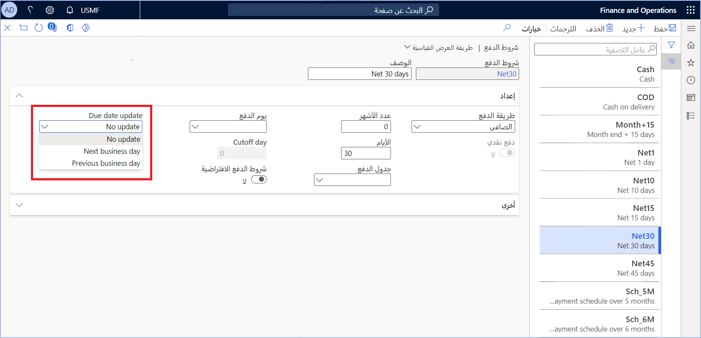
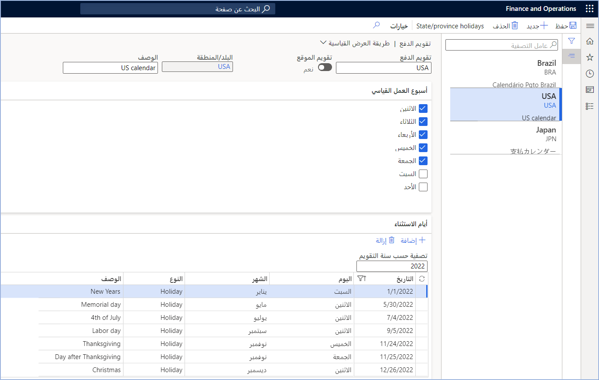
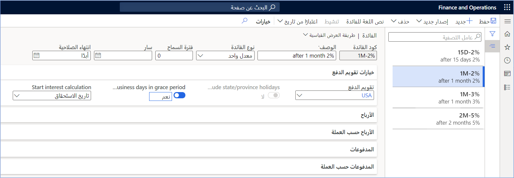
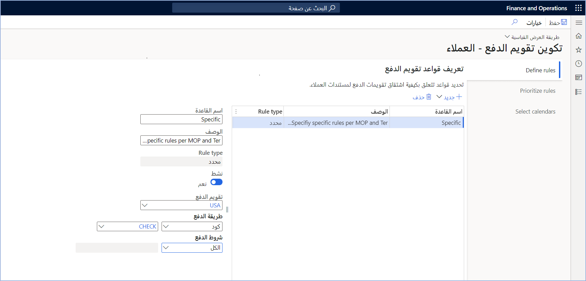
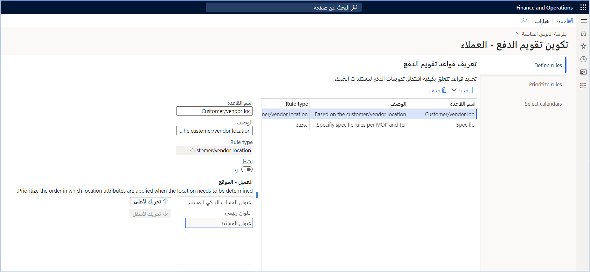
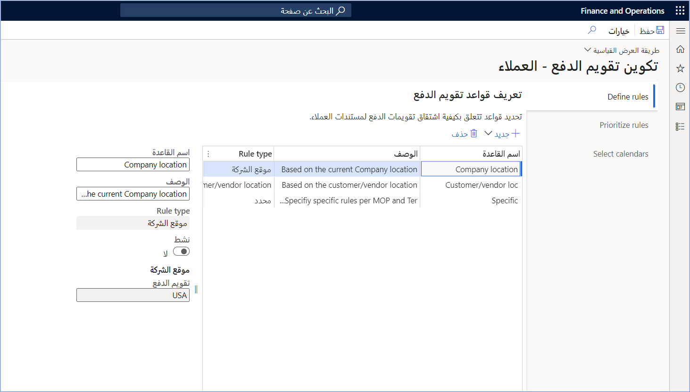

تتيح تقويمات الدفع إمكانية تحديد أيام العمل القياسية التي سيتم استخدامها لأحد العملاء. عندما تكون بصدد تحديد تاريخ استحقاق لإحدى الفواتير، سيتغير التاريخ لتجنب أيام العطلة وسيتم وضعه في يوم العمل التالي أو الأقدم لحساب الفائدة. 

## تقويمات الدفع
تشير تقويمات الدفع إلى أيام العمل التي سيستخدمها النظام عند تحديد تاريخ الاستحقاق أو حساب الفائدة للمدفوعات المتأخرة. ستبدأ الفائدة في أول يوم عمل قبل تاريخ الاستحقاق أو بعده إذا صادف تاريخ الاستحقاق أحد أيام العطلة.

### تمكين تقويمات الدفع
تأكد من تمكين مفتاح التكوين لأحد تقويمات الدفع للسماح للنظام باستخدام أحد التقويمات. بالإضافة إلى ذلك، يتعين عليك تحديد ما إذا كنت تستخدم تقويمات الدفع لتعديل تواريخ استحقاق الدفع أم لا. 

لإعداد شروط الدفع، انتقل إلى **الحسابات المدينة > الإعداد > إعداد الدفع > شروط الدفع**.

 

### إنشاء تقويم دفع

يُمكنك تحديد التقويمات في المستويات التالية:

- متاح لجميع البلدان/المناطق
- البلد/المنطقة المحددة
- الإعدادات المحلية ضمن البلد/المنطقة (مثل المحافظة أو المنطقة)
- المدينة

لإعداد تقويم دفع، اتبع هذه الخطوات:

1. انتقل إلى **حسابات المقبوضات > إعداد المدفوعات > تقويم الدفع**.

2. قم بإنشاء تقويم لكل بلد/منطقة تقوم بالعمل معها. بالنسبة لكل تقويم، ستقوم بتحديد أسبوع العمل القياسي والاستثناءات إلى الوضع القياسي. 

    وتحدث الاستثناءات إذا تعيّن اعتبار اليوم الذي لا يكون عادةً يوم عمل يومَ عمل أو تحديد عطلة تقع عادةً في أحد أيام العمل. يُمكنك إضافة وصف للإشارة إلى سبب أن التاريخ يمثل استثناءً لأسبوع العمل القياسي.

    > [!NOTE]
    > بخلاف التقويمات الأخرى داخل النظام، لا يُظهر تقويم الدفع كل تاريخ وما إذا كنت تعمل أو في عطلة. وهو إعداد عام لأيام العمل العادية والاستثناءات.

1. إذا قمت بتحديد تقويم **الموقع**، فأدخل **البلد/المنطقة** حتى يتم استخدام التقويم فقط للعملاء الموجودين في تلك البلد/المنطقة. 

     

1. إذا كنت بحاجة إلى إضافة استثناءات خاصة بالمحافظة أو المنطقة، فحدد عنصر القائمة **أيام عطلة المحافظة/المنطقة** ثم أضف الاستثناءات الخاصة بكل محافظة أو منطقة.

1. إذا كان لإحدى المدن في محافظة/منطقة المزيد من أيام العطلات، فحدد عنصر القائمة **أيام عطلات المدينة** من الصَفحة **أيام عطلات المحافظة/المنطقة**.
 
    يُمكن لاستثناءات المحافظة/المنطقة والمدينة فقط تحديد المزيد من أيام العطلات. لا يُمكنك استخدام هذه الاستثناءات لتغيير أيام العطلات العادية إلى أيام العمل.

### تحديد تقويم دفع
وبشكل افتراضي، يقوم النظام بتحديد تقويم الدفع الذي سيتم استخدامه استناداً إلى كود **الفائدة** المستخدَم لإحدى الفواتير. لإعداد أكواد الفائدة، انتقل إلى **‏‫عمليات التحصيل والائتمان > إعداد > إعداد أكواد الفائدة**. 

يُمكن لكل كود فائدة تحديد تقويم وما إذا كان سيتم تضمين أيام العمل في حسابات الفائدة أم لا. يُمكنك أيضاً اختيار ما إذا كنت تريد تضمين عطلة المحافظة/المنطقة والمدينة.

 

لا يؤثر تقويم الدفع إلا على تاريخ البدء لحسابات الفائدة. عندما تبدأ الفائدة في التراكم، سيسجل النظام الفائدة كل يوم، وليس أيام العمل فقط.

إذا لم تقم بتحديد قواعد تقويم الدفع، فسيقوم النظام بتحديد تقويم الدفع الذي سيتم استخدامه استناداً إلى كود الفائدة المحدد لتصنيف الفوترة الخاص بالعميل. في حالة عدم وجود كود فائدة ولم يتم تعيين الحقل **استخدام كود الفائدة من ملف تعريف الترحيل**، سيستخدم النظام كود الفائدة في تصنيف الفوترة. وبخلاف ذلك، سيستخدم النظام كود الفائدة في ملف تعريف الترحيل. 
 
## قواعد تقويم الدفع
تتيح قواعد تقويم الدفع إمكانية تحديد تقويمات الدفع بخلاف التقويمات المحددة بواسطة أكواد الفائدة. لإعداد هذه القواعد، انتقل إلى **الحسابات المدينة > الإعداد > إعداد المدفوعات > تكوين تقويم الدفع**.
 
عند إنشاء القواعد، يُمكنك تحديد أولوية للقاعدة. في حالة عثور النظام على عدة نتائج مطابقة‬، سيستخدم التقويم الذي يتطابق مع قاعدة الأولوية القصوى.

### إنشاء قواعد
عند إنشاء قاعدة جديدة، ستحتاج إلى إدخال اسم ووصف ونوع. يُمكنك تحديد أنواع القواعد التالية:

- **محدد** – يختار هذا النوع من القواعد تقويم الدفع لطريقة الدفع وشروط الدفع المحددة.
- **موقع العميل/المورد** – يستخدم هذا النوع من القواعد عنوان العميل/المورد لتحديد تقويم الدفع. يُمكنك تحديد ثلاثة عناوين وتحديد الترتيب لفحص كل عنوان.
- **موقع الشركة** – تستخدم هذه القاعدة موقع الشركة الحالية لتعيين تقويم الدفع.

تنشئ القيم التي تُدخلها مع القاعدة المعايير التي تحدد ما إذا كان سيتم استخدام التقويم المحدد للقاعدة أم لا.
 
### مثال على مجموعة القواعد
في هذا المثال، تم تحديد ثلاث قواعد: **محددة** و **موقع العميل/المورد** و **موقع الشركة**. تستخدم الأمثلة نوع القاعدة كاسم لكل قاعدة للمساعدة في فهم المثال بشكل أبسط. 

#### محدد
تنطبق القاعدة **المحددة** على العملاء والموردين حيث **الشيك** هو طريقة الدفع بغض النظر عن طريقة الدفع (المحددة باسم **الكل**). تحدد هذه القاعدة تقويم الدفع المطلوب استخدامه.

 

#### موقع العميل/المورد
تقوم هذه القاعدة **موقع العميل/المورد** أولاً بالبحث في العنوان الأساسي للعميل/المورد، ثم عنوان المستند (الفاتورة)، وأخيراً عنوان الحساب البنكي للمستند. يُمكنك نقل العناوين إلى الأعلى أو إلى الأسفل للحصول عليها بالتسلسل الذي ترغب في البحث فيه.

تستخدم القاعدة **موقع العميل/المورد** العنوان المحدد للبحث عن تقويم الدفع استناداً إلى البلد/المنطقة والمحافظة/المنطقة والمدينة. إذا لم يكن لديك تقويم دفع صالح لأيٍّ من عناوين العميل، فلن يقوم النظام بتحديد تقويم الدفع.

#### موقع الشركة
تعتمد قاعدة **موقع الشركة** على العنوان الأساسي الحالي للشركة/الكيان القانوني. ويحدد النظام تلقائياً التقويم إذا تطابق تقويم واحد فقط مع عنوان الشركة. إذا لم يكن لديك تقويم دفع صالح لعنوان الشركة الحالي، فلن يقوم النظام بتحديد أي تقويم دفع.

### ترتيب أولوية القواعد
والآن بعد إنشاء القواعد، يجب ترتيب أولوياتها نظراً لاحتمالية تطبيق قواعد متعددة على عميل أو مورد معين. حدد **ترتيب أولويات القواعد** في صَفحة **تكوين تقويم الدفع** لتحديد الأولويات لكل قاعدة.
يعرض النظام القواعد النشطة فقط. حدد **تحريك لأعلى** أو **تحريك لأسفل** لفرز القواعد في التسلسل الذي يجب أن يقوم النظام فيه بتقييم القواعد.

### حدد تقويمات الدفع التي يُمكن لقواعد تقويم الدفع استخدامها
عند استخدام قواعد موقع (الشركة أو العميل)، يُمكنك تحديد تقويمات الدفع التي يُمكن للنظام تحديدها. يُمكنك أيضاً تحديد ما إذا كان سيتم استخدام الاستثناءات المحددة لمستويات المحافظة/المنطقة والمدينة. إذا حاولت إحدى قواعد الشركة تحديد تقويم لم يتم تمكينه، فلن يستخدم النظام تقويم الدفع.
