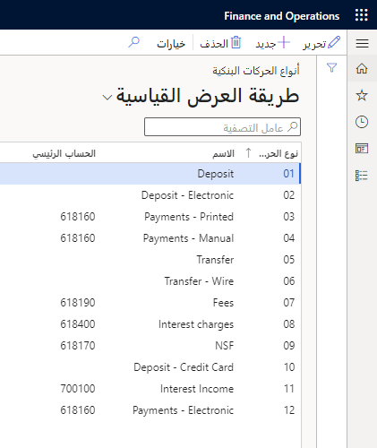
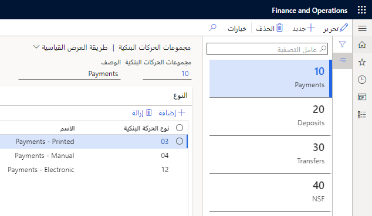

## أنواع الحركات البنكية 

لفهم سبب أهمية أنواع الحركات، أثناء تكوين بنك لشركة ما، ضع في اعتبارك السيناريو التالي.

### السيناريو 

يجب على آني، موظفة الحسابات في Adventure Works Cycles International، إعداد الوظائف البنكية لشركة جديدة. تقوم Annie أولاً بإعداد أنواع المعاملات التي يجب أن تقوم بها Adventure Works Cycles، مثل الإيداع والسحب. وبعد ذلك قامت بتجميع أنواع المعاملات هذه للسماح بمستوى إضافي لإعداد التقارير والتحليل. بعد ذلك، أنشأت آني مجموعات بنكية للبنوك التي تمتلك الشركة معها حسابات متعددة. وبعد ذلك تقوم بإنشاء أكواد الغرض من الدفع لتقديم التقارير إلى البنك المركزي. تشير آني إلى الحساب الذي يتم استخدامه للشيكات المرتجعة من البنك وسلسلة الأرقام المستخدمة في المستندات البنكية.
أخيراً، بعد أن تنتهي آني من إعداد الوظائف البنكية، تقوم بإدخال المعلومات الخاصة بالحسابات البنكية للشركة وتشير، لكل حساب، إلى كيفية تصميم الشيكات.

لا يوفر هذا السيناريو مثالاً واقعياً لأحد المتطلبات فحسب، بل يُعدك أيضاً، كمستشار وظيفي لمساعدة آني، في سيناريو يُعد مطلباً تم تحديده كجزء من معلومات جمعك.

تتمثل الخطوة الأولى في التعرف على المزيد حول أنواع الحركات البنكية. يمكنك استخدام أنواع الحركات البنكية لإعداد أنواع المعاملات التي يجب إجراؤها في الحسابات البنكية للشركة، مثل قسائم الإيداع والرسوم ورسوم الفائدة. 

**إدارة النقد والبنوك > الإعداد > أنواع الحركات البنكية**

 

إذا أبلغ البنك عن حركات في كشوف حساباته، يمكن للشركات استخدام تجميع لأنواع الحركات لتسوية موجزة. 

يمكن للمستخدمين الإشارة إلى نوع الحركة في أوراق عمل دفتر اليومية. عندما يتم تسجيل دفتر اليومية، ينسخ التطبيق محتويات حقل **نوع الحركة البنكية** إلى الحركة البنكية.

تحتاج إلى إنشاء نوع حركة واحد لحركات الأموال غير الكافية (NSF). تحدث حركات NSF عندما يتم إرجاع الشيك من البنك لأن الحساب البنكي يفتقر إلى الأموال الكافية لتنفيذ الشيك. 

يتم استخدام NSF لتحديد المدفوعات المرتجعة. عندما يقوم البنك بإرجاع دفعة، يقوم مُعرّف NSF تلقائياً بإلغاء الدفع من النظام. كما أنه يشير إلى الدفعة بحيث لا يتم تحديدها عند تسوية الحساب البنكي.

تساعد حركات NSF أيضاً مستخدمي الائتمان والتحصيلات في تسجيل NSF وتطبيق رسوم إضافية يفرضها البنك على حساب العميل. 

## مجموعات الحركات البنكية 

تساعدك مجموعات الحركات البنكية في إعداد مجموعات من أنواع الحركات البنكية المختلفة. في تسوية كشف الحساب البنكي، يمكنك حساب الإجماليات لكل مجموعة حركات بنكية ولكل نوع حركة بنكية. 

**إدارة النقد والبنوك > الإعداد > مجموعات الحركات البنكية**

على سبيل المثال، قد تتضمن مجموعة من التحويلات أنواع الحركات البنكية مثل التحويل والتحويل البنكي.

لمزيد من المعلومات حول طرق الدفع المختلفة، راجع [طرق دفع الحسابات الدائنة](/learn/modules/configure-accounts-payable-dyn365-finance/9-method-payment/?azure-portal=true) و[طرق دفع حسابات المقبوضات](/learn/modules/configure-accounts-receivable-dyn365-finance/7-methods-payment-control/?azure-portal=true).
