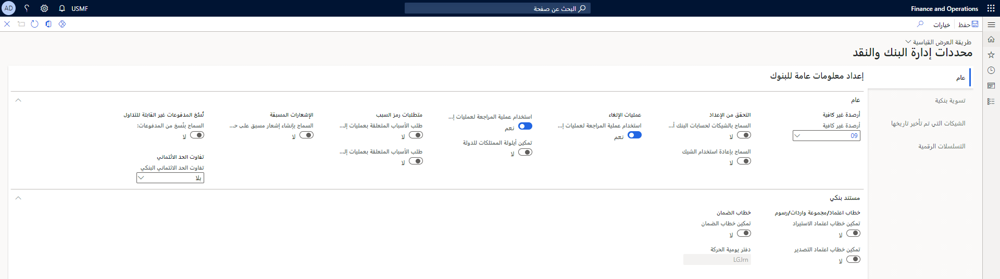

يمكنك استخدام صفحة **معلمات إدارة النقد والبنوك** في **إدارة النقد والبنوك > الإعداد** لتحديد قواعد الشيكات، والإشارة إلى التسلسل الرقمي لأنواع مختلفة من الحركات داخل Finance.
 
 

## الإشعارات المسبقة 

يمكنك تحديد خانة الاختيار **السماح بإنشاء التعليمات المسبقة على الحسابات البنكية غير النشطة** للسماح للمستخدمين بإنشاء إشارات مسبقة للحسابات البنكية غير النشطة.

## نسخ المدفوعات 

حدد خانة الاختيار **السماح بنسخ المدفوعات** للسماح للمستخدمين بطباعة نسخ من المدفوعات. وتشمل هذه الشيكات والسندات الإذنية والمدفوعات الإلكترونية. تتم طباعة نسخ الدفع كشيكات غير قابلة للتداول، مما يساعد المستخدمين على تسوية الخلافات مع الموردين أو العملاء.

## تفاوت الحد الائتماني 

استخدم قائمة **تفاوت حد الائتمان البنكي** لتحديد كيفية إعلام المستخدم عندما تتسبب دفتر يومية دفع تم ترحيله في رصيد يتجاوز حد الائتمان. 

تتوفر الخيارات التالية:

- **بلا** - لم يتم إنشاء أي تحذير أو خطأ في النظام.
- **تحذير** - يقوم النظام بإنشاء إعلام بالتحذير.
- **خطأ** - يقوم النظام بإنشاء إعلام بالخطأ.

