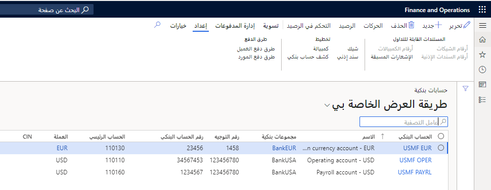
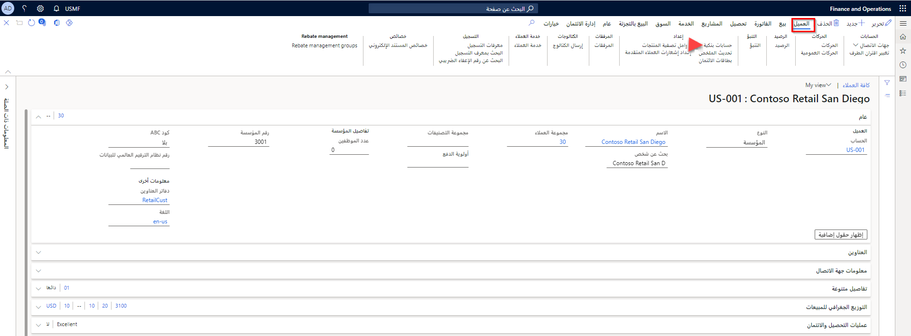

توضح هذه الوحدة كيفية تكوين البنوك وتخطيطات البنوك في Finance.

## مجموعات بنكية 

أنت تستخدم مجموعات البنك عندما تشترك العديد من الحسابات البنكية في نفس معلومات العنوان أو رقم التوجيه‬. عند إنشاء حساب بنكي جديد وإدخال المجموعة البنكية، سيتم نسخ معلومات المجموعة البنكية إلى الحساب تلقائياً. 

على سبيل المثال، يمكنك إنشاء مجموعة بنكية لمؤسسة مالية واحدة فيها خمسة حسابات مفتوحة.

يمكنك تحديث الأرصدة في نفس الوقت لكافة البنوك التي تنتمي إلى نفس المجموعة من خلال النقر فوق الزر **تحديث الحسابات البنكية** في صفحة **‏‫إدارة النقد والبنوك‬ > إعداد > المجموعات البنكية**.

## الحسابات البنكية 

يمكنك إدخال كافة المعلومات وصيانتها للحسابات البنكية للشركة في صفحة **الحسابات البنكية** في **إدارة البنك والنقد > الحسابات البنكية**. استخدم الخيارات الموجودة في الصفحة لعرض التفاصيل الخاصة بكل حساب بنكي، مثل الحركات والرصيد الحالي والشيكات التي تم إنشاؤها. 

يجب عليك تسمية الحسابات حتى يمكن التعرف عليها بسهولة. في Finance، يتم تحديد الحسابات البنكية حسب الاسم ورقم الحساب.

شاهد هذا الفيديو للتعرف على كيفية إعداد حساب بنكي لشركة جديدة.

 > [!VIDEO https://www.microsoft.com/videoplayer/embed/RE42hNt]

## إعداد المعلومات البنكية للمورد والعميل 

لتمكين المدفوعات الإلكترونية للعملاء والموردين، تحتاج إلى إعداد معلومات البنك الخاصة بالمورد والعميل كخطوة من خطوات إنشاء طريقة الدفع كنوع إلكتروني. الغرض من إعداد الحسابات البنكية للعملاء هو تكوين ملفات دفع العملاء التي يمكن استخدامها لحركات، مثل الديون المباشرة في النظام.

يمكنك إعداد المعلومات البنكية للمورد أو العميل من **الوحدة النمطية لعمليات التحصيل والائتمان‬ > العميل > كل العملاء > الحسابات البنكية**.

 
## الإشعارات المسبقة 

حدد خانة الاختيار **الإشعار المسبق المطلوب** إذا طلب البنك إشعارات مسبقة للحركات الإلكترونية.
إذا كانت الإشارات المسبقة مطلوبة، فحدد عدد الأيام التي يطلبها البنك لمعالجة إشعار مسبق في الحقل **أيام الاستجابة للإشعار المسبق**. 

يجب على البنك معالجة الإشعار المسبق قبل قبول المدفوعات الإلكترونية. لا يتوفر هذا الحقل إلا إذا قمت بتحديد خانة الاختيار **الإشعار المسبق مطلوب**.

## الحالة النشطة 

استخدم الحقول **نشط** لإدخال تواريخ معينة عندما يصبح الحساب البنكي نشطاً.
يعد الحقلان التاليان اختياريين ويكونا متاحين إذا تم تعيين الحقل **حالة الحساب البنكي** إلى **نشط لكافة الحركات**:

- **نشط من** - أدخل التاريخ الذي سيصبح فيه الحساب البنكي نشطاً ومتاحاً للحركات الجديدة. في حالة عدم إدخال تاريخ، سيكون حساب البنك متاحاً على الفور للحركات الجديدة.
- **نشط إلى** -أدخل التاريخ الذي لن يكون فيه الحساب البنكي نشطاً للحركات الجديدة. 

سيستمر إجراء أية حركات حالية لم تكتمل بحلول هذا التاريخ، مثل المدفوعات المعلقة كما تم جدولتها في الأصل. إذا لم تُدخل تاريخاً، فسيظل الحساب البنكي نشطاً بشكل غير محدود.

يمكنك استخدام حالة الحساب البنكي التالية لتحديد الحالة المراد استخدامها للحساب البنكي:

- **نشط لكافة الحركات**-الحساب البنكي نشط ومتاح لجميع الحركات.
- **غير نشط للحركات الجديدة** - لا يمكن جدولة أي حركات جديدة لهذا الحساب البنكي. سيستمر إجراء أية حركات حالية لم تكتمل بعدُ بحلول هذا التاريخ، مثل المدفوعات المُعلقة كما تم جدولتها في الأصل.
- **غير نشط لكافة الحركات** - لا يمكن جدولة أي حركات، سواء كانت جديدة أو حالية، أو معالجتها لهذا الحساب البنكي.

## حد الائتمان 

إذا كان البنك يستخدم حدود الائتمان لهذا الحساب، فاستخدم الحقل **حد الائتمان** لإدخال المبلغ الذي يقدمه البنك لهذا الحساب.

## تخطيط الشيك 

صفحة **تخطيط الشيك** هي المكان الذي تقوم فيه بإعداد تخطيط الشيك للحسابات البنكية. يمكنك تحديد تخطيط شيك مختلف لكل حساب بنكي.

في الصفحة **تخطيط شيك** وفي الصفحتين **السندات الإذنية‬** و **تخطيط الكمبيالة**، يمكنك تحديد الأسلوب المستخدم لإنشاء أرقام الشيكات من القائمة **أسلوب رقم الشيك**. 

يمكنك استخدام أحد الأسلوبين التاليتين، والذي يمكن تغييره إذا قامت الشركة بتغيير سياستها الخاصة بالتخطيطات:

- **ثابت** -استخدم هذا الأسلوب إذا كانت لديك شيكات مطبوعة مسبقاً. قبل أن تتمكن من استخدام الشيكات للدفع، فإنه يجب إنشاؤها عن طريق تحديد **أرقام الشيك** من علامة التبويب **إعداد** في جزء الإجراءات في الصفحة **الحسابات البنكية**.
- **مجاناً** -استخدم هذا الأسلوب إذا لم يكن لديك شيكات مطبوعة مسبقاً. يتم اقتراح أرقام الشيكات تلقائياً عند استخدام الشيكات الخاصة بالدفع.

لاحظ أنه على الرغم من أن العديد من الشركات في جميع أنحاء العالم تستخدم المدفوعات الإلكترونية، إلا أن بعض الشركات أو الوكالات الحكومية لا تزال تستخدم الشيكات كأسلوب لدفع المبالغ المستردة. لهذا السبب يجب أن تكون على دراية بتخطيط الشيك. 

## تحديد خيارات MICR 

لتوفير المال، تطبع العديد من الشركات الشيكات الخاصة بها. يستخدمون الورق القياسي، لكنهم يطبعون رمز التعرف على الأحرف بالحبر المغناطيسي (MICR)، والذي يستخدم للتحقق من شرعية أو أصالة المستندات الورقية، مثل الشيكات. 

يُستخدم الحبر الخاص، الذي يتأثر بالمجالات المغناطيسية، في طباعة أحرف معينة على المستندات الأصلية، مثل رقم الحساب البنكي ورقم المسار ورقم الشيك.

ستتوفر لديك الخيارات التالية أثناء تحديد MICR خلال تخطيط الشيك: **أصفار البادئة** -للإشارة إلى ما إذا كان سطر MICR يحتوي على أصفار بادئة أم لا.
**طول رقم الشيك** -يشير إلى عدد الأحرف التي تم إدخالها في سطر MICR لرقم الشيك.
**سطر-MICR** - أدخل سطر MICR الكامل، والذي يتضمن المحددات. 

لا يمكن إدخال رقم الشيك نظراً لأنه فريد لكل شيك. قم بتعيين المكان لرقم الشيك في سطر MICR بتسلسل الأحرف %1.

لا يمكن تضمين سطر MICR إلا إذا كان من المقرر طباعة الشيك على ورقة فارغة من دون العلامات المطبوعة مسبقاً، مثل العلامات المائية.

يجب مراعاة السيناريو التالي لكي تفهم بشكل أفضل سبب احتياج بعض الشركات لإنشاء الشيكات.

### السيناريو 

في شركة Adventure Works Cycles، تتولى آني الإمساك بالدفاتر التي تدير إنشاء الشيكات والمدفوعات الإلكترونية وحذفها وإلغاءها. تقوم آني بإنشاء الشيكات المستردة للعملاء عند الطلب ومعالجة المدفوعات للموردين. أيضاً، عندما تتلقى Adventure Works Cycles كشف حساب بنكي، تقوم آني بتسوية البيان بالحركات في التطبيق.

بعد قيام المستخدمين بإنشاء شيك، فبإمكانهم حذفه إذا لم يُستخدم. تكون الشيكات التي تم إنشاؤها ولكن لم يتم استخدامها بالحالة **تم إنشاؤها** في الحقل **الحالة**. إذا قمت بتضمين الشيكات التي لها حالة بخلاف **تم إنشاؤها** في الفترة بين الحقلين **من** و **إلى**، فلن يتم حذف أي شيكات وسيتم إلغاء المهمة **حذف الشيكات**.

قد لا تتمكن من استخدام الشيكات بعد طباعتها أو محاولة طباعتها. على سبيل المثال، في حالة تلف الشيك أثناء طباعته، فإنه يجب إلغاء الشيكات غير المستخدمة. إذا كنت ترغب في إلغاء شيك في سطر دفتر يومية الدفع، فحدد زر **حالة الدفع** ثم انقر على **مرفوض**. يمكنك استخدام ذلك فقط في حالة عدم ترحيل الشيكات.

## الحوالة البنكية 

استخدم صفحة **الحوالة** لعرض الحوالات التي تمت على الحسابات البنكية للشركة. الحوالة عبارة عن وظيفة لإنشاء الملف الذي يجب إرساله إلى البنك مع تعليمات الدفع الإلكتروني لفواتير المورّد.

