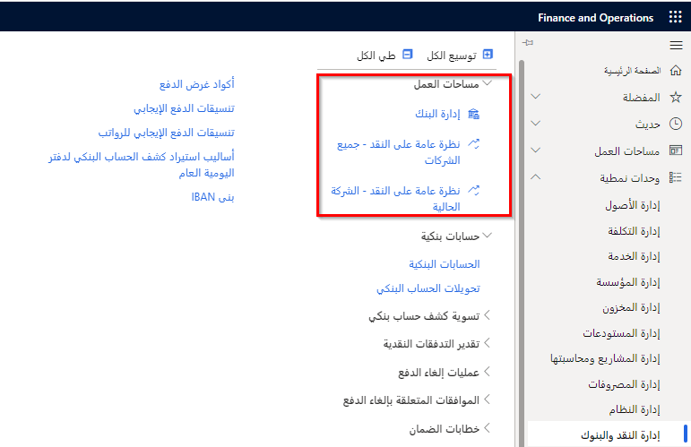

يمكنك استخدام أدوات التنبؤ بالتدفقات النقدية لتحليل متطلبات العملات والتدفقات النقدية المقبلة حتى يتسنى لك تقدير احتياجات الشركة من النقد في المستقبل.

## التنبؤ بالتدفقات النقدية 

للحصول على تنبؤات بالتدفقات النقدية، أكمل المهام التالية:

- قم بتحديد جميع حسابات السيولة وسردها في قائمة. حسابات السيولة عبارة عن حسابات الشركة الخاصة بالنقد أو ما يعادله.
- قم بتكوين السلوك التنبؤي للحركات الذي يؤثر على حسابات السيولة الخاصة بالشركة.

بعد إكمال هذه المهام، يمكنك حساب التنبؤات الخاصة بمتطلبات العملات المستقبلية والتدفقات النقدية وتحليلها.
يمكن أن يتكامل التنبؤ بالتدفقات النقدية مع دفتر الأستاذ العام والحسابات الدائنة والحسابات المدينة والموازنة وإدارة المخزون. 

تستخدم عملية التنبؤ معلومات الحركة التي يتم إدخالها في Finance، وتتنبأ عملية الحساب بالتأثير المتوقع للنقد على كل حركة. 

يتم أخذ الأنواع التالية من الحركات في الاعتبار عند حساب التدفقات النقدية:

- **أوامر المبيعات** - أوامر المبيعات التي لم تتم فوترتها بعدُ والتي ينتج عنها مبيعات فعلية أو مالية.
- **أوامر الشراء** - أوامر الشراء التي لم تتم فوترتها بعدُ والتي تنتج عنها عمليات شراء فعلية أو مالية.
- **الحسابات المدينة** - حركات العملاء المفتوحة (الفواتير التي لم يتم سدادها بعدُ).
- **الحسابات الدائنة** - حركات الموردين المفتوحة (الفواتير التي لم يتم دفعها بعدُ).
- **حركات دفتر الأستاذ** الحركات التي تم فيها تحديد ترحيل مستقبلي.
- **إدخالات سجل الموازنة** - إدخالات سجل الموازنة التي يتم تحديدها لتنبؤات التدفقات النقدية.
- **تنبؤات بالطلب** - بنود نموذج التنبؤ بالمخزون التي يتم تحديدها لتنبؤات التدفقات النقدية.
- **تنبؤات بالتوريد** - بنود نموذج التنبؤ بالمخزون التي يتم تحديدها لتنبؤات التدفقات النقدية.

لا يحدث التكامل المباشر مع وحدة **إدارة المشروع والمحاسبة** في Finance، إلا أن هناك عدة طرق لتضمين حركات المشروع في تنبؤات التدفقات النقدية. 

يتم تضمين فواتير المشروع التي تم ترحيلها في التنبؤات كجزء من حركات العملاء المفتوحة. يتم تضمين أوامر المبيعات وأوامر الشراء التي بدأها المشروع في التنبؤ كأوامر مفتوحة بعد إدخالها في النظام. 

يمكنك أيضاً تحويل تنبؤات المشروع إلى نموذج موازنة دفتر أستاذ. يتم بعد ذلك تضمين نموذج موازنة دفتر الأستاذ هذا في تنبؤات التدفقات النقدية كجزء من إدخالات سجل الموازنة.

## حساب التدفقات النقدية 

قبل أن تتمكن من عرض تحليلات التنبؤ بالتدفقات النقدية، تحتاج إلى تشغيل عملية حساب التدفقات النقدية. ستؤدي عملية الحساب إلى عرض تأثيرات الحركات التي تم إدخالها على النقد في المستقبل.

احسب تنبؤات التدفقات النقدية مستخدماً صفحة حساب تنبؤات التدفقات النقدية. يمكنك حساب إما التنبؤ الكامل بالتدفق النقدي أو التنبؤ المتزايد بالتدفق النقدي.

- لمسح جميع حركات التنبؤ بالتدفقات النقدية وإعادة الحساب، قم بتعيين الحقل **طريقة حساب التنبؤ بالتدفقات النقدية** إلى **إجمالي**. نوصي باستخدام هذا الأسلوب إذا لم تقم بتحديث تنبؤات التدفقات النقدية لفترة طويلة.
- لتحديث معلومات التدفقات النقدية الحالية للحركات الجديدة فقط، قم بتعيين الحقل **طريقة حساب التنبؤ بالتدفقات النقدية** إلى **جديد**. ستعرض الصفحة تاريخ آخر تشغيل لعملية حساب التدفقات النقدية. 

يمكنك أيضاً استخدام معالجة الدُفعات للتنبؤ بالتدفقات النقدية. للمساعدة في ضمان تحديث تحليلات التنبؤ الخاصة بك بانتظام، قم بإعداد معالجة دُفعة متكررة لحساب التنبؤات بالتدفقات النقدية.
 
## تقرير التدفقات النقدية 

بعد حساب تنبؤات التدفقات النقدية، قم بتحديث معلومات الكيان المقترن لإعداد التقارير التحليلية. 

في صفحة **إدارة النظام > إعداد > مخزن الكيانات**، حدد القياس المجمع **LedgerCovLiquidityMeasurement** ثم انقر على **تحديث‏‎**.

تحتوي مساحتا العمل على بيانات التنبؤ بالتدفقات النقدية. تحتوي إحدى مساحتي العمل على بيانات لجميع الشركات، بينما تحتوي مساحة العمل الأخرى على بيانات للشركة الحالية فقط.

يتم التحكم في الوصول إلى مساحات العمل لجميع الشركات من خلال مهمة **عرض مساحة عمل جميع الشركات للتدفق النقدي**. بشكل افتراضي، تتوفر مساحة العمل **نظرة عامة على النقد - جميع الشركات** أمام الأدوار الوظيفية التالية:

- المدير التنفيذي
- المدير المالي
- المراقب المالي

تتحكم مهمة مساحة العمل **عرض مساحة عمل الشركة الحالية للتدفق النقدي** في وصول الشركة الحالية إلى مساحة العمل. تتوفر مساحة العمل **نظرة عامة على النقد - الشركة الحالية** بشكلٍ افتراضي أمام الأدوار الوظيفية التالية:

- المحاسب
- مدير المحاسبة
- المشرف على المحاسبة
- مدير الحسابات الدائنة
- مدير الحسابات المدينة

تعرض مساحة العمل **نظرة عامة على النقد - جميع الشركات** تحليلات للتنبؤ بالتدفقات النقدية بعملة النظام. يتم تحديد عملة النظام ونوع سعر صرف النظام المُستخدم في التحليلات في صفحة **معلمات النظام**.
 
تعرض مساحة العمل هذه نظرة عامة على التنبؤ بالتدفقات النقدية وأرصدة الحسابات البنكية لجميع الشركات. يقدم مخطط التدفقات النقدية الداخلية والخارجية نظرة عامة على الحركات النقدية المستقبلية والأرصدة بعملة النظام، إلى جانب معلومات تفصيلية حول الحركات المتنبأ بها. كما يمكنك أيضاً عرض أرصدة العملات التي تم التنبؤ بها.

تعرض مساحة العمل **نظرة عامة على النقد - الشركة الحالية** تحليلات لتنبؤات التدفقات النقدية بعملة المحاسبة المحددة للشركة. يتم تعريف عملة المحاسبة المستخدمة للتحليلات في صفحة **دفتر الأستاذ**. 

تعرض مساحة العمل هذه نظرة عامة على التنبؤ بالتدفقات النقدية وأرصدة الحسابات البنكية للشركة الحالية. يقدم مخطط التدفقات النقدية الداخلية والخارجية نظرة عامة على الحركات النقدية والأرصدة بعملة المحاسبة، إلى جانب معلومات تفصيلية حول الحركات التي تم التنبؤ بها. يمكنك أيضاً الاطلاع على أرصدة العملات المتنبأ بها وبيانات التنبؤ بالتدفقات النقدية لحسابات وأوامر وأصناف معينة في الصفحات التالية:

- **ميزان المراجعة** - حدد **التنبؤات بالتدفقات النقدية** لعرض التدفقات النقدية المستقبلية للحساب الرئيسي المحدد.
- **جميع أوامر المبيعات** - في علامة التبويب **الفاتورة**، حدد **التنبؤات بالتدفقات النقدية** لعرض تأثير النقد المتنبأ به على أمر المبيعات المحدد.
- **جميع أوامر الشراء** - في علامة التبويب **الفاتورة**، حدد **تنبؤات التدفقات النقدية** لعرض تأثير النقد المتنبأ به على أمر الشراء المحدد.
- **التنبؤ بالتوريد** - حدد **التنبؤات بالتدفقات النقدية** لعرض التدفقات النقدية المستقبلية المقترنة بالتنبؤ بتوريد الصنف المحدد.
- **التنبؤ بالطلب** - حدد **التنبؤات بالتدفقات النقدية** لعرض التدفقات النقدية المستقبلية المقترنة بالتنبؤ بطلب الصنف المحدد.
