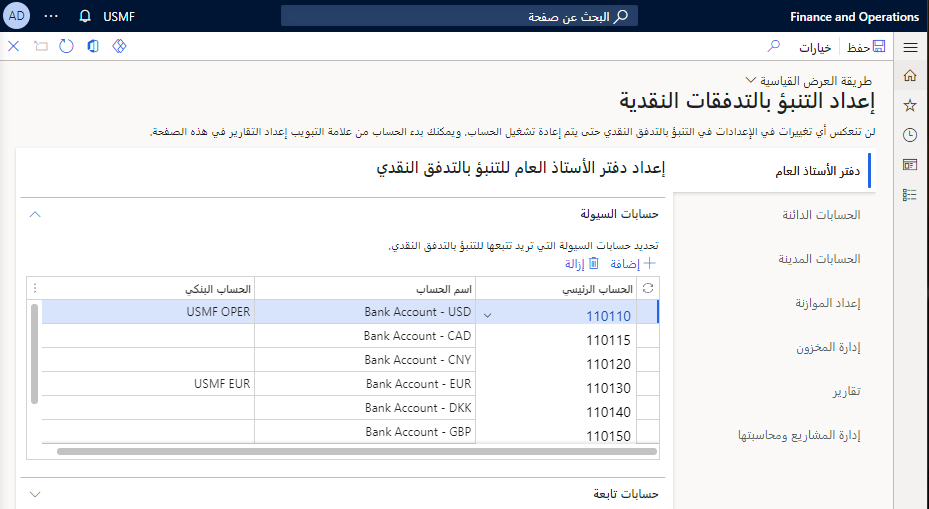
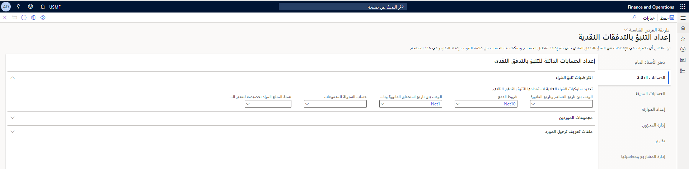
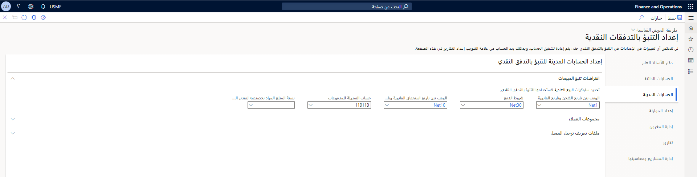
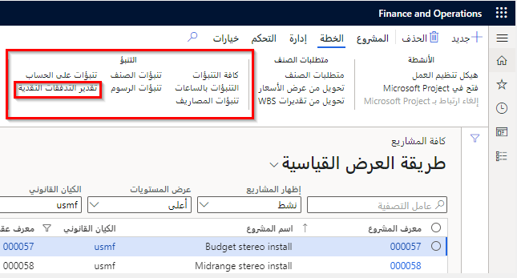

لتكوين عملية التنبؤ بالتدفق النقدي، استخدم صفحة **إعداد التنبؤ بالتدفق النقدي** وحدد حسابات السيولة لتعقب وتنبؤ التدفقات النقدية الافتراضية للوحدات النمطية التالية في Finance، إذا لزم الأمر:

- دفتر الأستاذ العام
- الحسابات الدائنة
- الحسابات المدينة
- إعداد الموازنة

## دفتر الأستاذ العام 

يتعين عليك أولاً تحديد حسابات السيولة لإجراء التعقب من خلال التنبؤ بالتدفق النقدي. وعادةً ما تكون حسابات السيولة هذه حسابات رئيسية مرتبطة بالحسابات المصرفية التي ستتلقى الأموال وتصرفها. 

في صفحة **إعداد التنبؤ بالتدفق النقدي** في **إدارة النقد والبنوك > التنبؤ بالتدفق النقدي**. في علامة التبويب **دفتر الأستاذ العام**، حدد الحسابات الرئيسية المراد تضمينها للتنبؤ. إذا تم إقران حساب بنكي بالحساب الرئيسي في صفحة **الحساب البنكي**، فسيتم عرضه في حقل **الحساب البنكي**.

يمكنك إعداد تنبؤ تدفق نقدي تابع لحساب رئيسي يحتوي على حركات مرتبطة مباشرة بالحركات في حساب رئيسي آخر. يُنشئ كل سطر تضيفه في قسم **الحسابات التابعة** مبلغاً للتدفق النقدي في حساب رئيسي تابع. ويكون هذا المبلغ نسبة مئوية من مبالغ التدفق النقدي للحساب الرئيسي الأساسي الذي حددته.

أولاً، قم بتعيين حقل **الحساب الرئيسي** على الحساب الرئيسي الأساسي حيث يُتوقع حدوث الحركات مبدئياً. قم بتعيين حقل **الحساب الرئيسي التابع** إلى الحساب الذي سيتأثر بالحركة الأولية مقابل الحساب الرئيسي الأساسي. قم بتعيين القيم المناسبة للحقول الأخرى على السطر. يمكنك تغيير القيمة في حقل **النسبة المئوية** لتعكس تأثير الحساب الرئيسي الأساسي على الحساب الرئيسي التابع. بالنسبة لتنبؤات المبيعات أو الشراء، حدد قيمة **شروط الدفع** النموذجية لمعظم العملاء أو الموردين. قم بتعيين حقل **نوع الترحيل** إلى نوع الترحيل المتوقع المرتبط بتنبؤ التدفق النقدي.

## الحسابات الدائنة 

يمكنك حساب التنبؤ بالمشتريات باستخدام خيارات الإعداد في علامة التبويب **الحسابات الدائنة** في صفحة **إعداد التنبؤ بالتدفق النقدي**. قبل أن تتمكن من تكوين التنبؤ بالتدفق النقدي للحسابات الدائنة، تحتاج إلى تكوين شروط الدفع ومجموعات الموردين وملفات تعريف ترحيل المورد.
 

في قسم **افتراضيات تنبؤ الشراء**، يمكنك تحديد سلوكيات الشراء الافتراضية للتنبؤ بالتدفق النقدي. تحدد ثلاثة حقول وقت التأثير النقدي: وهي **الوقت بين تاريخ التسليم وتاريخ الفاتورة**، و **شروط الدفع**، و **الوقت بين تاريخ استحقاق الفاتورة وتاريخ الدفع**. سيستخدم التنبؤ الإعداد الافتراضي للحقل **شروط الدفع** فقط إذا لم يتم تحديد قيمة في الحركة. استخدم شرط الدفع لوصف العدد النموذجي للأيام لكل جزء من العملية.

يحدد حقل **حساب السيولة للمدفوعات** حساب السيولة الذي غالباً ما يتم استخدامه للمدفوعات. استخدم الحقل **نسبة المبلغ المراد تخصيصه للتنبؤ بالتدفق النقدي** لتحديد ما إذا كان يجب استخدام نسبة مئوية للمبالغ أثناء التنبؤ. اترك هذا الحقل فارغاً إذا تعين استخدام مبالغ الحركة الكاملة أثناء التنبؤ.

يمكنك تجاوز الإعداد الافتراضي للحقل **الوقت بين تاريخ استحقاق الفاتورة وتاريخ الدفع** لمجموعات موردين محددة. سيستخدم التنبؤ القيمة الافتراضية من قسم **افتراضيات تنبؤ الشراء‬‏‫** ما لم يتم تحديد قيمة مختلفة لمجموعة الموردين المرتبطة بالمورد في الحركة. لتجاوز القيمة الافتراضية، حدد مجموعة مورّدين، ثم عيّن القيمة الجديدة للحقل **وقت الشراء**.

يمكنك تجاوز الإعداد الافتراضي للحقل **حساب السيولة للمدفوعات** لملفات تعريف ترحيل مورد معين. سيستخدم التنبؤ القيمة الافتراضية من قسم **افتراضيات تنبؤ الشراء‬‏‫** ما لم يتم تحديد حساب سيولة مختلف لملف تعريف الترحيل المرتبط بالمورد على الحركة. لتجاوز القيمة الافتراضية، حدد ملف تعريف الترحيل، ثم حدد حساب السيولة المتوقع تأثره.

## الحسابات المدينة

يمكنك حساب التنبؤ بالمبيعات باستخدام خيارات الإعداد في علامة التبويب **الحسابات المدينة** في صفحة **إعداد التنبؤ بالتدفق النقدي**. قبل أن تتمكن من تكوين التنبؤ بالتدفق النقدي للحسابات المدينة، تحتاج إلى تكوين شروط الدفع ومجموعات العملاء وملفات تعريف ترحيل العملاء.
 

في قسم **افتراضات تنبؤ المبيعات**، يمكنك تحديد سلوكيات المبيعات الافتراضية للتنبؤ بالتدفق النقدي. تحدد ثلاثة حقول وقت التأثير النقدي: وهي **الوقت بين تاريخ الشحن وتاريخ الفاتورة، وشروط الدفع**، و **الوقت بين تاريخ استحقاق الفاتورة وتاريخ الدفع**. سيستخدم التنبؤ الإعداد الافتراضي للحقل **شروط الدفع** فقط إذا لم يتم تحديد قيمة في الحركة. استخدم شرط الدفع لوصف العدد النموذجي للأيام لكل جزء من العملية.

يحدد حقل **حساب السيولة للمدفوعات** حساب السيولة الذي غالباً ما يتم استخدامه للمدفوعات. استخدم الحقل **نسبة المبلغ المراد تخصيصه للتنبؤ بالتدفق النقدي** لتحديد ما إذا كان يجب استخدام نسبة مئوية للمبالغ أثناء التنبؤ. اترك هذا الحقل فارغاً إذا تعين استخدام مبالغ الحركة الكاملة أثناء التنبؤ.

يمكنك تجاوز الإعداد الافتراضي للحقل **الوقت بين تاريخ استحقاق الفاتورة وتاريخ الدفع** لمجموعات عملاء محددة. سيستخدم التنبؤ القيمة الافتراضية من قسم **افتراضيات تنبؤ المبيعات‬‏‫** ما لم يتم تحديد قيمة مختلفة لمجموعة العملاء المرتبطة بالعميل على الحركة. لتجاوز القيمة الافتراضية، حدد مجموعة العملاء، ثم عيّن القيمة الجديدة للحقل **وقت البيع**.

يمكنك تجاوز الإعداد الافتراضي للحقل **حساب السيولة للمدفوعات** لملفات تعريف ترحيل عميل معين. سيستخدم التنبؤ القيمة الافتراضية من قسم **افتراضيات تنبؤ المبيعات‬‏‫** ما لم يتم تحديد حساب سيولة مختلف لملف تعريف الترحيل المرتبط بالعميل على الحركة. لتجاوز القيمة الافتراضية، حدد ملف تعريف الترحيل، ثم عيًن حساب السيولة المتوقع تأثره.

## إعداد الموازنة 

يمكن تضمين الميزانيات التي تم إنشاؤها من نماذج الميزانية في التنبؤات بالتدفق النقدي. في علامة التبويب **‏‫إعداد الموازنة‬** في صفحة **إعداد التنبؤ بالتدفق النقدي**، حدد نماذج الميزانية المراد تضمينها في التنبؤ. بشكل افتراضي، يتم تضمين إدخالات سجل الموازنة الجديدة في التنبؤات بعد تمكين نموذج الموازنة للتنبؤ بالتدفق النقدي. يمكن الكتابة فوق التضمين في التنبؤ بالتدفق النقدي في إدخالات سجل الموازنة الفردي.

## إدارة المخزون 

يمكن تضمين توريد المخزون والتنبؤات بالطلب في تنبؤات التدفق النقدي. في علامة التبويب **إدارة المخزون** في صفحة **إعداد التنبؤ بالتدفق النقدي**، حدد نموذج التنبؤ المراد تضمينه في التنبؤ بالتدفق النقدي. يمكن الكتابة فوق التضمين في التنبؤ بالتدفق النقدي على بنود توقع العرض والطلب الفردية.

## التنبؤ بالتدفقات النقدية مع تكامل المشروع
تتيح ميزة **التنبؤ بمشروع التدفق النقدي** في Finance التكامل مع إدارة المشروع والتنبؤ بالمحاسبة/التدفق النقدي. من خلال تمكين هذه الميزة، ستقوم بتضمين التكاليف والإيرادات المتوقعة في توقعات التدفق النقدي. يمكن عرض تنبؤ التدفق النقدي لكل مشروع في صفحة **جميع المشاريع**. 
 

يمكن تضمين المشاريع التي تستخدم نموذج تنبؤ لتوقعات التكلفة والإيرادات في القدرة على التنبؤ بالتدفقات النقدية في إدارة النقد والبنوك. يتم اختيار نموذج التنبؤ بالتدفق النقدي، وتظهر المصروفات والإيرادات المتوقعة في مساحة عمل **نظرة عامة على النقد: الشركة الحالية** أو مساحة عمل **نظرة عامة على النقد: جميع الشركات**. لتخصيص أنواع المشاريع وأنواع حركات التكلفة، استخدم **إعداد التنبؤ بالتدفق النقدي**.

لمزيد من المعلومات، راجع [التنبؤ بالتدفق النقدي](/dynamics365/finance/cash-bank-management/cash-flow-forecasting/?azure-portal=true).

