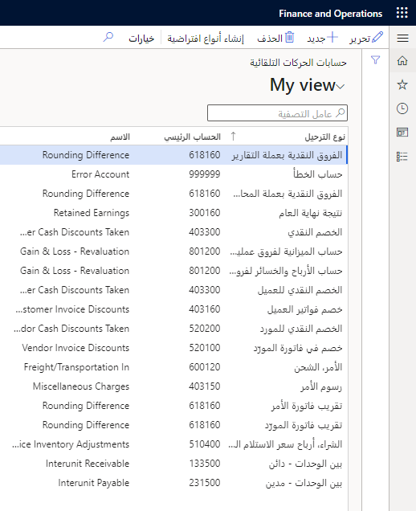
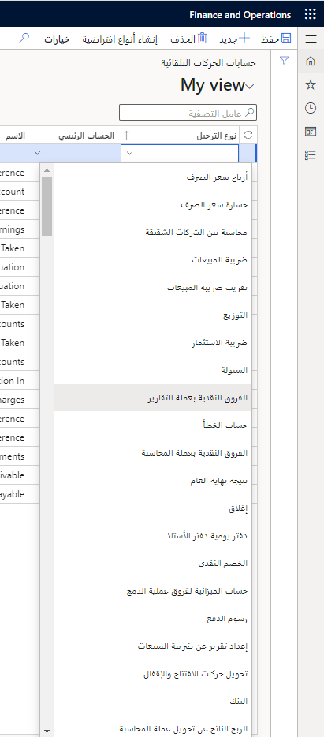

تكون الوحدات النمطية في Finance على درجة عالية من التكامل، لذا تتم معالجة العديد من عمليات الترحيل تلقائياً. وتوجد أوقات يتم فيها ترحيل إحدى الحركات لكن لا يوجد حساب دفتر أستاذ محدد لتلك الحركة. 

على سبيل المثال، عند ترحيل فاتورة وتعيين الخصم، يتم ترحيل هذا المبلغ تلقائياً إلى حساب للخصومات. ويجب إعداد الحساب المناسب لهذا النوع من الترحيل، من خلال حسابات النظام. ويمكن أن يكون فرقاً نقدياً أو حساب خطأ أو خصماً نقدياً. 

يمكنك تحديد حسابات للحركات التلقائية مثل الفروق التقريبية والإيرادات المحتجزة والخصومات. 

**دفتر الأستاذ العام > إعداد الترحيل > حسابات للحركات التلقائية**
 

بالنسبة إلى الكيان القانوني الذي تم إنشاؤه حديثاً، عندما تفتح الصفحة **حسابات الحركات التلقائية** للمرة الأولى، ستكون فارغة. ويمكنك تحديد **إنشاء أنواع افتراضية** في أعلى الصفحة لكي يتم إنشاء الإدخالات تلقائياً في الحقول **نوع الترحيل** و **الاسم**. بعد ذلك، يجب عليك تحديد الحسابات الرئيسية المقابلة التي ترغب في تعيينها إلى قائمة الأنواع الافتراضية.  

كما يمكنك إعداد حسابات أخرى لحركات تلقائية يدوياً.  وتوجد قائمة منسدلة بأنواع الترحيل، إلى جانب أنه يمكنك إضافة المزيد إذا لزم الأمر.  

**دفتر الأستاذ العام > إعداد الترحيل > حسابات للحركات التلقائية**

عند ترحيل الحركة في Finance، قد تتلقى رسالة خطأ إذا لم يتم إعداد نوع ترحيل معين ويحتاج إليها دفتر اليومية. على سبيل المثال، إذا كنت تستخدم إدخال دفتر اليومية لأول مرة لنوع حركة محدد لم يتم تكوينه في الصفحة **حسابات الحركات التلقائية**.  

في الصفحة **حسابات الحركات التلقائية**، راجع المعايير الآتية: 

- تحديد الحسابات الرئيسية للحركات التلقائية التي يتعذر إعدادها في مكان آخر في Finance.  
- توجد حسابات تلقائية أخرى تم إعدادها في كل وحدة نمطية، على سبيل المثال، ملفات تعريف الترحيل في الوحدتين النمطيتين "الحسابات المدينة" و"الحسابات الدائنة".  

يلزم وجود **حساب الخطأ والفرق النقدي** و **حسابات نتيجة نهاية العام** للحركات التلقائية. يتم إعداد الحسابات الأخرى للحركة التلقائية وفقاً لما إذا كان يتم استخدام هذه الوظيفة. 

في حالة تطبيق تحديث على مثيل Finance، يمكن إضافة حسابات جديدة للحركات التلقائية. حدد دائماً **إنشاء أنواع افتراضية** بعد تطبيق التحديث للتأكد من أن لديك جميع أنواع الحسابات الافتراضية الأخيرة.

لمقاطعة التحديثات مع ظهور رسالة خطأ عند استخدام حساب الخطأ في عملية الترحيل، حدد خانة الاختيار  **مقاطعة في حالة الحساب الخطأ** الموجودة في الصفحة **معلمات دفتر الأستاذ العام**.

لتسجيل خصم نقدي أو تغييره يدوياً في عملية التسوية، يجب إعداد حساب نظام الخصم النقدي. لعرض خصم على إجمالي مبلغ الفاتورة، يجب أن يقوم خصم فاتورة العميل أو خصم فاتورة المورد أو كليهما بإعداد حسابات للحركات التلقائية لأنواع ترحيل الخصم النقدي للعميل والمورد.

