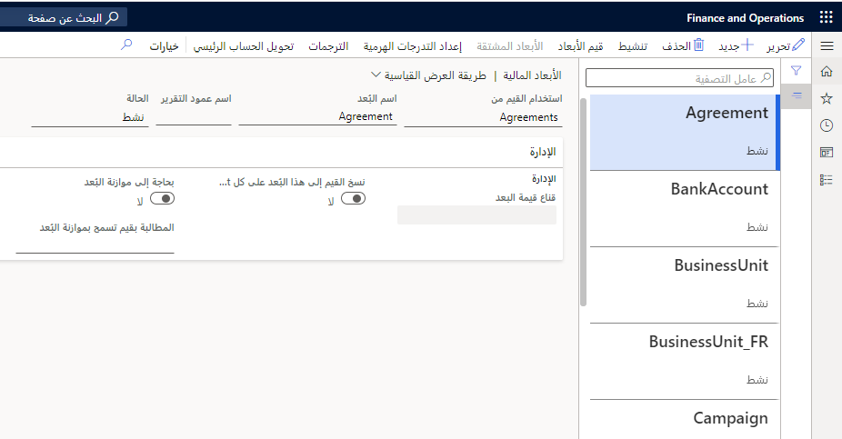
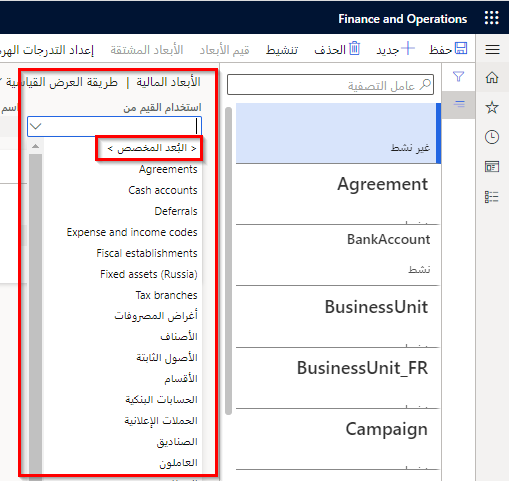
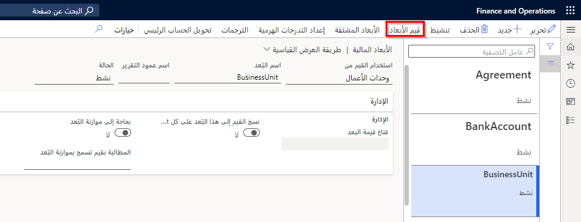

يُعد البعد المالي حساباً فرعياً للحسابات العامة، والذي يسمح بتقسيم الحسابات إلى تفاصيل إضافية لإعداد التقارير والتحليل. ومن دون الأبعاد، يجب إنشاء حسابات متعددة لكل مجموعة من أبعاد الحسابات والأبعاد المالية مثل القسم ومركز التكلفة والغرض. 

وتوجد بعض الفوائد الأساسية لاستخدام الأبعاد المالية.  

- توفر وصفاً أكثر تفصيلاً للحركة.  
- تقوم بتبسيط عملية المحاسبة عند تمكين التحليل التفصيلي دون إنشاء مخطط تفصيلي للحسابات.  
- يتم تحديدها لتحليل الحركات المالية وتصنيفها.  
- يتم عادةً تنظيم الحركات المالية وفقاً لرقم الحساب والإيصال.
- تتوفر خيارات التجميع والتصنيف الإضافية عند تعيين أبعاد متعددة للحركات.
- تتيح لك عرض ملف البيانات من منظورات مختلفة لتحسين الفعالية في تتبع أرقام الحسابات.  
- يمكن استخدامها في Finance.  

يمكنك إضافة أبعاد للبيانات الأساسية مثل:

- حسابات دفتر الأستاذ
- العملاء
- الموردون

استخدم الصفحة **الأبعاد المالية** لإنشاء الأبعاد المالية التي يمكنك استخدامها كشرائح حساب لمخططات الحسابات. 
 

يوجد نوعان من الأبعاد المالية: الأبعاد المخصصة والأبعاد المدعومة بالكيان. 

- وتتم مشاركة الأبعاد المخصصة عبر الكيانات القانونية، ويتم إدخال القيم والاحتفاظ بها من قِبل المستخدمين. 
- وبالنسبة إلى الأبعاد المدعومة بالكيان، يتم تحديد القيم في مكان آخر في النظام، كما هو الحال في كيانات "العملاء" أو "المتاجر". وتتم مشاركة بعض الأبعاد المدعومة بالكيان عبر الكيانات القانونية، بينما تكون الأبعاد الأخرى المدعومة بالكيان خاصة بالشركة.
 

بعد إنشاء الأبعاد المالية، استخدم الصفحة **قيم البعد المالي** لتعيين خصائص إضافية لكل بُعد مالي. ويمكنك تعيين خيارات لقيم الأبعاد التي يمكن مشاركتها بين مخطط الحسابات والكيان القانوني. كما يمكنك تعيين خيارات محددة لقيم الأبعاد استناداً إلى مخطط الحسابات أو الكيان القانوني المحدد.
 

يمكنك استخدام الأبعاد المالية لتمثيل الكيانات القانونية، وبذلك لا يلزم إنشاء الكيانات القانونية في Finance. ومع ذلك، لم يتم تصميم الأبعاد المالية لمعالجة متطلبات التشغيل أو العمل الخاصة بالكيانات القانونية. 

تم تصميم وظيفة المحاسبة بين الوحدات في Finance للتعامل فقط مع الإدخالات المحاسبية التي تم إنشاؤها بواسطة كل حركة.

قبل إعداد الأبعاد المالية على أنها كيانات قانونية، قم بتقييم العمليات التجارية الخاصة بك في المناطق الآتية لتحديد ما إذا كان هذا الإعداد سيلائم مؤسستك:

- المخزون
- المبيعات والمشتريات بين الأبعاد المالية والكيانات القانونية
- حساب ضريبة المبيعات وإعداد التقارير الخاصة بها
- التقارير التشغيلية

فيما يأتي بعض القيود:

- يمكنك استخدام وظائف ضريبة المبيعات مع الكيانات القانونية فقط، وليس مع الأبعاد المالية.
- لا تتضمن بعض التقارير الأبعاد المالية. لذلك، لإعداد تقارير باستخدام البعد المالي، قد تضطر إلى تعديل التقارير.

