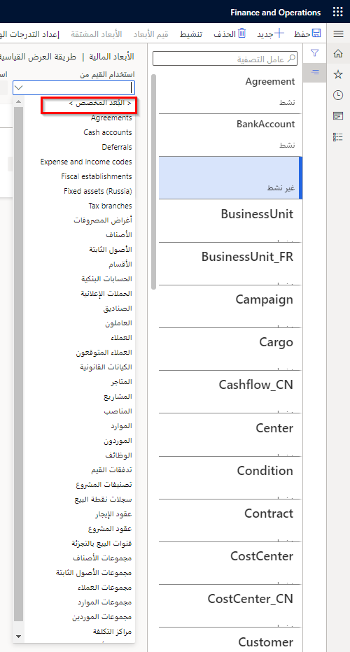

لإنشاء بعد مالي معرف من قبل المستخدم، انتقل إلى **دفتر الأستاذ العام > دليل الحسابات > الأبعاد > الأبعاد المالية** في الحقل **استخدام القيم من**، حدد **البعد المخصص**.
 

يمكنك تحديد قناع الحساب للحد من الكمية ونوع المعلومات التي يمكن إدخالها لقيم الأبعاد. يمكنك إدخال الأحرف التي تبقي كما هي لكل قيمة بعد، مثل الأحرف أو الواصلة (-). 

يمكنك إدخال علامات الأرقام (#) وعلامات العطف (&) كعناصر نائبة للأحرف التي ستتغير في كل مرة يتم فيها إنشاء قيمة بعد. استخدم علامة الرقم (#) كعنصر نائب لرقم وعلامة العطف (&) كعنصر نائب لحرف. لا يتوفر الحقل الخاص بقناع التنسيق إلا في حالة تحديد **بعد مخصص** في الحقل **استخدام القيم من**

### مثال 

لتقييد قيمة البعد بالأحرف "CC" وثلاثة أرقام، قم بإدخال **CC-###** كقناع تنسيق.

 

