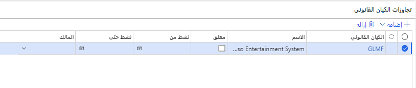

## تنشيط بُعد مالي 

عند تنشيط بعد مالي، يتم تحديث الجدول بحيث يتضمن اسم البعد المالي. تتم إزالة الأبعاد المحذوفة. يمكنك إدخال قيم الأبعاد قبل تنشيط البُعد المالي. 

لا يمكن استخدام بُعد مالي في Finance حتى يتم تنشيطه. 

على سبيل المثال، لا يمكن إضافة بعد مالي إلى بنية حساب حتى يتم تنشيط البُعد المالي. عند تحديد **تنشيط**، يتم تحديث كافة الأبعاد وسيتم تحديث حقل **الحالة** إلى **نشط**.

**دفتر الأستاذ العام > دليل الحسابات > الحسابات > الأبعاد المالية**
 

## الترجمات 

في الصفحة **ترجمات النص**، يمكنك إدخال نص للبُعد المالي المحدد بلغات مختلفة. في أية صفحة في Finance تحتوي على الزر **ترجمات**، مثل الصفحة **ترجمة الحساب الرئيسي**، يمكنك إدخال هذا النص.
 

## تجاوزات الكيان القانوني 

لا تكون جميع الأبعاد صالحة لجميع الكيانات القانونية. كذلك، قد تكون بعض الأبعاد مرتبطة فقط لفترة محددة. في هذه الحالات، يمكنك استخدام القسم **تجاوزات الكيان القانوني** لتحديد الشركات التي يجب أن يتم إيقاف البُعد بها بشكل مؤقت للمالك والفترة التي يكون البُعد نشطاً فيها.

**دفتر الأستاذ العام > دليل الحسابات > الأبعاد > الأبعاد المالية** ثم حدد بعداً مالياً وحدد **قيم الأبعاد**.
 

 
## حذف بُعد مالي 

للمساعدة في الحفاظ على التكامل المرجعي للبيانات، يمكن أن يتم حذف الأبعاد المالية في حالات نادرة. إذا حاولت حذف بعد مالي، يتم تقييم المعايير التالية:

- هل تم استخدام البُعد المالي في أية حركات مرحلة أو غير مرحلة، أو في أي نوع من مجموعة قيم الأبعاد؟
- هل البُعد المالي مستخدم في أيه بنية حساب نشط أو بنية قاعدة متقدمة أو مجموعة أبعاد مالية؟
- هل البُعد المالي هو جزء من تنسيق تكامل البُعد المالي الافتراضي؟
- هل تم إعداد البُعد المالي كبعد افتراضي؟

في حالة استيفاء أي من هذه المعايير، لن يمكنك حذف البُعد المالي.

