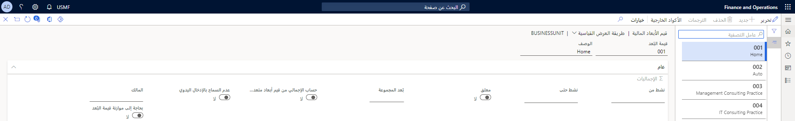
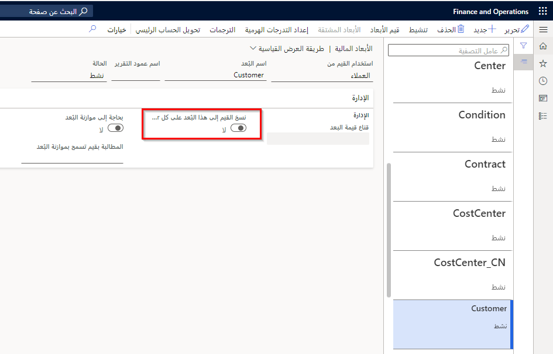

يمكنك استخدام قيم من سجلات رئيسية، مثل العميل والمورد، كقيم افتراضية في الأبعاد الجديدة. عند إنشاء الأبعاد الجديدة، يتم إدخال معرف السجل الرئيسي بقيم الأبعاد الخاصة بهذه السجلات الرئيسية. على سبيل المثال، عند إنشاء عميل جديد، يتم إدخال معرف العميل في البعد الخاص بالعميل. عند إنشاء أوامر التوريد أو الفواتير أو المستندات الأخرى التي تتطلب معرف العميل، يتم استخدام القواعد الافتراضية الموجودة، وتتم إضافة معرف العميل إلى المستند.

**دفتر الأستاذ العام > دليل الحسابات > الحسابات > قيم الأبعاد المالية**
 

يتم التحكم في ميزة البعد الافتراضي هذه بواسطة إعداد في الصفحة **الأبعاد المالية**. يسمي هذا الإعداد **نسخ القيم إلى هذا البعد في كل اسم بعد جديد تم إنشاؤه**، حيث **اسم البعد** هو اسم البعد. بشكل افتراضي، يتم إيقاف تشغيل الميزة. ومع ذلك، يمكن تشغيلها في أي وقت.
 

إذا كانت السجلات موجودة بالفعل للبعد، سيتم تحديث السجلات الرئيسية عند تشغيل الميزة. ومع ذلك، لا يتم تحديث المستندات والحركات الموجودة.

