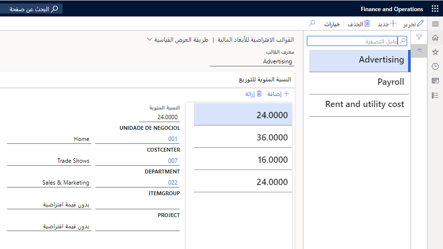
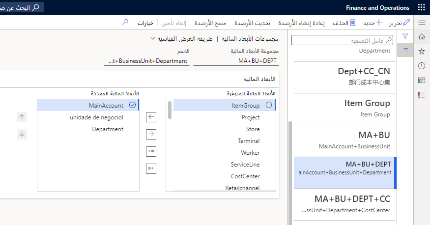

## قوالب الأبعاد المالية 

يمكن استخدام قوالب الأبعاد المالية للنماذج الشائعة التي تستخدمها لتوزيع قيم المستند المصدر. 

استخدم الصفحة **قوالب الأبعاد المالية الافتراضية** لإنشاء قالب النسبة المئوية ومجموعات قيم الأبعاد المالية. سيتم استخدام المعلومات الموجودة في القالب لعرض قيم الأبعاد المالية الافتراضية عند توزيع مبالغ مستند المصدر.
 
**دفتر الأستاذ العام > دليل الحسابات > الأبعاد > القوالب الافتراضية للأبعاد المالية**

## مجموعات الأبعاد المالية 

تتضمن مجموعة الأبعاد المالية إما أبعاداً مالية أو مجموعات أبعاد مالية.  السبب الرئيسي لمجموعة الأبعاد المالية هو لأغراض إعداد التقارير.  يمكنك الإبلاغ عن الحسابات المتعددة ومجموعات الأبعاد.  

تشتمل مجموعات الأبعاد المالية على أغراض متعددة. ويتم استخدامها لتحديد كيفية تقديم التقارير والاستعلامات المرتبطة بدفتر الأستاذ العام. كما تستخدم مجموعات الأبعاد المالية لحساب الأرصدة أثناء عملية الترحيل. ويمكن جدولة الأرصدة أيضاً للحساب أو التحديث اليدوي.

يتم تخزين الأرصدة استنادا إلى مجموعة الأبعاد المالية ويتم حسابها استنادا إلى الخيار الذي يتم حسابه مع الترحيل أو جدول المجموعة. تقوم مجموعات الأبعاد المالية أيضاً بتحريك البيانات المعروضة في الصفحة **قائمة ميزان المراجعة**.

التسلسل الذي يتم اعتبار مجموعات الأبعاد المالية فيه يؤثر على كيفية فرز الحركات، ويتم تقديم الحقول. 

على سبيل المثال، تشير المجموعة "القسم" و"مركز التكلفة" إلى أن نوع بُعد "القسم" هو الأول و"مركز التكلفة" هو الثاني. لذلك، فإن المجموعة المالية تعتبر مركبة من "القسم" و"مركز التكلفة". يتم تقديم مبالغ القسم أولا، ويتم عرض مبالغ مركز التكلفة ثانياً.

**دفتر الأستاذ العام > دليل الحسابات > الأبعاد > مجموعات الأبعاد المالية**
 

يمكن استخدام مجموعة الأبعاد المالية المحددة كوحدة أو في شكل أزواج عند الاستعلام عن الحركات المالية أو الإبلاغ عنها. ويعتبر تحديد مجموعة الأبعاد المالية الأساسية والثانوية عند تقديم النتائج. 

تفصِّل مجموعة الأبعاد المالية الثانوية الأرقام الخاصة بمجموعة الأبعاد الرئيسية. يقتصر تحديد مجموعة الأبعاد المالية الثانوية على التركيز على تلك التي لا تشترك في نوع بُعد بمجموعة أبعاد رئيسية. 

لذلك، إذا كانت مجموعة الأبعاد الرئيسية مركبة للحساب الرئيسي والقسم، فلا يمكن تحديدها في المجموعة المالية الثانوية.

