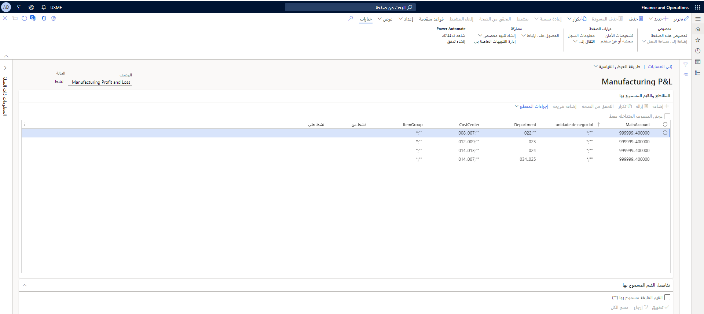
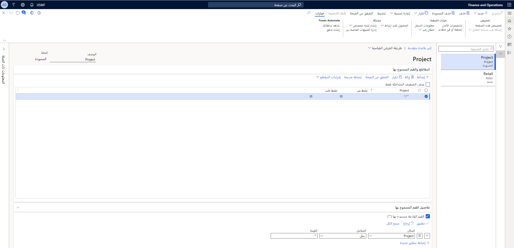
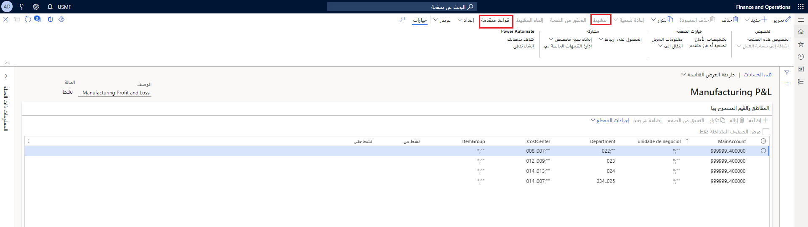

تتكون بنى الحساب من الحسابات الرئيسية، ويمكن أن تتضمن أبعاداً مالية. وتستخدم بنيات الحساب لتحديد المجموعات الصالحة التي تشكل بالاشتراك مع الحسابات الرئيسية مخططاً للحسابات.  

تسمح لك بنية الحساب بتحديد تسلسل الإدخال في دفتر يومية الحساب الرئيسي والأبعاد المالية.  كما تتيح لك القليل من الأبعاد أو الكثير من الأبعاد المالية لنطاق الحسابات الضرورية.  

## تكوين بنى الحساب 

يجب أن يكون للبنية دائماً على الأقل مقطع حساب رئيسي، ويمكنك اختيارياً إضافة المزيد من الأبعاد المالية، والتي تتم الإشارة إليها على أنها أجزاء في الصفحة **تكوين بنى الحسابات**. 

**دفتر الأستاذ العام > مخطط الحسابات > البنى > بنى الحسابات**
 

وليس مطلوباً أن يكون الحساب الرئيسي هو الشريحة الأولى في بنية الحساب. ومع ذلك، يجب أن تكون شريحة في بنية الحساب.

تستخدم بنيات الحساب الحساب الرئيسي والأبعاد المالية لإنشاء مجموعة من القواعد التي تحدد الأمر والقيم المستخدمة عند إدخال رقم الحساب. يمكنك إعداد العديد من بنى الحسابات كما تحتاج لعملك. يتم تعيين بنى الحسابات لإعداد دفتر الأستاذ الخاص بالشركة، حتى يمكن مشاركتها.

تتيح البنى المتعددة للحسابات للشركة إمكانية تعقب المعلومات لحسابات معينة أثناء عدم التأثير على الحسابات الأخرى. 

على سبيل المثال، قد لا تتطلب حسابات الميزانية العمومية العديد من الأبعاد المالية مثل حسابات الأرباح والخسائر. بالنسبة لحسابات الميزانية، قد تكون مهتما فقط بالقسم. بالنسبة لحسابات الأرباح والخسائر، قد ترغب أيضاً في تتبع مركز التكلفة والغرض والمنطقة.

شاهد هذا الفيديو لمعرفة المزيد حول كيفية إنشاء بنية حساب.

> [!VIDEO https://www.microsoft.com/videoplayer/embed/RE47KgJ]

## قواعد متقدمة 

تقوم القواعد المتقدمة بربط البعد المالي أو الأبعاد المالية المتعددة برقم الحساب أو نطاق أرقام الحسابات ومن ثم يمكن تجميع معلومات إضافية لإعداد التقارير والتحليل فيما عدا ما قمت بإعداده في بنى الحسابات المرتبطة.  

بينما تتيح لك بنى وقيود الحساب إنشاء الأشجار البسيطة للمجموعات الصالحة، في بعض الأحيان توجد حسابات داخل تلك البنية والتي يجب تعقبها مقابل الأبعاد المالية الأخرى.  

على سبيل المثال، لنفترض أن لديك بنية حساب تم إعدادها لحسابات الأرباح والخسائر المطلوب تعقبها مع الأقسام فقط.  ومع ذلك، فهناك حسابان من حسابات الأرباح والخسائر التي تحتاج أيضا لأن يتم تعقبها مع مراكز التكلفة.  بدلاً من إضافة بعد مركز التكلفة إلى بنية الحساب بالكامل، يمكنك إنشاء قاعدة متقدمة للتأكد من أنه يتم إعداد الحسابات القليلة التي يجب تعقبها مقابل مراكز التكلفة فقط. 
 
يجب عدم استخدام القواعد لاستبدال استخدام القيود في بنية الحساب للأبعاد الإضافية المطلوبة دائماً بغض النظر عن الحساب الرئيسي.  يجب أيضا عدم استخدام القواعد لنسخ مجموعات أبعاد الحساب الموجودة بالفعل في بنية الحساب أو القواعد الأخرى.  ستقوم أية تكرارات تلقائياً بالانضمام إلى أكثر القيود صرامة واستخدامها.  سيظهر موقع مجموعة أبعاد الحساب المكررة فقط في التكرار الأول.

عند إنشاء بنية حساب، يكون الحد الأقصى لعدد الشرائح هو 11. إذا كنت بحاجة إلى مقاطع أكثر من تلك، فقم بتقييم الإعداد والمتطلبات الخاصة بك بشكل دقيق، كما سيؤثر ذلك على أسلوب عمل المستخدم. يجب مراعاة ما إذا كان يمكن اشتقاق مقطع في سيناريو تقرير باستخدام تدرج هرمي بدلا من إدخال البيانات أو باستخدام حقل معرف من قبل المستخدم. 

**دفتر الأستاذ العام > مخطط الحسابات > البنى > بنى القواعد المتقدمة** 

على سبيل المثال، إذا كنت ترغب في الإبلاغ عن الموقع، ولكن يمكنك تحديد الموقع حسب مركز الإدارة أو القسم، فلن تحتاج إلى موقع كبعد مالي. إذا كانت هناك حاجه بعد التقييم الذي تحدده لأكثر من 11 شريحة، يمكنك إضافة شرائح إضافية باستخدام القواعد المتقدمة.

توفر بنى القواعد المقدمة مجموعات الأبعاد المالية الصالحة للقاعدة المتقدمة. 

على سبيل المثال، تريد تعقب حساب مصروفات السفر بواسطة الخطوط الجوية. يمكنك إعداد "مصروفات السفر" كحساب رئيسي وإنشاء بعد مالي آخر يسمي "خطوط جوية" وتعيين معايير لهذا البعد المالي مثل "خط جوي 1" و"خط جوي 2" و"خط جوي 3". والآن، يمكنك تعقب مصروفات السفر بسهولة بواسطة كل خط طيران محدد.

لإضافة قواعد متقدمة أو تحريرها لبنية حساب، يجب أن تكون بنية الحساب في حالة مسودة. إذا كانت بنية الحساب نشطة، وقامت بتحديد إنشاء قاعدة متقدمة جديدة أو تحرير قاعدة متقدمة موجودة، فسوف تتلقى رسالة ويمكنك تغيير حالة بنية الحساب من نشط.

كما ذكر سابقاً، تتطلب بنى الحسابات الحساب الرئيسي. لا يلزم أن يكون الحساب الرئيسي هو الشريحة الأولى في البنية، ولكنه يحدد بنية الحساب المستخدمة أثناء إدخال رقم الحساب. وبسبب ذلك، لا يمكن أن توجد قيمة الحساب الرئيسي إلا في بنية واحدة معينة إلى دفتر الأستاذ حتى لا تتداخل. 

بعد تحديد بنية الحساب، يتم تصفية قائمة القيم المسموح بها لإرشاد المستخدم من خلال انتقاء قيم الأبعاد الصالحة فقط، مما يقلل من احتمال إدخال غير صحيح لدفتر اليومية.

شاهد هذا الفيديو لمعرفة كيفية إنشاء بنية قاعدة متقدمة.

> [!VIDEO https://www.microsoft.com/videoplayer/embed/RE47UCX]

إذا كنت تخطط للموازنة مقابل بعد مالي، فيجب أن يكون جزءاً من بنية حساب. لا يستخدم إعداد الموازنة قواعد متقدمة.

عند إعداد بنية حسابك هناك أفضل الممارسات التي يمكنك اتباعها. ومع ذلك، فإن هذا الدليل هو فقط الإرشادات بحيث يجب اعتبار المناقشة الشاملة حول العمل وخطة نمو والصيانة كجزء من تلك المناقشة.

- اجعل الحساب الرئيسي أول مره أو أقرب من القيمة الموجودة في مقدمة بنية الحساب قدر الإمكان، لذا يحصل المستخدمون على أفضل الخبرات الإرشادية التي يمكنهم أثناء إدخال الحساب.
- أعد استخدام بنى الحساب بقدر الإمكان لتقليل الصيانة عبر الكيانات القانونية.
- للحصول على التباينات عبر الكيانات القانونية، ضع في اعتبارك استخدام قواعد متقدمة بحيث يمكن إعادة استخدام بنية الحساب.
- عند تحديد القيم المسموح بها، استخدم النطاقات وأحرف البدل قدر الإمكان. لا يسمح هذا إلا بزيادة الصيانة وتغييرها بدون الصيانة، ولكن يقوم النظام أيضا بذلك بشكل نموذجي مع هذا التكوين.
- لا تضع علامة نجمية سوى لكل مقطع في بنية الحساب ثم يعتمد على القواعد المتقدمة فقط. يمكن أن يكون هذا الأمر صعب الإدارة وغالبا ما يؤدي إلى خطأ في المستخدم أثناء الصيانة مما قد يؤدي إلى تعذر ترحيل النظام.

## تنشيط بنية حساب 

عندما ترضى عن الإعداد الجديد أو تغيير في بنية حساب، يجب عليك تنشيطه. في حالة تعيين بنية حساب إلى دفتر الأستاذ، يمكن أن يكون هذا التنشيط عملية تشغيل طويلة، حيث يجب مزامنة كافة الحركات غير المرحلة في النظام مع البنية الجديدة. لا تتأثر الحركات المرحلة بتغييرات في بنية الحساب.

**دفتر الأستاذ العام > مخطط الحسابات > البنى > تكوين بنى الحسابات** 
 

