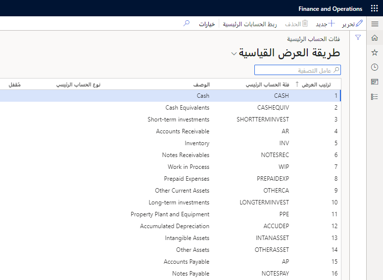

إنها فكرة جيدة أن تربط الحسابات الرئيسية بفئات الحساب الرئيسي، للاستفادة من التقارير المالية الافتراضية دون الاضطرار إلى إجراء أي تعديلات. يسمح لك هذا بتصميم التقارير وصيانتها بسرعة وسهولة.

يمكن استخدام فئات الحسابات الرئيسية لتصنيف حساب دفتر أستاذ عام بشكل أفضل. استخدم فئات الحساب الرئيسية بصورة رئيسية لتجميع حسابات دفتر الأستاذ أو تحديدها للمكعبات ومؤشرات الأداء الأساسي (KPI). افتراضياً، يتم توفير ما يزيد عن خمسين فئة حساب دفتر أستاذ في البيانات التوضيحية للبيانات المالية.

**دفتر الأستاذ العام > دليل الحسابات > الحسابات > فئات الحساب الرئيسية**

يمكن تغيير قيم **فئة الحساب الرئيسي** و **الوصف** و **نوع الحساب الرئيسي** في أي وقت لفئات الحساب الرئيسية المحددة من قبل المستخدم والافتراضية.

## إغلاق فئات الحساب الرئيسي  

لإلغاء تنشيط فئة حساب رئيسي، بما في ذلك أي من فئات الحساب الرئيسي الافتراضية، حدد خانة الاختيار **مُقفل** في صفحة **فئات الحساب الرئيسية**. إذا حاولت إغلاق فئة حساب رئيسية مرتبطة بالفعل بحساب رئيسي، فيتم عرض رسالة تحذير تسرد الحسابات الرئيسية المرتبطة. حدد إما **متابعة** أو **إلغاء الأمر**. بعد إغلاق فئة الحساب الرئيسي، لا يمكن ربطها بالحسابات الرئيسية.   

يمكن حذف فئة الحساب الرئيسي المعرفة من قبل المستخدم إذا لم تكن معينة للاستخدام مع طلبات الشراء في صفحة **محددات الحسابات الدائنة**. ولا يمكن حذف أي من فئات حساب دفتر الأستاذ الافتراضية.

