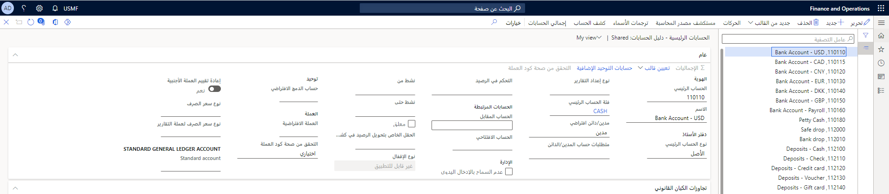
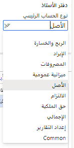

الحساب الرئيسي هو حساب في دفتر الأستاذ العام يُستخدم لتسجيل الحركات المالية أو الأرصدة أو الإجماليات التي تتعلق بالأصول والخصوم والإيرادات والمصروفات وحقوق الملكية. حدد المعلومات الخاصة بالحساب الرئيسي، مثل فئة الحساب الرئيسي وعناصر التحكم بالمدين والدائن والحسابات ذات الصلة.

**دفتر الأستاذ العام > دليل الحسابات > الحسابات > الحسابات الرئيسية**
 

إذا تم استخدام الحساب للحركات المدينة أو الدائنة فقط، فحدد قيمة، إما دائن أو مدين في القائمة المنسدلة طلب مدين/دائن. يتم بعد ذلك التحقق من التحديد الذي تم إجراؤه عند التحقق من صحة بنود دفتر اليومية وترحيلها. إذا تُرك الحقل فارغاً، فسيتم اقتراح خصم تلقائياً.   

يجب تحديد نوع الحساب الرئيسي عند إنشاء الحساب الرئيسي في صفحة **الحسابات الرئيسية**.  
 

تحدد أنواع الحسابات الرئيسية التالية كيفية استخدام الحساب في مخطط الحسابات.

- **الأرباح والخسائر والإيرادات** و **المصروفات** -تستخدم كحسابات ترحيل. يتم استخدام حساب الأرباح والخسائر لتسجيل الإيرادات والمصروفات. يحدد مجموع جميع حسابات التشغيل نتائج نهاية العام. تؤدي حسابات الإيرادات والمصروفات نفس الوظيفة الخاصة بحساب الأرباح والخسائر. يتم تسجيل أرصدة هذه الحسابات الرئيسية في حساب نتيجة نهاية العام أثناء عملية فتح الحركات. يتم استخدام حسابات المصروفات بواسطة التحكم في الموازنة.  
- **الميزانية العمومية والأصل والالتزام** و **حق الملكية** – تُستخدم كحسابات حركات تُسجل المبالغ التي تمتلكها الشركة أو تدين بها. إذا كنت تستخدم حسابات الأصول والالتزام وحقوق الملكية، فيمكن أن تتميز الحسابات بدرجة أعلى من المواصفات وبالتالي يمكنك إنشاء تقارير حول رصيد الشركة على قدر أعلى من الدقة. يتم ترحيل أرصدة هذه الحسابات الرئيسية إلى العام الجديد أثناء عملية فتح الحركات.   
- **الإجمالي** - استخدم هذا لإضافة فترات فاصلة بالحساب. على سبيل المثال، يكون من المفيد في كثير من الأحيان إنشاء إجمالي لنطاق من حسابات الإيرادات للحصول على نظرة عامة سريعة على إجمالي المبيعات للفترة الحالية عندما تقوم بتشغيل قائمة مالية.  
- **الإبلاغ** -يستخدم لإعداد تقارير القائمة المالية. إذا قمت بتحديد **الإبلاغ** في حقل **النوع**، فحدد كيفية استخدام الحساب لإعداد التقارير. يمكنك تحديد **رأس أو رأس فارغ** أو **رأس صفحة**.

## تجاوزات الكيان القانوني

ليست كافة الحسابات الرئيسية صالحة لجميع الكيانات القانونية، قد يكون الحساب الرئيسي ذا صلة فقط لفترة محددة. في هذا السيناريو، يمكنك استخدام **تجاوزات الكيان القانوني** لتحديد الشركات التي يجب أن يتم إيقاف الحساب الرئيسي بها بشكل مؤقت للمالك والفترة التي يكون البُعد نشطاً فيها. لا يمكن تقييد التجاوزات على المستوى المشترك أكثر من التجاوزات على مستوى الكيان القانوني.

## حسابات التحكم في الرصيد 

استخدم صفحة **حسابات التحكم في الرصيد** لمراقبة الرصيد الحالي والمتوقع على حساب ما عند إدخال الحركات في دفتر يومية. لست مطالباً بإعداد حسابات التحكم في الرصيد للعمل مع Finance.
تساعدك حسابات التحكم في الرصيد على تتبع الموازنة الحالية والمتوقعة لحسابات السيولة.  وهي تتضمن الحسابات البنكية والحسابات النقدية النثرية. يمكنك تحديد معيار التحكم في الرصيد للحركات الموجودة بالحساب الحالي في قائمة التحكم في الرصيد. 

علي سبيل المثال، عند إدخال الحركات في دفتر يومية حساب، إذا تم تحديد **التحكم في المدين**، فسيقوم النظام بالتأكد من أن المبلغ الإجمالي لحركات دفتر اليومية لا يجعل رصيد الحساب ينتقل إلى الدائن.  

حدد فقط حسابات الأصول أو الالتزام في هذا الحقل لأنه يتم تعيين حسابات الأرباح والخسائر والإيرادات والتكلفة إلى الصفر عند إنشاء الحركات الافتتاحية.

يمنع تحديد خانة الاختيار **عدم السماح بالإدخال** أي مستخدم من إدخال هذا الحساب يدوياً في إدخال دفتر يومية.  إذا قمت بتحديد خانة الاختيار **متوقف مؤقتاً**، فسيتم منع كافة الترحيلات للحساب الرئيسي المحدد.  لا يمكنك تعليق حساب تم تعيينه كحساب مجموعة موازنة في حساب آخر.   

