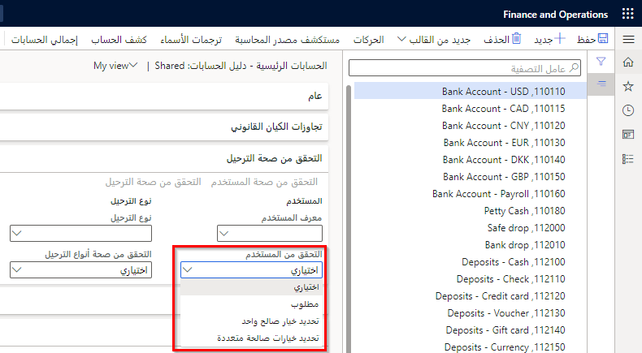

توجد أربعة إعدادات للتحقق من صحة الترحيل يمكن تحديدها لكل حساب. يمكن تعيين التحقق من صحة الترحيل للخيارات التالية: 

- ‏رمز العملة
- معرِف المستخدم  
- أنواع الترحيل
- نوع ترحيل ضريبة المبيعات لمجموعة ترحيل دفتر الأستاذ

يمكن أن تستند إعدادات التحقق من الصحة إلى المعايير التالية: 

- **اختياري** - لا يتم التحقق من صحة الحقل وقت الترحيل. ويكون ذلك هو الإعداد الافتراضي.  
- **مطلوب** - يتحقق النظام من اكتمال الحقل للترحيل. لم يتم التحقق من القيمة.  
- **تحديد خيار واحد صالح** - يتحقق النظام من اكتمال الحقل للترحيل وأن القيمة تتوافق مع القيمة المحددة في الحساب.  
- **تحديد عدة خيارات صالحة** - يتحقق النظام من اكتمال الحقل بإحدى القيم المحددة في الزر **قائمة التحقق من الصحة**. إنه يمكّن أزرار التحقق من الصحة مثل **التحقق من صحة المستخدم** و **التحقق من صحة الترحيل**. 

### السيناريو

يطلب قسم الشؤون المالية للشركة أن يقوم أشخاص معينون فقط بترحيل الحركات التي تقع تحت نوع ترحيل ضريبة المبيعات.

والحل لهذا هو تعيين إعداد التحقق من صحة إلى **التحقق من المستخدم** ليكون **تحديد عدة خيارات صالحة** وأنواع الترحيل إلى **تحديد خيار واحد صالح**.

**دفتر الأستاذ العام > دليل الحسابات > الحسابات > الحسابات الرئيسية**

