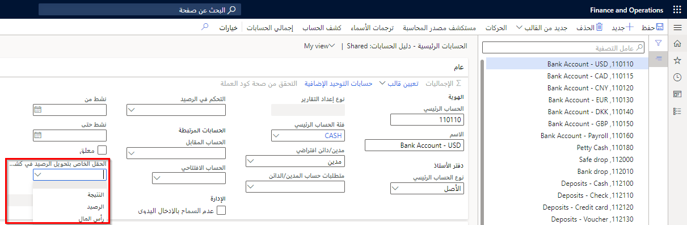

ومن الأهمية بمكان تحديد عمليات الإغلاق للحساب الرئيسي وكيفية توزيع الأرصدة في وقت الإقفال.

**دفتر الأستاذ العام > دليل الحسابات > الحسابات > الحسابات الرئيسية**
 
 

في القائمة المنسدلة **‬‏‫الحقل الخاص بتحويل الرصيد في كشف تسويات الإقفال**، حدد كيفية تحويل الأرصدة إلى كشف تسويات الإقفال أثناء عملية الإقفال. 

- فارغ - اترك الحقل فارغاً لتحويل الرصيد إلى حقل **الفرق**.  
- النتيجة - حدد هذا الخيار لتحديث حسابات التشغيل.  
- الرصيد - حدد هذا الخيار لحسابات الرصيد.  
- رأس المال - حدد هذا الخيار للحسابات المتعلقة بتنبؤات التدفق النقدي وإعادة التقييم.  