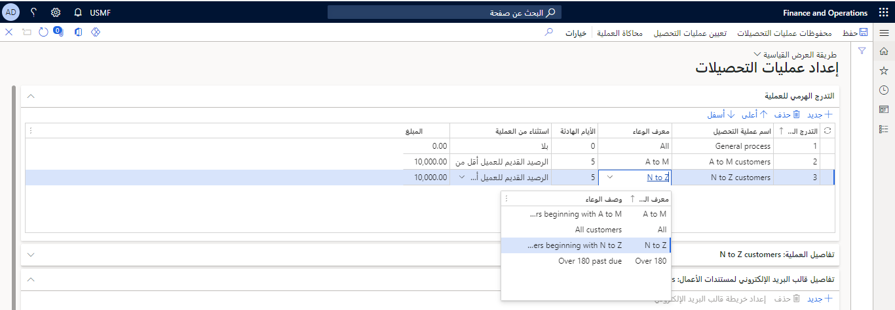
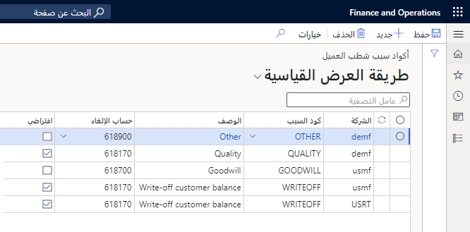

يمكنك تكوين حسابات المقبوضات للائتمان والتحصيلات لتتبع الفواتير والمدفوعات الواردة من العملاء.  من المهم أن تضع في اعتبارك أن تكوين وحدة **حسابات المقبوضات** له تأثير مباشر على تكوين وحدة الائتمان والتحصيل.

دعنا نراجع تدفق الأعمال الإجمالي لإدارة الائتمان والتحصيلات.

1. معلومات الفواتير والائتمان التي استلمها البائع.
1. يوافق البائع على شروط الائتمان ويبدأ في الشحن إلى العميل.
1. تم إصدار فاتورة للعميل.
1. يفشل العميل في الدفع ضمن الشروط.
1. تشير الفاتورة إلى التحصيلات.
1. تبدأ معالجة التحصيلات.

## مكونات الائتمان والتحصيلات
بالإضافة إلى إعداد حسابات القبض للائتمان والتحصيلات، هناك العديد من المكونات التي يجب إعدادها لاستخدام الوظيفة داخل Finance. يجب إعداد المكونات التالية للاستعداد لاستخدام الائتمان والتحصيلات.

- تعريفات فترات التأخر
- لقطة التأخر
- أوعية العملاء (اختيارية)
- فريق التحصيلات (اختياري)
- فئة حالة التحصيلات
- أسماء دفاتر اليومية
- كود السبب لحركات الشطب
- مجلد لمرفقات البريد الكتروني
- قوالب البريد الإلكتروني
- معلمات حسابات المقبوضات (AR) للتحصيلات
- وكلاء التحصيلات (اختياري)
- حساب الإلغاء
- إعدادات Outlook لمستخدمي نماذج التحصيلات
- إعدادات البريد الكتروني لجهات اتصال العميل للتحصيلات 
- إعدادات البريد الكتروني لمندوبي المبيعات

باستخدام أوعية العملاء، يمكنك بسهولة إدارة التحصيلات للعملاء ذوي الخصائص المشتركة. يمكنك إنشاء مجموعات من العملاء الذين يشاركونك المعلمات الأساسية والحفاظ عليها. وتشمل شروط الدفع وفترات التسوية وحسابات دفتر الأستاذ لترحيل المخزون ومجموعة ضريبة المبيعات وإعداد الحساب الافتراضي.

من خلال إعداد ملفات تعريف الترحيل التي تتحكم في ترحيل حركات العملاء إلى دفتر الأستاذ العام، يمكنك إدارة تسلسل رسائل التحصيل والفائدة التي يمكن تعيينها لعميل أو مجموعة من العملاء أو جميع العملاء. 

هناك اعتبار آخر لوحدة الائتمان والتحصيل وهو التأكد من إعداد طرق الدفع للعملاء وشروط الدفع وأكواد الرسوم وأيام الدفع ورسوم الدفع بشكل صحيح للحصول على أدق المعلومات حول العملاء المتأخرين في السداد قبل معالجة التحصيل.

أثناء عملية التحصيل، غالباً ما تحتاج إلى تسجيل أموال غير كافية (NSF) أو ربما تقترح شطبها عندما يرفض العملاء المتأخرون سداد ديونهم.
يمكنك بعد ذلك إنشاء دفاتر يومية، على سبيل المثال، دفترة يومية لـ NSF وآخر للشطب. 

يوضح الإجراء التالي كيفية إعداد معلمات عمليات الشطب ثم شطب الحركات من علامة التبويب **التحصيلات** لمعلمات حسابات المقبوضات، وصفحة **فتح فواتير العملاء**، وصفحة **العميل**. 

1.  انتقل إلى **الحسابات المدينة > إعداد > معلمات الحسابات المدينة**.
2.  حدد علامة التبويب **التحصيلات‬**.
3.  قم بتوسيع قسم ‎‏‫الشطب أو طيه. يُعد دفتر يومية الشطب دفتر اليومية العام الذي يحتفظ بحركات الشطب التي تقوم بإنشائها. يمكنك إرفاق كود سبب لكل شطب. يمكنك تجاوز هذا الإعداد الافتراضي في وقت الشطب.
4.  قم بتعيين التحديد إلى **نعم** إذا كنت تريد فصل ضريبة المبيعات عن الحركة الأصلية في عملية الشطب.
5.  أغلق الصفحة.
 
    

## إعداد مهمة تحصيل تلقائية 

تتيح لك ميزة مهمة التحصيل التلقائي إعداد إستراتيجية عملية التحصيل التي تحدد تلقائياً فواتير العميل التي تتطلب تذكيراً بالبريد الإلكتروني أو نشاط التحصيل (مثل مكالمة هاتفية) أو خطاب تحصيل ليتم إرساله إلى العميل.

لإنشاء عمليه تحصيل تلقائية، انتقل إلى **الائتمان والتحصيلات > الإعداد > إعداد معالجة التحصيلات**. تستند خطوات المعالجة إلى أقدم فاتورة مفتوحة لعميل معين، وستحدد هذه الفاتورة نوع الاتصال أو النشاط الذي يجب أن يتم.

أولاً، ستقوم بتكوين **التدرج الهرمي للعملية**، وهو أمر يتم تشغيل العمليات به ومتى يكون ذلك. يرتبط كل مستوى من مستويات التدرج الهرمي بوعاء العملاء، وإذا كان العميل ينتمي إلى مجموعات متعددة، فسيحدد التدرج الهرمي العملية التي لها الأسبقية.  

تُستخدم **أيام الهدوء** لضمان عدم الاتصال بالعميل كثيراً من خلال عملية تلقائية. لاستبعاد العملاء من العملية، حدد "استخدام الفواتير أو مبالغ أرصدة استحقاق العملاء" لاستبعاد العميل من العملية التلقائية و **المبلغ** للحد. لمعرفه المزيد حول أوعية العملاء، راجع [مراجعة معلومات التحصيلات](/dynamics365/finance/accounts-receivable/tasks/review-collections-information/?azure-portal=true). 
 

في علامة التبويب السريعة **تفاصيل العملية**، يمكنك تكوين نوع الاتصال الذي سينتقل إلى بند **إعداد عملية التحصيلات** المميز. الحقول هي:

- **الوصف** - تُستخدم لتحديد الغرض أو اسم الخطوة في التدرج الهرمي.
- **نوع الإجراء**- تحديد ما إذا كانت الخطوة ستنشئ نشاطاً أو ترسل بريداً إلكترونياً أو تنشئ خطاب تحصيل.
- **مستند الأعمال** - تحديد القالب المستخدم لإنشاء نوع الإجراء. يمكن أن يكون هذا قالب نشاط أو قالب بريد إلكتروني أو خطاب تحصيل لكل عميل.
- يمكن إنشاء أنواع الإجراءات إما قبل أو بعد تاريخ استحقاق الفاتورة، استناداً إلى الإعداد المعروض في العمود **الأيام فيما يتعلق بتاريخ استحقاق الفاتورة**.
- عند تحديد نوع إجراء البريد الإلكتروني، سيتم استخدام المستلم لتحديد ما إذا كان العميل أو مجموعة المبيعات أو جهة اتصال وكيل التحصيلات. ستحدد القيمة الموجودة في حقل **جهة الاتصال لغرض العمل** بعد ذلك جهة الاتصال من حساب العميل التي ستتلقى الاتصال.

في علامة التبويب السريعة **تفاصيل مستند الأعمال**، سيختلف التكوين استناداً إلى **نوع الإجراء** المحدد في علامة التبويب السريعة **تفاصيل العملية**. 

- عندما يكون **نوع الإجراء** هو **نشاط**، سيتم عرض تفاصيل قالب النشاط. تتضمن هذه التفاصيل اسم قالب النشاط ونوع النشاط الذي سيتم إنشاؤه والغرض من النشاط وعدد الأيام المجدولة لإكمال النشاط وتفاصيل النشاط. 
- عندما يكون **نوع الإجراء** هو **بريد إلكتروني** في علامة التبويب السريعة **تفاصيل العملية**، سيحتوي هذا القسم على علامتي تبويب سريعتين. 
    - يتم استخدام الأولى لتحديد معرف القالب، ووصف البريد الإلكتروني، واللغة الافتراضية، واسم المستخدم الذي سيتم تعيينه لرسائل البريد الإلكتروني التي يتم إرسالها تلقائياً، وعنوان البريد الإلكتروني المرتبط بالمرسل. 
    
    

- ستسمح الثانية بإنشاء نص الرسالة الإلكترونية بعد حفظ القيم الموجودة في حقلي **اللغة** و **الموضوع** عن طريق تحديد **تحرير**. سيؤدي ذلك إلى فتح نافذة تسمح بتحميل محتوي HTML. 
 
    

    

## إعداد أسماء دفاتر اليومية (التسوية، والشطب، وNSF) 

يمكنك إعداد أسماء دفاتر اليومية المستخدمة عند معالجة الحركات في صفحة **التحصيلات**. تتضمن هذه العملية تسوية حركة وشطب حركة ومعالجة دفعة NSF.

فيما يلي أنواع دفاتر اليومية المطلوب استخدامها للحركات.

- **التسويات** - استخدام نوع دفتر يومية مدفوعات العميل.
- **عمليات الشطب** - استخدام نوع دفتر اليومية اليومي.
- **NSF** – استخدام نوع دفتر يومية مدفوعات العميل.

## إعداد كود السبب لحركات الشطب 

يمكنك استخدام أكواد الأسباب الافتراضية عندما يتم شطب الحركات في علامة التبويب **التحصيلات** في معلمات حسابات المقبوضات لتحديد سبب الشطب. يمكنك تغيير الكود أثناء عملية الشطب.

يمكنك إدارة أكواد سبب شطب العميل من **حسابات المقبوضات > إعداد أكواد سبب شطب العميل**.

## إعداد معلومات NSF للحسابات البنكية 

قم بتحديث الحسابات البنكية بحيث يكون لديها دفتر اليومية الصحيح عند تحديد مدفوعات NSF في علامة التبويب السريعة **التحصيلات** في الحساب البنكي. 

في علامة التبويب **إدارة الدفع**، في حقل **دفتر يومية مدفوعات NSF**، حدد دفتر يومية دفع.

