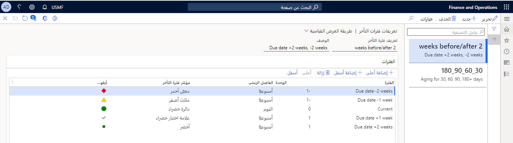
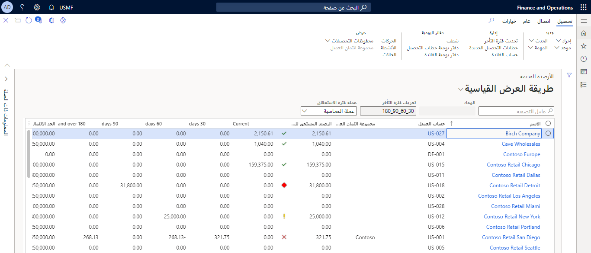
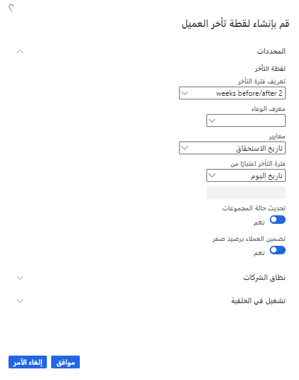
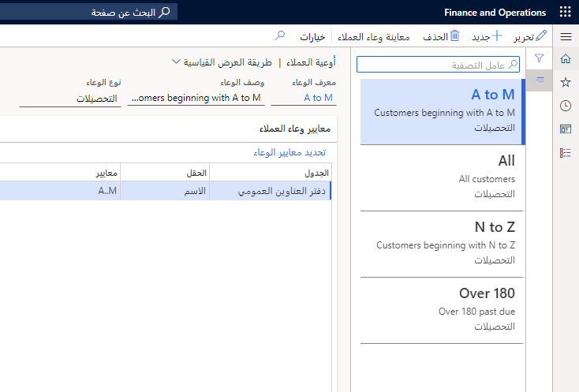
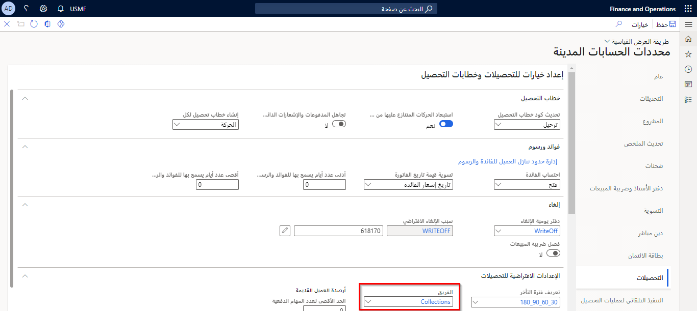
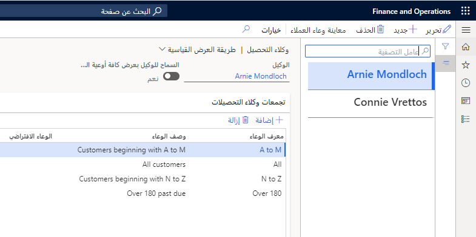

تشرح هذه الوحدة كيفية تكوين مكونات الائتمان والتحصيلات.

## إعداد تعريفات فترة التأخر 
 
يمكنك استخدام صفحة **تعريفات فترة التقادم** لتحليل استحقاق حسابات العملاء وحسابات الموردين، بناءً على التاريخ الذي تدخله. يتم استخدام التاريخ الذي تم إدخاله، جنباً إلى جنب مع الوحدة ومعلومات الفاصل الزمني التي تدخلها في علامة التبويب **الفترات** في هذه الصفحة، لحساب الفاصل الزمني لكل **فترة تقادم** (رأس العمود) في صفحة **تعريف فترة التقادم**.

تتوافق كل فترة تقادم تقوم بإعدادها لتعريف فترة التقادم مع عمود في صفحة القائمة أو في الصفحة أو التقرير عند إجراء التحليل.

يتم عرض فترات التقادم في صفحة القائمة، أو في الصفحة أو التقرير، بالترتيب الذي قمت بتعيينها به. تحتاج إلى استخدام تعريفات فترة التقادم لإنشاء لقطات تقادم العملاء. تُستخدم لقطات التقادم لعرض المعلومات في صفحة **التحصيلات** وفي صفحات القائمة ذات الصلة.

يحدد تعريف فترة التقادم الأعمدة التي تظهر في صفحات قوائم **الأرصدة القديمة وأنشطة التحصيلات**، و **حالات التحصيلات**. كما تحدد الفترات التي تظهر في صفحة التحصيلات. 

إذا تم إعداد وعاء العملاء، فسيتم استخدام تعريف فترة التقادم للوعاء. 

إذا لم يتم إعداد أوعية العملاء، فسيتم استخدام تعريف فترة التقادم الافتراضي المحدد في صفحة **معلمات حسابات المقبوضات**. 

إذا لم يتم تحديد تعريف افتراضي لفترة التقادم، فسيتم استخدام تعريف فترة التقادم الأولى في صفحة **الائتمان والتحصيلات > الإعداد > تعريفات فترة التقادم**.
 

## قم بإنشاء لقطة تأخر العميل 

توفر اللقطات القديمة وصولاً سريعاً إلى معلومات التقادم لموظفي التحصيلات باستخدام صفحة **الأرصدة القديمة** في **الائتمان والتحصيلات > التحصيلات > الأصدة القديمة**. تتضمن هذه الصفحة رموزاً بجوار حقل **رصيد المبلغ المستحق** الذي يتيح للمستخدمين التعرف بسرعة على الحسابات وحالة تقادمها.

يجب إنشاء لقطة تقادم قبل أن تتمكن من عرض المعلومات في صفحة **الائتمان والتحصيلات > التحصيلات > الارصدة القديمة**.

انتقل إلى **الائتمان والتحصيلات > المهام الدورية > أرصدة العملاء القديمة** لتحديث لقطة تقادم العميل.
 

لكل عميل، تحتوي لقطة التقادم على العناصر التالية.

- رأس لقطة تقادم
- واحد أو أكثر من رؤوس لقطات تقادم الشركات
- سجلات تفصيلية لكل فترة تقادم في تعريف فترة التقادم

أنشئ سجلات لقطات تقادم لجميع العملاء أو للعملاء في وعاء العملاء.
 
## اختياري - إعداد أوعية العملاء 

يمكنك إعداد أوعية العملاء لتمثيل مجموعات العملاء. 

يمكنك استخدام مجموعات العملاء كعوامل تصفية لمعلومات العميل التي تظهر في صفحة **الائتمان والتحصيلات > التحصيلات > إعداد > أوعية العملاء** أو عند إنشاء لقطات التقادم.
  

فيما يلي أمثلة يمكن استخدامها لأوعية العملاء.

- العملاء الذين لديهم أرصدة تزيد على مبلغ محدد
- العملاء في دول أو مناطق أو ضواحي محددة
- أنواع العملاء
- العملاء مجمعين حسب الحجم أو الكم أو تكرار الأوامر
 
## اختياري - إنشاء وكيل تحصيل 

إذا قام العديد من الأشخاص في مؤسستك بعمل التحصيلات، فيمكنك إعداد فريق التحصيلات. يمكنك تحديد الفريق في صفحة **معلمات حسابات المقبوضات**. 
 

قبل أن يتمكن العمال من إنشاء أنشطة أو إرسال رسائل بريد إلكتروني باستخدام صفحة **التحصيلات**، تحتاج إلى التحقق من تحيدد مفتاح تكوين **مزامنة Microsoft Outlook**، وأن مزامنة Outlook معدة لهؤلاء العمال.

إذا لم تقم بإنشاء فريق تحصيل، فسيتم إنشاء فريق تلقائياً عندما تقوم بإعداد وكلاء التحصيل في صفحة **الائتمان والتحصيلات > الإعداد > وكلاء التحصيل**.
  

استخدم صفحة **وكلاء التحصيل** لإعداد الموظفين والمقاولين كوكلاء تحصيل وتعيين أوعية العملاء لهم اختيارياً. وكيل التحصيل هو الشخص الذي يعمل مع العملاء للتأكد من تحصيل المدفوعات في الوقت المناسب.

إذا قام العديد من الأشخاص في مؤسستك بعمل المجموعات، فيمكنك إعداد وكلاء التحصيل، الذين تم إعدادهم كمستخدمين في صفحة **علاقات المستخدمين**. 

يمكنك تعيين أوعية العملاء (استعلامات العملاء) لوكلاء التحصيل لمساعدة الوكلاء في تنظيم عملهم. تتم إضافة وكلاء التحصيل إلى الفريق الذي تم تحديده في صفحة **معلمات حسابات المقبوضات**. إذا لم يتم تحديد فريق في تلك الصفحة، فسيتم إنشاء فريق جديد يسمى التحصيلات تلقائياً، وتتم إضافة وكلاء التحصيل إلى هذا الفريق.

## إعداد فئة حالة التحصيلات 

إذا كنت تخطط لاستخدام الحالات لتنظيم عمل التحصيلات، فقم بإعداد فئة حالة لها نوع فئة التحصيلات. انتقل إلى **إدارة المؤسسة > الإعداد > الحالات > فئات الحالات** لإنشاء فئة حالة تحصيل.
  

هذا الإعداد مطلوب فقط إذا كنت تريد استخدام وظيفة الحالة في صفحة **الائتمان والتحصيلات > التحصيلات > حالات التحصيلات**.

## إعداد إعدادات البريد الإلكتروني والعنوان لجهات اتصال عملاء التحصيلات 

قم بإعداد عناوين البريد الإلكتروني لجهات اتصال العملاء إذا كنت تريد إرسال رسائل بريد إلكتروني إلى جهات الاتصال هذه من صفحة **التحصيلات**. يتم استخدام جهة اتصال التحصيلات كجهة اتصال افتراضية في صفحة **التحصيلات**. يمكنك إعداد عنوان كشف حساب للعميل إذا كان يجب على البيانات استخدام عنوان آخر غير العنوان الأساسي.

في علامة التبويب السريعة **الائتمان والتحصيلات** لأحد العملاء، في حقل **جهة اتصال التحصيلات**، حدد الشخص في مؤسسة العميل الذي يعمل مع وكيل التحصيل الخاص بك. يتم استخدام هذا الشخص كجهة اتصال افتراضية في صفحة **التحصيلات**، ويتم إرسال رسائل البريد الإلكتروني إليه.

إذا لم يتم تحديد جهة اتصال تحصيلات للعميل، فسيتم استخدام جهة الاتصال الأساسية للعميل. إذا لم يتم تحديد جهة اتصال أساسية، فسيتم إرسال رسائل البريد الإلكتروني إلى العنوان الأول المدرج في صفحة **جهات الاتصال**.

