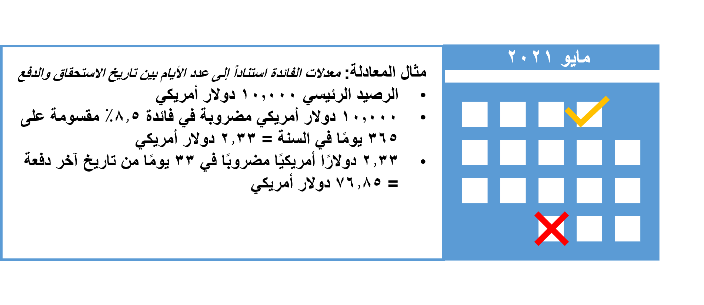

تحتوي أكواد الفائدة على إعدادات تحدد متى يتم فرض فائدة، وكيف يتم حسابها على الحسابات المتأخرة.

لإعداد أكواد الفائدة، انتقل إلى **عمليات التحصيل والائتمان > الفائدة > إعداد أكواد الفائدة**

يمكنك إعداد كود فائدة واحد، وتطبيقه على ملفات تعريف متعددة لترحيل العملاء، أو على أكواد الفوترة، أو على بنود فاتورة محددة. وعندما يتم تغيير تفاصيل كود الفائدة، تقوم جميع الميزات التي تستخدم الكود تلقائياً بتنفيذ التغييرات على حركات جديدة. بالنسبة لكل كود من أكواد الفائدة، يمكنك إعداد نوعين من المعدلات:
 
- **معدلات لإيرادات الفوائد** - وهي تمثل الإيرادات التي تم الحصول عليها عن طريق تغيير الفائدة على الفواتير أو إشعارات الفائدة.
- **معدلات لمدفوعات الفوائد** - وهي تمثل التكلفة التي يتم دفعها للفائدة على الإشعارات الدائنة.

ويمكن أن يوجد كل من نوعي المعدلات في نفس الوقت وفي نفس كود الفائدة. يمكن أن تستند معدلات الفائدة إلى ثلاثة أنواع من أنواع الحسابات التالية.

- الفائدة حسب النسبة المئوية
- الفائدة حسب المبلغ
- الفائدة حسب النطاق، والتي ينتج عنها نسبة مئوية واحدة أو مبلغ واحد

عند استخدام كود فائدة لحساب الفائدة، يتم إنشاء إشعار فائدة منفصل لكل معدل من معدلات الفائدة التي تكون مفعلة أثناء الفترة التي يتجاوز فيها الدفع تاريخ الاستحقاق للحركة. ويمكنك استخدام علامة التبويب **إيرادات** في صفحة **كود الفائدة** لإعداد معدلات الفائدة للفائدة التي تكسبها من خلال فرض فائدة. استخدم علامة التبويب **المدفوعات** لإعداد معدلات فائدة للفائدة التي تقوم بدفعها.

توضح القائمة التالية الحقول المتاحة في علامة التبويب **إيرادات**.

- **حساب الفائدة كل** – أدخل الوحدة الزمنية وحدد الفترة المراد استخدامها لتحديد وقت حساب الفائدة: 
    - **اليوم** - حساب الفائدة كل يوم؛ يتم حساب فائدة الأشهر الجزئية بمعدل 1/30 من الفائدة الشهرية لكل يوم
    - **الشهر** - حساب الفائدة في اليوم الأول من كل شهر؛ يتم حساب الفائدة بمعدل 1/1 من سعر الفائدة الشهرية
    - **يوم التقويم** - حساب الفائدة كل يوم؛ يتم حساب الفائدة للأشهر الجزئية بمعدل 1/عدد الأيام في شهر الفائدة الشهرية لكل يوم. 

    

- **الفائدة حسب النطاق** – حدد نوع النطاق لاستخدامه في صفحة **نطاق فائدة العميل**:
    - **لا شيء** - معدل الفائدة هو نفسه دائماً، بغض النظر عن مبلغ الفاتورة أو عدد الأيام أو الأشهر التي تراكمت منذ تاريخ استحقاق الفاتورة. إذا قمت بتحديد هذا الخيار، لا يتوفر زر **النطاقات**.
    - **المبلغ** - يتغير سعر الفائدة كلما تغير مبلغ الفاتورة.

- **الفائدة الشهرية %** – أدخل النسبة المئوية لاستخدامها في حساب الفائدة. ويجب أن يكون هذا المبلغ أكبر من صفر (0). ولا يتوفر هذا الحقل إلا في حالة تحديد المبلغ أو الأيام أو الأشهر في حقل **الفائدة حسب النطاق**.

## معدلات الفائدة استناداً إلى نسبة المئوية 

يمكنك إعداد معدلات الفائدة التي تقوم بحساب نسبة مئوية محددة.

- ينطبق مبلغ الفائدة على جميع العملات.
- ويمكن إدخال حدود مبلغ الفائدة الاختيارية.
- يتم تحديد النسبة المئوية في حقل **حساب الفائدة بالاستناد إلى** في صفحة **إعداد أكواد الفائدة**.

على سبيل المثال، لإعداد كود فائدة يُقيّم فائدة بقيمة 5 بالمائة لكل فترة مكونة من شهرين يتجاوز فيها دفع الفاتورة تاريخ الاستحقاق للحركة، فقد تقوم بإدخال **2** في حقل **حساب الفائدة كل** وتحديد **شهر**‏‎.

## معدلات الفائدة استناداً إلى المبالغ 

يمكنك إعداد معدلات الفائدة التي تقوم بحساب مبلغ محدد لكل عملة.

- يتم تحديد مبلغ فائدة لكل عملة في كود الفائدة.
- ويمكن إدخال حدود مبلغ الفائدة الاختيارية.
- يتم تحديد **المبلغ** في حقل **حساب الفائدة بالاستناد إلى** في صفحة **إعداد أكواد الفائدة**.

على سبيل المثال، لإعداد كود فائدة يُقيّم فائدة بقيمة 25.00 لكل فترة مكونة من 20 يوماً يتجاوز فيها دفع الفاتورة تاريخ الاستحقاق للحركة، فقد تقوم بإدخال **20** في حقل **حساب الفائدة كل** وتحديد **يوم**.

## معدلات الفائدة استناداً إلى النطاقات 

يمكنك إعداد معدلات الفائدة التي تتنوع اعتماداً على المبلغ المتأخر، أو عدد الأيام التي تأخر تسديد المبلغ فيها، أو عدد الأشهر التي تأخر تسديد المبلغ خلالها.

- يمكنك استخدام علامة التبويب **الأرباح حسب العملة** لتحديد إعدادات الفائدة المحددة لكل عملة. وهذا أيضاً هو المكان الذي ستحدد فيه النطاق.
- استخدم زر **النطاقات** لإضافة البنود التي تمثل النطاقات التي تريد إعدادها. تمثل القيمة **من** بداية النطاق، ويمثل رقم قيمة **الفائدة** إما نسبة مئوية أو مبلغ، استناداً إلى التحديد في حقل **حساب الفائدة بالاستناد إلى** في صفحة **إعداد أكواد الفائدة**.

### معدلات الفائدة استناداً إلى عدد الأيام بين تاريخ الاستحقاق والدفع
إذا قامت إحدى الشركات بتزويد عميل بمنتجات أو خدمات بموجب شروط اتفاقية التجارة ولم تحصل على مدفوعاتها بحلول التاريخ المتفاوض عليه، فيحق لك الحصول على فائدة وتعويض عن مدفوعاتك. يستند قياس الفائدة إلى الممارسات التقليدية.

يمكن استخدام معادلة للمعدل، إما سنوياً أو شهرياً، محولة إلى معدلات يومية، مضروبة في عدد الأيام المنقضية بين تاريخ الاستحقاق وتاريخ التسوية (أو التاريخ الذي تم فيه الحساب، في حالة عدم السداد) لحساب الفائدة.
 

يمتد هذا الإجراء ليشمل كل معاملاتك التجارية مع الشركات الأخرى، بما في ذلك أصحاب المشروعات الفردية، بشرط عملهم في أنشطتهم الاقتصادية أو المهنية المستقلة ومع السلطات العامة.

### مثال 1: الفائدة حسب النطاق = المبلغ 

يمكنك إعداد كود فائدة يُقيّم الفائدة مرةً واحدة لكل فترة مكونة من ثلاثة أشهر يتجاوز فيها دفع الفاتورة تاريخ الاستحقاق للحركة. ثم تريد تأسيس الحساب على قيمة فائدة بنسبة مئوية، وفقاً لفترات المبالغ التي تم تجاوزها. وستكون قيمة الفائدة هي 1 بالمائة لمبالغ الفاتورة حتى 1،000.00، و2 بالمائة للمبالغ من 1،001.00 إلى 5،000.00، و3 بالمائة للمبالغ الأكبر من 5،000.00. 

ومن ثم، يمكنك إعداد حقول **كود الفائدة** باستخدام القيم التالية:

- **كود الفائدة** - 3M%ByAmt
- **حساب الفائدة كل** - 3/شهر
- **الفائدة حسب النطاق** – المبلغ
- **حساب الفائدة بالاستناد إلى** - النسبة المئوية

إعداد معلومات النطاق كما يلي.

<table border="1">
     <tr>
      <th>من القيمة</th>
      <th>قيمة الفائدة</th>
     </tr>
     <tr>
      <td>0</td>
      <td>1</td>
     </tr>
     <tr>
      <td>1،001</td>
      <td>2</td>
     </tr>
     <tr>
      <td>5،001</th>
      <td>3</td>
     </tr>
</table>

### مثال 2: الفائدة حسب النطاق = الأيام 

يمكنك إعداد كود فائدة يُقيّم الفائدة مرةً واحدة لكل فترة مكونة من 15 يوماً يتجاوز فيها دفع الفاتورة تاريخ الاستحقاق للحركة. ثم تريد تأسيس الحساب على قيمة فائدة مبلغ، وفقاً لفترات الأيام التي تم تجاوزها. ستكون قيمة الفائدة 10.00 لكل 15 يوماً أثناء فترة 60 يوماً الأولى، و15.00 لكل فترة مكونة من 15 يوماً خلال الأيام من 61 إلى 90، و20.00 لكل 15 يوماً بداية من اليوم 91 فصاعداً. 

ومن ثم، يمكنك إعداد حقول **كود الفائدة** باستخدام القيم التالية:

- **كود الفائدة** - 15DAmtXDay
- **حساب الفائدة كل** - 15/يوم
- **الفائدة حسب النطاق** – الأيام
- **حساب الفائدة بالاستناد إلى** - المبلغ

إعداد معلومات النطاق كما يلي.

<table border="1">
     <tr>
      <th>من القيمة</th>
      <th>قيمة الفائدة</th>
     </tr>
     <tr>
      <td>0</td>
      <td>10</td>
     </tr>
     <tr>
      <td>61</td>
      <td>15</td>
     </tr>
     <tr>
      <td>‏91</th>
      <td>20 </td>
     </tr>
</table>

### مثال 3: الفائدة حسب النطاق = الشهور 

يمكنك إعداد كود فائدة يُقيّم الفائدة مرةً واحدة لكل شهر يتجاوز فيها دفع الفاتورة تاريخ الاستحقاق للحركة. ثم تريد تأسيس الحساب على قيمة فائدة نسبة مئوية، وفقاً لفترات الأشهر التي تم تجاوزها. ستكون قيمة الفائدة 1.5 بالمائة لكل شهر لمدة الثلاثة أشهر الأولى المتأخرة، و2.0 بالمائة لكل شهر للثلاثة أشهر الثانية، و2.5 بالمائة لكل شهر بعد الأشهر الستة الأولى.
  
ومن ثم، يمكنك إعداد حقول كود الفائدة باستخدام القيم التالية.

- **كود الفائدة** - 1M%ByMth
- **حساب الفائدة كل** - 1/شهر
- **الفائدة حسب النطاق** – الشهور
- **حساب الفائدة بالاستناد إلى** – النسبة المئوية

إعداد معلومات النطاق كما يلي.

<table border="1">
     <tr>
      <th>من القيمة</th>
      <th>قيمة الفائدة</th>
     </tr>
     <tr>
      <td>0</td>
      <td>1.5</td>
     </tr>
     <tr>
      <td>4</td>
      <td>2</td>
     </tr>
     <tr>
      <td>7</th>
      <td>2.5 </td>
     </tr>
</table>

## الإصدارات الجديدة 

أكواد الفائدة سارية التاريخ. إذا كنت تريد تعديل معدل الفائدة، فيمكنك إنشاء إصدار جديد يكون سارياً المفعول اعتباراً من تاريخ في المستقبل.

لعرض إصدارات مختلفة، يمكنك استخدام اختيار قائمة **اعتباراً من تاريخ** لتحديد تاريخ الانقطاع. كما يمكنك تحديد **عرض كافة السجلات** لعرض كافة أكواد الفائدة في الصفحة.

