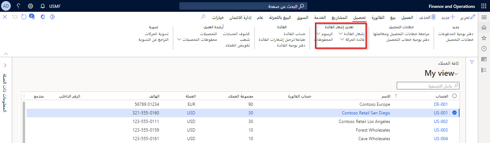

يمكنك استخدام الأزرار التي على علامة التبويب **تحصيل** في صفحة قائمة **كافة العملاء** للتنازل عن تكاليف أو عكسها أو إعادة المطالبة بها.

- يُعفى من التكاليف التي يُتنازَل عنها. ويجوز لك التنازل عن تكاليف إذا تنازع عميل مثلاً على التكاليف، وترغب في الحفاظ على علاقة عمل جيدة بهذا العميل.
- التكاليف التي تُعاد المطالبة بها تصبح مستحقة مرة أخرى. ويمكنك إعادة المطالبة بالتكاليف التي سبق التنازل عنها. وقد تضطر إلى إعادة المطالبة بالتكاليف إذا تبين لك أنه يجب عدم التنازل عنها.
- تتم إزالة التكاليف الملغاة من حساب العميل، ولا تظل مستحقة بعد الآن. يجوز لك إلغاء التكاليف، إذا تم مثلاً تحديد سعر فائدة خاطئ لحساب المبلغ الذي يمتلكه العميل. يمكنك استخدام عملية منفصلة لإعادة حساب الفائدة وإنشاء إشعار فائدة يحتوي على تكاليف جديدة للعميل.

جميع هذه الإجراءات تغيِّر إشعار الفائدة. إشعار الفائدة هو مستند أعمال يُعلِم العملاء عند تحميل فائدة أو رسوم إلى حسابهم. وعند التنازل عن الفائدة أو الرسوم أو عكسها، يتم تلقائياً إنشاء إشعار دائن أو فاتورة تسوية تلقائياً لتسوية التكاليف. أما إذا أعدت المطالبة بتكاليف تنازلت عنها، فسيتم تلقائياً إنشاء فاتورة بالمبلغ المدين لإعادة المطالبة بالتكاليف التي يدين بها العميل. 

وتصف القائمة التالية نتائج كل إجراء للعميل، والعملية المتضمَّنة. 

- **التنازل عن إشعارات الفائدة الكلية مع كل الفائدة والرسوم التي تتضمنها. - أو - تحديد أو التنازل عن الرسوم أو حركات الفائدة التي تعد جزءاً من إشعارات الفائدة** – يتم الإعفاء من التكاليف. 
    - **معالجة** يتم إنشاء إشعار دائن، أو فاتورة تسوية، للعميل. يتم استخدام إشعار الدائن لتسوية إشعار الفائدة أو حركات الفائدة أو الرسوم التي حددتها. ويساوي المبلغ الذي تمت تسويته المبلغ الإجمالي للتكاليف، مطروحاً منه أي مدفوعات سابقة قام بها العميل، وأي مبالغ سبق التنازل عنها أو تم شطبها. إذا كان مبلغ إشعار الدائن يتجاوز المبلغ الذي يدين به العميل، فيمكنك تحويل إشعار الدائن إلى فاتورة مورد. ويمكنك بعد ذلك إعطاء العميل مبلغاً مسترداً
- **إعادة المطالبة بإشعارات الفائدة بالكامل مع كل الفائدة والرسوم التي تتضمنها. - أو - تحديد وإعادة المطالبة بالرسوم أو حركات الفائدة التي تعد جزءاً من إشعارات الفائدة** - يُصبح المبلغ الذي سبق التنازل عنه مستحقاً مرة أخرى.
    -    **معالجة** - يتم إنشاء فاتورة بمبلغ مدين، وتتم تسوية المبلغ تلقائياً مقابل التكاليف التي سبق التنازل عنها. لا تُعاد المطالبة بإشعارات الفائدة الفعلية. وبدلاً من ذلك، يتم إنشاء فاتورة توضح المبلغ المستحق من العميل. لا يزال يمكن وجود الإشعارات الدائنة، أو فواتير التسوية، التي تم إنشاؤها لتسوية إشعارات الفائدة المتنازَل عنها، إذا لم تُستخدَم لتسوية إشعارات الفائدة. وفي هذه الحالة، يتم إلغاء الإشعارات الدائنة المستحقة. عادة، تتم تسوية الإشعارات الدائنة المستحقة تلقائياً عند التنازل عن إشعارات الفائدة. ولكن، قد يوجد الإشعار الدائن المستحق إذا دفع أحد العملاء بإشعار فائدة، حتى وإن قام العميل بالنزاع على التكاليف.
- **عكس إشعارات الفائدة بالكامل. - أو - عكس حركات الفائدة المحددة التي تعد جزءاً من إشعارات الفائدة. ملاحظه: لا يمكنك عكس رسوم. ولكن، يمكنك عكس إشعار فائدة كامل يتضمن رسوماً** - لا تظل التكاليف مستحقة من العميل. ولكن، تصبح التكاليف مستحقة مرة أخرى إذا قمت بإعادة حساب الفائدة.
    - **معالجة** - العملية هي نفسها عملية التنازل مع إشعارات فائدة للتنازل أو حركات الفائدة المحددة. يتم إنشاء إشعار دائن، أو فاتورة تسوية، للعميل. يُستخدَم إشعار الدائن هذا لتسوية إشعار الفائدة تلقائياً. يمكنك استخدام عملية منفصلة لإعادة حساب الفائدة وإنشاء إشعار فائدة جديد.

كما يمكنك أيضاً استخدام عملية منفصلة لشطب ديون مشكوك في تحصيلها. وتميِّز هذه العملية جميع حركات العميل للتسوية بدلاً من التنازل عن التكاليف التي تمثل جزءاً من إشعارات الفائدة فقط.

## تسوية الفائدة للفواتير 

بالإضافة إلى تسوية إشعارات الفائدة، يمكنك إزالة تكاليف الفائدة على الفواتير باستخدام إحدى العمليات التالية. تجري العمليتان كلتاهما تعديلات على إشعارات الفائدة ذات الصلة.

## تصحيح فاتورة ترتبط بها فائدة 

يمكنك تصحيح فاتورة تم ترحيلها يشملها إشعار فائدة. تؤدي هذه العملية إلى نسخ التفاصيل من الفاتورة الموجودة إلى فاتورة جديدة لإجراء التصحيحات التي تريدها فقط. يتم إلغاء الفاتورة، وإنشاء فاتورة جديدة. كما يتم أيضاً إلغاء الفائدة على الحركة في إشعار الفائدة، إذا تم ترحيل إشعار الفائدة.

يمكنك إجراء التصحيح باستخدام زر **تصحيح الفاتورة** في جزء الإجراءات الخاص بفاتورة النص الحر. لا تتوفر هذه الميزة إلا في حالة تحديد مفتاح تكوين **تصحيح فاتورة النص الحر**.

## عكس حركة عميل ترتبط بها فائدة 

يمكنك عكس حركة عميل في فاتورة ما، إذا تم إنشاء فاتورة بطريقة غير صحيحة. إذا كانت حركة العميل المعكوسة تشتمل على فائدة مضمنة في إشعار فائدة، وإذا تم ترحيل إشعار الفائدة، فسيتم أيضاً إلغاء الفائدة على الحركة في إشعار الفائدة. يتم إلغاء إشعار الفائدة إذا لم يتم ترحيله.

يمكنك عكس حركات العميل باستخدام الزر **عكس** في صفحة **حركات العميل**.

## التنازل عن إشعارات الفائدة أو إعادة المطالبة بها 

يمكنك التنازل عن جميع التكاليف الموجودة في إشعارات الفائدة التي تحددها، أو إعادة المطالبة بها. عند التنازل عن التكاليف، لا يمكن أن يتجاوز إجمالي المبلغ الذي سيتم التنازل عنه أي حدود مبالغ تم تعيينها. لا يمكنك إعادة المطالبة بإشعار فائدة إلا إذا كان قد سبق التنازل عنه.

يمكنك التنازل عن إشعارات الفائدة أو إعادة المطالبة بها باستخدام الزر **إشعار الفائدة** ضمن علامة التبويب **تحصيل** في صفحة **العميل**.

## التنازل عن حركات الفائدة أو إعادة المطالبة بها 

يمكنك التنازل عن حركات فائدة معينة في إشعار فائدة أو إعادة المطالبة بها، بدلاً من تعديل جميع التكاليف في إشعار الفائدة هذا. عند التنازل عن التكاليف، لا يمكن أن يتجاوز إجمالي المبلغ الذي سيتم التنازل عنه أي حدود مبالغ تم تعيينها. لا يمكنك إعادة المطالبة بحركة فائدة إلا إذا كان قد سبق تم التنازل عنها.

يمكنك التنازل عن إشعارات الفائدة أو إعادة المطالبة بها باستخدام الزر **فائدة الحركة** ضمن علامة التبويب **تحصيل** في صفحة **العميل**.

## التنازل عن الرسوم أو إعادة المطالبة بها 

يمكنك التنازل عن رسوم معينة في إشعار فائدة أو إعادة المطالبة بها، بدلاً من تعديل جميع التكاليف في إشعار الفائدة هذا. عند التنازل عن التكاليف، لا يمكن أن يتجاوز إجمالي المبلغ الذي سيتم التنازل عنه أي حدود مبالغ تم تعيينها. لا يمكنك إعادة المطالبة برسوم إلا إذا كان قد سبق التنازل عنها.

يمكنك التنازل عن إشعارات الفائدة أو إعادة المطالبة بها باستخدام الزر **الرسوم** ضمن علامة التبويب **تحصيل** في صفحة **العميل**.

## عكس إشعارات الفائدة ##

يمكنك عكس جميع التكاليف الموجودة في إشعارات الفائدة التي تحددها. تتم إزالة التكاليف الملغاة من حساب العميل، ولا تظل مستحقة بعد الآن. بعد عكس إشعار الفائدة، يمكنك إعادة حساب الفائدة وإنشاء إشعار فائدة جديد.

ويمكنك عكس إشعارات الفائدة باستخدام الزر **إشعار الفائدة** ضمن علامة التبويب **تحصيل** في صفحة **العميل**. 

## عكس حركات الفائدة 

يمكنك عكس جميع التكاليف الموجودة في حركات الفائدة التي تحددها. تتم إزالة التكاليف الملغاة من حساب العميل، ولا تظل مستحقة بعد الآن. بعد عكس الحركات، يمكنك إعادة حساب الفائدة وإنشاء إشعار فائدة جديد.

يمكنك عكس حركات الفائدة باستخدام الزر **فائدة الحركة** ضمن علامة التبويب **تحصيل** في صفحة **العميل**.

## عرض محفوظات التعديلات الخاصة بتكاليف تم التنازل عنها أو إعادة المطالبة بها أو عكسها 

يمكنك عرض المحفوظات التفصيلية للتعديلات التي أُجريت لإشعارات الفائدة، مثل المستخدم الذي أدخل التعديل ونوع التعديل والمبلغ ووقت إدخال التعديل. على سبيل المثال، قد ترغب في عرض التعديلات السابقة التي تم إدخالها لإشعار فائدة قبل إنشاء إشعار فائدة جديد.

يمكنك عكس حركات الفائدة باستخدام الزر **المحفوظات** ضمن علامة التبويب **تحصيل** في صفحة **العميل**.

