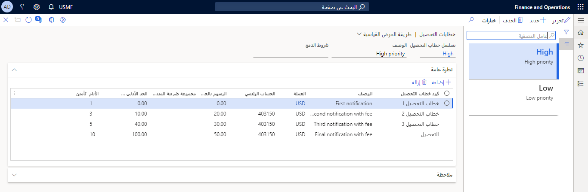

تعد إدارة وتحصيل الحركات المتأخرة وظيفة ضرورية في العديد من المؤسسات. في Finance، تتمركز معظم وظائف المجموعات في صفحة **المجموعات** وفي صفحات القوائم المرتبطة التالية.

- التحصيلات
- حالات التحصيل
- أنشطة التحصيل

يتولى شخص واحد من حين لآخر معالجة تحصيلات الشركة من جميع العملاء. بينما في حالات أخرى يعمل فريق من مندوبي التحصيل معاً لإدارة عمليات التحصيل.
 
إذا كانت احتياجات عملك تتطلب منك ذلك، فيمكنك إعداد مندوبين معنيين بالتحصيل. يمكنك أن تقوم بتعيين وعاء واحد أو أكثر من أوعية العملاء لكل وكيل تحصيل (الوعاء هو استعلام يضم مجموعة من العملاء).

على سبيل المثال، يمكن أن يتألف وعاء العملاء من عملاء US-001 حتى US-019، وبإمكانك أن تُعين العديد من مندوبي التحصيل للوعاء. يتيح ذلك لكل وكيل تحصيل في وعاء عملاء إمكانية عرض العملاء من US-001 حتى US-019.

## إعداد خطابات التحصيل 

إذا لم يدفع العميل الفاتورة، فإن الشركة تُرسل إليه عادةً خطاب تحصيل بناءً على سياستها. بالإضافة إلى ذلك، يمكن للشركة تحصيل رسوم على كل خطاب تحصيل، مع إضافة الرسوم إلى رصيد خطاب التحصيل الخاص بالعميل.

- يوجد خيار في نوع خطاب التحصيل الذي يتم إرساله عادةً، يعتمد على مدى تأخر العميل في سداد المدفوعات.
- يحتوي خطاب التحصيل على تخطيط قياسي لا يمكن تعديله إلا بواسطة أحد المطورين. ومع ذلك، فهناك خيار لإعداد إشعارات محددة يتم طباعتها في خطاب تحصيل بتسلسل معين.

وسواء كنت تفضل القيام بإجراء خطاب تحصيل واحد فقط لجميع العملاء أو القيام بعدة إجراءات تحصيل مختلفة، فإنه يُمكن لتطبيقات Finance التعامل مع كلا التفضيلين. حدد الخطوات التي يجب تضمينها لكل إجراء تحصيل، على سبيل المثال، إذا كان سيتم فرض رسوم على العميل، فما عدد أيام السماح المسموح بها، وما الحد الأدنى للمبلغ المستحق لكل خطاب تحصيل. تأكد من تحديد قواعد احتساب الفائدة وترحيلها.
 

## تسلسل خطابات التحصيل 

تعمل خطابات التحصيل بشكل متسلسل. وهذا يعني أنه لا يمكن طباعة خطاب التحصيل 2 (رقم اثنين) لعميل ما لم تتم بالفعل طباعة خطاب التحصيل 1 (رقم واحد).

بالإضافة إلى ذلك، يبين تحديد المعلمات الخطابَ الذي سيتم إرساله إلى العميل. هذا لا يعني أنه يجب استخدام جميع خطابات التحصيل المحددة مسبقاً. على سبيل المثال، قد يحتوي تسلسل خطاب التحصيل على إحدى البنيات التالية:

- التسلسل 1:
    - خطاب التحصيل 1
    - خطاب التحصيل 2
    - التحصيل
- التسلسل 2:
    - خطاب التحصيل 1
    - خطاب التحصيل 2
    - خطاب التحصيل 3
    - خطاب التحصيل 4
    - التحصيل
- التسلسل 3:
    - خطاب التحصيل 1
    - خطاب التحصيل 2
- التسلسل 4:
    - خطاب التحصيل 1
    - التحصيل 

لكي تتمكن من استخدام تسلسل خطاب التحصيل، يجب إرفاق تسلسل خطاب التحصيل بملف تعريف ترحيل العميل في ملفات تعريف الترحيل في الحقل **تسلسل خطاب التحصيل**.

يُنشئ Finance أول خطاب تحصيل وفقاً لتاريخ الاستحقاق المُبين في الفاتورة والقيمة التي تُدخلها لفترة السماح في حقل **الأيام** في هذا البند، وكذلك المعلومات الأخرى التي تقوم بإدخالها في هذا البند.

## إشعار خطاب التحصيل 

يمكنك طباعة أو نشر أو إلغاء مهام خطاب التحصيل في صفحة **إشعار خطاب التحصيل**. إذا لم يكن من الضروري نشر خطاب تحصيل معين، فقم بإلغاء الرسالة عن طريق تحديد الخط والضغط على الزر **إلغاء**. يمكنك إلغاء مجموعة من الأحرف عن طريق الضغط على زر إلغاء وإدخال معايير التحديد. بالإضافة إلى ذلك، يمكنك إضافة رسوم وتغيير الصياغة وما إلى ذلك قبل الترحيل. وبمجرد ترحيل الخطاب، فلن يُسمح بإجراء أي تغييرات عليه.

من المعتاد الانتظار لترحيل رسوم خطاب التحصيل حتى يدفع العميل الرسوم. في معظم الحالات، لا يدفع العميل الرسوم على الإطلاق.

لذلك، يظل خطاب التحصيل في هذه الصفحة ويتم إلغاؤه في النهاية بعد دفع الفاتورة. يجب ترحيل خطاب التحصيل (مرفق برسوم) فقط إذا دفع العميل الرسوم.

## التحكم في خطابات التحصيل على مستوى العميل 

يمكنك أيضاً إعداد خطابات التحصيل على مستوى العميل بحيث يتم تعقب رمز خطاب التحصيل لكل حركة، ولكن ستعتمد معالجة خطاب التحصيل على مستوى خطاب التحصيل الواحد المُخزن للعميل. سيحتوي خطاب التحصيل الواحد على جميع الحركات المتأخرة عن تاريخ الاستحقاق للعميل. 

نظراً لأنه يتم الآن تعقب أيام السماح على مستوى العميل، فلن يتم إرسال خطاب التحصيل التالي حتى يمر عدد أيام السماح لخطاب التحصيل التالي في التسلسل، بالرغم من تأخر الحركات بعد إرسال خطاب التحصيل الأخير. يُقلل هذا الخيار من عدد خطابات التحصيل التي سترسلها لكل عميل.

## تجاهل المدفوعات والإشعارات الدائنة عند حساب كود خطاب التحصيل 

إذا قمت بتضمين المدفوعات والإشعارات الدائنة في الحركات التي سيتم تضمينها في خطابات التحصيل، فقد يكون لديك مدفوعات أو إشعارات دائنة تؤدي إلى تشغيل خطاب التحصيل. يمكنك التحكم في كيفية قيام المدفوعات والإشعارات الدائنة بالتحكم في رمز كود التحصيل عن طريق تغيير قيمة معلمة **تجاهل المدفوعات ومذكرات الائتمان عند حساب كود خطاب التحصيل**.

لتجاهل المدفوعات والإشعارات الدائنة عند حساب كود خطاب التحصيل، قم بما يلي:

1. انتقل إلى **الحسابات المدينة > إعداد > معلمات الحسابات المدينة** ثم حدد علامة التبويب **التحصيلات**.
1. قم بتغيير قيمة **تجاهل المدفوعات والإشعارات الدائنة عند حساب كود خطاب التحصيل** إلى **نعم**.

