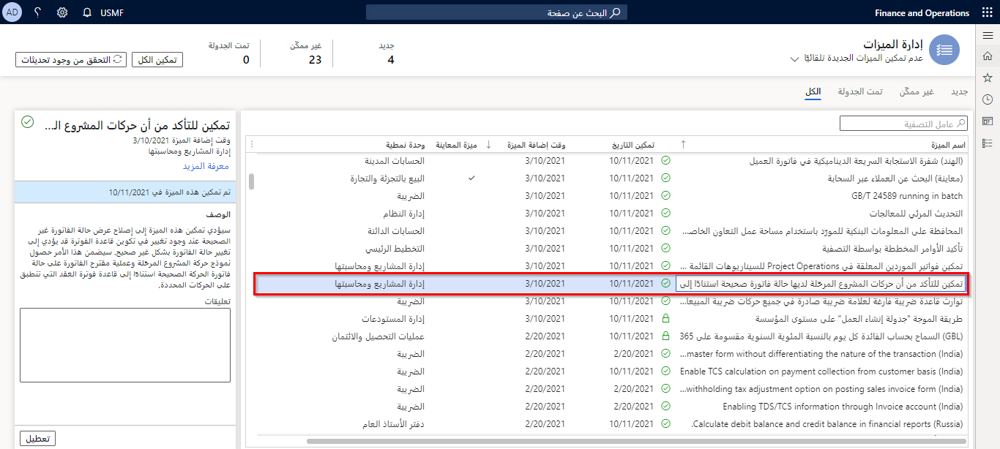

من المعروف أن العملة هي وحدة قياس للمال. ومع ذلك، عندما يتعلق الأمر بالأعمال التجارية، فهي أيضاً وحدة قياس لسلامة الشركة. مثل ضغط الدم لديك، يجب فحص الارتفاعات والانخفاضات للحفاظ على نمط حياة صحي، يجب مراقبة تدفق الأموال في العمل باستمرار للحفاظ على المؤسسة مزدهرة وصحية. 

تتمثل الخطوة الأولى لإعداد الإدارة المالية في Finance في تحديد وتكوين العملات المقبولة للكيان القانوني.

## عملات المحاسبة وإعداد التقارير

يستخدم Finance مفهوم عملة المحاسبة وعملة التقارير.

- **عملة المحاسبة** - هذه هي وحدة القياس النقدية المستخدمة لتسجيل القيمة النقدية المحولة للحركات الاقتصادية في حسابات دفتر الأستاذ. يُشار إليها أيضاً باسم عملة "الشركة" أو دفتر الأستاذ. 

- **عملة التقارير** - عملة التقارير هي عملة محاسبة ثانوية، تقيس القيمة النقدية المحولة للحركات بعملة ثانوية، غالباً لغرض الدمج أو تقديم التقارير إلى مؤسسة رئيسية.

مثال على ذلك، إذا كان لديك شركة فرعية في كندا، فإن شركتك الأساسية في الولايات المتحدة. عند تشغيل التقارير، تريد أن ترى نتائج العمليات التجارية بالدولار الكندي (CAD). لتحقيق ذلك، يجب عليك تحويل دولاراتك الأمريكية (USD) إلى دولارات كندية (CAD). يستخدم النظام سعر الصرف المحدد في صفحة **أسعار الصرف** لتحويل المبالغ لأغراض إعداد التقارير.

إذا تم تحديد خانة الاختيار **تحويل**، فإنها تسمح بعرض المعلومات المالية بعملة غير عملة الشركة الافتراضية في النماذج والتقارير.

## نوع العملة

**نوع العملة** في **دفتر الأستاذ العام > العملات > العملات** يُستخدم للبلدان أو المناطق الناطقة باللغة الإسبانية لتحديد النوع المطبوع على الشيكات والتقارير. حدد **مؤنث** إذا كانت العملة المحددة لها نوع مؤنث وكان هذا النوع مستخدماً في الشيكات والتقارير. القيمة الافتراضية لهذا الحقل هي **مذكر**، مما يعني، في الواقع، عدم وجود نوع لتلك العملة.

## العملة 

تُستخدم وظائف العملات المتعددة إذا كانت شركتك تمارس أعمالها بأكثر من عملة واحدة. إذا كانت المؤسسة تحتوي على العديد من الكيانات القانونية وتتعامل بعملات متعددة، فإن الحفاظ على العملات وسعر الصرف المقابل لها أمر أساسي.

يشير مصطلح "التحويل الثلاثي للعملات" إلى العملية التي يجب فيها تحويل المبالغ من عملة وطنية إلى عملة وطنية مشاركة أخرى من خلال مقارنتها بعملة أخرى، مثل اليورو.

يمكن لعملة واحدة فقط أن تمثل عملة التحويل الثلاثي. بشكل افتراضي، يتم تحديد عملة اليورو على أنها **عملة التحويل الثلاثي**. يمكنك تغيير عملة التحويل الثلاثي، عن طريق مسح خانة الاختيار **العملة المرجعية للتحويل الثلاثي** في سجل اليورو في صفحة **العملات**. بعد ذلك، يمكنك تحديد **العملة المرجعية للتحويل الثلاثي** للعملة المطلوبة.
 

يمكن أن يكون لكل عملة سمات محددة مرتبطة بها. يعتبر الاسم والرمز ورمز العملة خاصاً بكل عملة.

## دمج العملة المزدوجة

يسمح Finance للمستخدمين بالتحكم في العملة المستخدمة كعملة للحركة في شركة الدمج (إما عملة المحاسبة أو التقارير). تتيح لك هذه الوظيفة أيضاً نسخ المبالغ تلقائياً من الشركة المصدر إلى شركة الدمج طالما أن العملات هي نفسها. نسخ المبالغ تلقائياً من الشركة المصدر إلى شركة الدمج

- عند تمكين عنصر تحكم **تحديد مبلغ الدمج من** في صفحة **الدمج عبر الإنترنت**، يمكن للمستخدمين اختيار عملة المحاسبة أو عملة التقارير من الشركة المصدر ستُستخدم كعملة للحركة في شركة الدمج. 

- يمكنك تمكين ميزة **نسخ المبالغ مباشرة من الشركة المصدر إلى شركة الدمج إذا كانت العملات متماثلة** بحيث يتم نسخ مبالغ عملة المحاسبة أو التقارير من الشركة المصدر مباشرةً إلى مبلغ عملة المحاسبة أو التقارير في شركة الدمج إذا كانت أي من العملات متطابقة. عند استخدام ذلك، يتم حساب مبلغ عملة المحاسبة وإعداد التقارير في شركة الدمج باستخدام سعر الصرف إذا لم تكن أي من العملات متطابقة. 

يمكنك تمكين هذه الميزة في مساحة عمل **إدارة الميزات** في Finance، عن طريق تحديد **تمكين وظيفة العملة المزدوجة في دمج دفتر الأستاذ العام**، ثم تحديد **تمكين الآن**.

