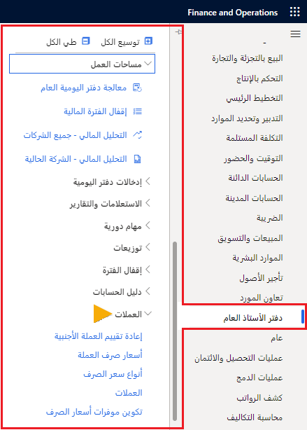

قبل أن تتمكن من استيراد أسعار الصرف، يجب عليك إعداد المعلومات التي يطلبها مقدمو الخدمة الذين يقدمون أسعار الصرف.

تساعد معرفة كيفية تكوين موفري أسعار الصرف في تقليل الوقت اللازم لإدارة التغييرات المستمرة في السوق فيما يتعلق بأسعار الصرف. على الرغم من أن الشركات يمكنها إما تطوير خدمات موفر أسعار الصرف أو شراؤها أو الاشتراك فيها، إلا أنك ستجد موفرين مدمجين في Finance.

## أنواع أسعار الصرف 

أنواع أسعار الصرف هي بيانات مشتركة عبر Finance ويجب إعدادها مرة واحدة فقط. أنواع أسعار الصرف عبارة عن مجموعة تسمح بأسعار صرف مختلفة لعملتين. تشمل الأمثلة الشراء والبيع والسوق والموازنة. إذا كانت الشركة تتداول بعملات متعددة، فيجب عليها استخدام تحويلات متعددة لأسعار الصرف. 

لا يمكن أن يوجد زوج العملات إلا مرة واحدة ولا يتم دعم الدخول في زوج عملات متبادلة. لذلك، إذا كان لديك بالفعل إعداد من الدولار الأمريكي إلى اليورو، فلا يمكنك إنشاء زوج عملات من اليورو إلى الدولار الأمريكي لنفس نوع سعر الصرف. 

سيحسب Finance السعر المتبادل تلقائياً إذا لم يتمكن من العثور على زوج العملات بالضبط أثناء تحويل الترجمة. إذا كان لديك فقط إعداد من الدولار الأمريكي إلى اليورو وكنت تقوم بإدخال مبلغ الحركة باليورو في كيان قانوني حيث الدولار الأمريكي هو عملة المحاسبة، فسيقوم Finance أولاً بالبحث عن زوج العملات المحدد في نوع السعر الذي يستخدمه دفتر الأستاذ: اليورو إلى الدولار الأمريكي. إذا لم يتم العثور عليه، فسيتم بعد ذلك البحث عن الدولار الأمريكي مقابل اليورو وحساب السعر المتبادل.

نظراً لإمكانية وجود أسعار متعددة للعملة نفسها، فإن تاريخ الترحيل يحدد السعر المطبق.

على سبيل المثال، تم إدخال سعر الصرف في 1 يناير، وإدخال سعر صرف آخر في 1 فبراير. إذا تم إصدار فاتورة بأمر مبيعات في 15 يناير، فسيتم استخدام سعر الصرف اعتباراً من 1 يناير لحساب مبلغ الفاتورة. إذا تم تنفيذ تسوية الصرف في 2 فبراير، فسيتم استخدام السعر من 1 فبراير كتسوية.

استخدم صفحة **تكوين موفري أسعار الصرف** في **دفتر الأستاذ العام > العملات** لتحديد موفري أسعار الصرف. 
 

يتم تضمين بعض موفري أسعار الصرف في بيانات العرض التوضيحي في Finance. 

## استيراد أسعار صرف العملات

إذا تلقى كيان قانوني فواتير بعملات أجنبية، فمن الضروري تحويل العملة الأجنبية إلى العملة المحلية. يعني هذا أن أسعار الصرف المحدثة للعملات المختلفة مطلوبة. 

تقدم هذه الوحدة نظرة عامة على الإعدادات والمعالجة المطلوبة لاستيراد أسعار الصرف المرجعية المنشورة عبر الإنترنت من قِبل موفري أسعار الصرف، مثل البنك المركزي الأوروبي والبنك المركزي لروسيا الاتحادية.

يمكنك استيراد أسعار الصرف من موفري أسعار الصرف وإعدادها في صفحة **أسعار صرف العملات**. استخدم صفحة **استيراد أسعار الصرف** لاستيراد أسعار الصرف. 

شاهد هذا الفيديو للتعرف على كيفية استيراد أسعار صرف العملات.

 > [!VIDEO https://www.microsoft.com/videoplayer/embed/RE3URoR] 
