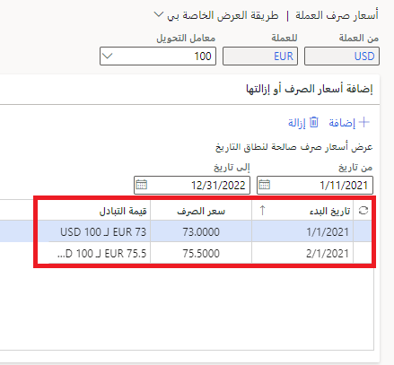
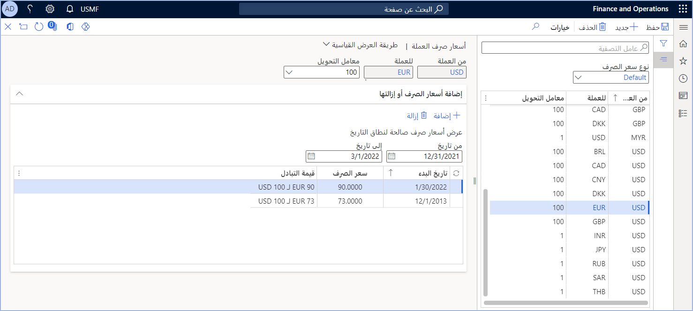

قبل أن تتمكن من استيراد أسعار الصرف، يجب عليك إعداد المعلومات التي يطلبها مقدمو الخدمة الذين يقدمون أسعار الصرف.

تساعد معرفة كيفية تكوين موفري أسعار الصرف في تقليل الوقت اللازم لإدارة التغييرات المستمرة في السوق فيما يتعلق بأسعار الصرف. على الرغم من أن الشركات يمكنها إما تطوير خدمات موفر أسعار الصرف أو شراؤها أو الاشتراك فيها، إلا أنك ستجد موفرين مدمجين في Finance.

## أنواع أسعار الصرف 

أنواع أسعار الصرف هي بيانات مشتركة عبر Finance ويجب إعدادها مرة واحدة فقط. أنواع أسعار الصرف عبارة عن مجموعة تسمح بأسعار صرف مختلفة لعملتين. تشمل الأمثلة الشراء والبيع والسوق والموازنة. إذا كانت الشركة تتداول بعملات متعددة، فيجب عليها استخدام تحويلات متعددة لأسعار الصرف. 

لا يمكن أن يوجد زوج العملات إلا مرة واحدة ولا يتم دعم الدخول في زوج عملات متبادلة. لذلك، إذا كان لديك بالفعل إعداد من الدولار الأمريكي إلى اليورو، فلا يمكنك إنشاء زوج عملات من اليورو إلى الدولار الأمريكي لنفس نوع سعر الصرف. 

سيحسب Finance السعر المتبادل تلقائياً إذا لم يتمكن من العثور على زوج العملات بالضبط أثناء تحويل الترجمة. إذا كان لديك فقط إعداد من الدولار الأمريكي إلى اليورو وكنت تقوم بإدخال مبلغ الحركة باليورو في كيان قانوني حيث الدولار الأمريكي هو عملة المحاسبة، فسيقوم Finance أولاً بالبحث عن زوج العملات المحدد في نوع السعر الذي يستخدمه دفتر الأستاذ: اليورو إلى الدولار الأمريكي. إذا لم يتم العثور عليه، فسيتم بعد ذلك البحث عن الدولار الأمريكي مقابل اليورو وحساب السعر المتبادل.

نظراً لإمكانية وجود أسعار متعددة للعملة نفسها، فإن تاريخ الترحيل يحدد السعر المطبق.

**مثال**

تم إدخال سعر صرف في 1 يناير، وإدخال سعر صرف آخر في 1 فبراير. إذا تمت فوترة أمر مبيعات في 15 يناير، فسيتم استخدام سعر الصرف اعتباراً من 1 يناير لحساب مبلغ الفاتورة. إذا تمت فوترة أمر مبيعات في 2 فبراير، فسيتم استخدام السعر من 1 فبراير كتعديل.

استخدم الصفحة **أسعار صرف العملة** في **دفتر الأستاذ العام > العملات > أسعار صرف العملة** لمراجعة أسعار الصرف التي تم اعدادها لهذا المثال.

> [!div class="mx-imgBorder"]
> 

استخدم صفحة **تكوين موفري أسعار الصرف** في **دفتر الأستاذ العام > العملات** لتحديد موفري أسعار الصرف. 
 
> [!div class="mx-imgBorder"]
> 

يتم تضمين بعض موفري أسعار الصرف في بيانات العرض التوضيحي في Finance. 

## استيراد أسعار صرف العملات

إذا تلقى كيان قانوني فواتير بعملات أجنبية، فمن الضروري تحويل العملة الأجنبية إلى العملة المحلية. يعني هذا أن أسعار الصرف المحدثة للعملات المختلفة مطلوبة. 

تقدم هذه الوحدة نظرة عامة على الإعدادات والمعالجة المطلوبة لاستيراد أسعار الصرف المرجعية المنشورة عبر الإنترنت من قِبل موفري أسعار الصرف، مثل البنك المركزي الأوروبي والبنك المركزي لروسيا الاتحادية.

يمكنك استيراد أسعار الصرف من موفري أسعار الصرف وإعدادها في صفحة **أسعار صرف العملات**. استخدم صفحة **استيراد أسعار الصرف** لاستيراد أسعار الصرف. 

شاهد هذا الفيديو للتعرف على كيفية استيراد أسعار صرف العملات.

 > [!VIDEO https://www.microsoft.com/videoplayer/embed/RE3URoR] 

## إدخال أسعار الصرف يدوياً
إذا اخترت إدخال أسعار الصرف يدوياً بدلاً من استيرادها، فيجب عليك إدخال أسعار كل مجموعة من العملات التي يستخدمها نظامك. تسمى كل مجموعة *زوج عملات*.  

> [!NOTE] 
> كل مجموعة ثنائية الاتجاه. على سبيل المثال، إذا أدخلت سعراً من الدولار الأمريكي إلى البيزو المكسيكي، فسيتم تضمين سعر البيزو المكسيكي إلى الدولار الأمريكي. إذا حاولت إدخال كل من الدولار الأمريكي إلى البيزو المكسيكي والبيزو المكسيكي إلى الدولار الأمريكي، فإنه تظهر رسالة **أسعار الصرف محددة بالفعل بين عملة الدولار الأمريكي وعملة البيزو المكسيكي. لا يمكنك إدخال أسعار الصرف المتبادلة لنفس نوع سعر الصرف**. 

عند إدخال أسعار صرف العملات، تنطبق الإدخالات على جميع الكيانات القانونية في بيئتك. لا تدخل أسعار الصرف لكل كيان قانوني على حدة.
التثليث هو عملية منفصلة تم وصفها مسبقاً في هذا التدريب. إذا كنت تستخدم طريقة التثليث، فسوف تقوم بتحديث سعر الصرف بين كل عملة والعملة المثلثة، وليس العملات الفردية التي تستخدم العملة المثلثة.  على سبيل المثال، يمكنك تحديث العملة من الدولار الأمريكي إلى اليورو، ولكنك لن (ولا يمكنك) تحديث سعر الصرف لليورو إلى كورونا سلوفاكيا (SKK) إذا كنت تستخدم اليورو كعملة تثليث لكورونا سلوفاكيا (SKK). سعر الصرف بين كورونا سلوفاكيا (SKK) واليورو ثابت.

لإدخال أسعار الصرف يدوياً، اتبع هذه الخطوات.

1. انتقل إلى **دفتر الأستاذ العام > العملات > أسعار صرف العملات**. يتم تحميل بعض العملات عند تثبيت نظامك ولكن يمكنك إضافة المزيد من العملات حسب الحاجة. حدد عنصر قائمة **العملات** لإضافة عملة جديدة بحيث يمكنك إدخال أسعار الصرف.
1. حدد عنصر قائمة **أسعار صرف العملات**، ثم حدد **نوع سعر الصرف**.  لكل نوع قواعد مختلفة لإدارة سعر الصرف. قد يتطلب النوع إدخالاً يومياً أو يستخدم متوسط الشهر.
1. عندما تحدد نوع سعر الصرف وتعرف السعر المطلوب إدخاله، أدخل زوج عملات جديداً أو حدد زوج عملات لتغييره. 
2. نظراً لأن الأسعار تتغير كثيراً، قم بإضافة إدخال تاريخ جديد وسعر جديد بدلاً من تغيير إدخال موجود. يطلب النظام **تاريخ بدء** فقط.  سيستخدم أحدث تاريخ قبل تاريخ كل معاملة لاختيار سعر صرف العملة الصحيح. عند إدخال سعر صرف جديد وحفظه، يتم استخدام السعر فوراً لأي حركات تقع ضمن النطاق الزمني الذي أدخلته.  
1. تظهر لقطة الشاشة مكان إدخال سعر صرف العملة. يمثل حقل **عامل التحويل** عدد الوحدات في **من العملة** التي تقوم بتحويلها إلى **إلى العملة**. تقوم معظم المؤسسات بتعيين قيمة هذا الحقل إلى **1** أو **100**. 

    > [!div class="mx-imgBorder"]
    > 
  

