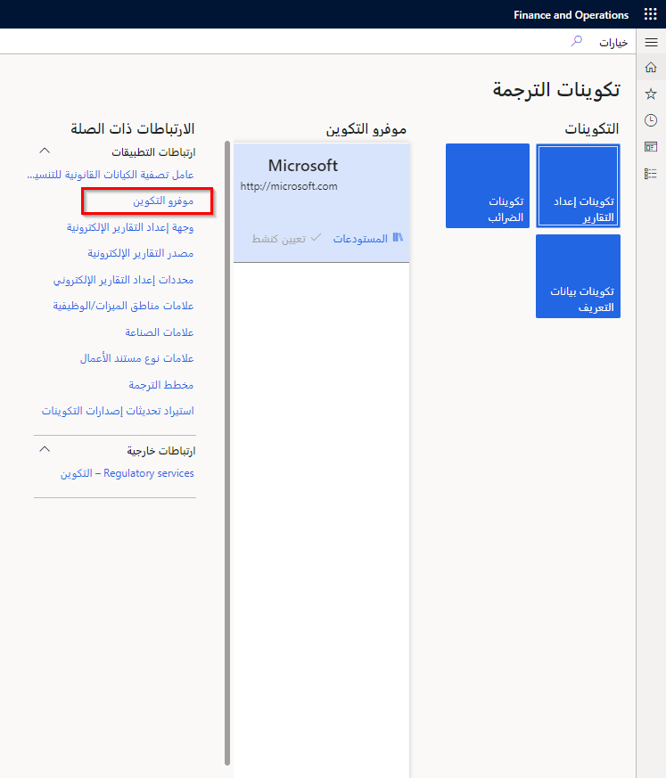

قبل أن تتمكن من البدء في تكوين وظيفة إعداد التقارير الإلكترونية، قم بإعداد أنواع المستندات المطلوبة في إدارة المستندات:

- مستندات Office التي يتم استخدامها كقوالب للتقارير
- تخزين إخراج تقارير التقارير الإلكترونية في أرشيف الوظائف
- تخزين لإخراج التقارير بحيث يمكن عرضها في برامج أخرى
- وثائق للاحتفاظ بخطوط الأساس لمخرجات التكوين
- مستندات لمعالجة الملفات في إطار العمل لجميع الأغراض الأخرى

اتبع هذه الخطوات لإعداد الوظيفة الأساسية للتقارير الإلكترونية:

1. افتح مساحة عمل **التقارير الإلكترونية**.
2. في قسم **ارتباطات التطبيقات**، حدد **معلمات التقارير الإلكترونية**.
3. في علامة التبويب **عام**، قم بتشغيل خيار **تمكين وضع التصميم** لتمكين تجربة تصميم التقارير الإلكترونية لمثيل Finance الحالي.
4. في علامة التبويب **المرفقات**، حدد أنواع المستندات التي يجب استخدامها لتخزين الملفات في إطار عمل التقارير الإلكترونية. لاحظ أنه في قسم **التكوينات**، نوع المستند عبارة عن ملف به كل كيان قانوني، بينما جميع أنواع المستندات الأخرى عبارة عن ملفات أو صور.
5. في علامة التبويب **LCS**، حدد عدد السلاسل المتوازية التي يجب استخدامها لتحميل تكوين التقارير الإلكترونية من المستودعات في Lifecycle Services، بحيث يتم تحميل التكوينات بأكثر الطرق فعالية. يمكن أن تختلف القيمة من **1** إلى **15**، اعتماداً على الموارد المتاحة للبرنامج الحالي. سيتم تحديد العدد الحقيقي للسلاسل تلقائياً بناءً على هذا الإعداد وعلى عدد المهام الأخرى وأولوياتها.
6. أغلق الصفحة.
7. ضمن قسم **موفرو التكوينات**، يمكنك تحديد كل موفر على أنه نشط من خلال تحديد **تعيين نشط**. قد تحتاج لتحديد علامات الحذف لعرض خيار **تعيين نشط**. سيظهر خيار **تعيين نشيط** باهتاً إذا كان موفر التكوين نشطاً بالفعل. يتم تخزين اسم الموفر النشط وعنوان الإنترنت في تكوين التقارير الإلكترونية كسمات لمالك التكوين.

## إنشاء موفر تكوين جديد

في شركة العرض التوضيحي **USMF** في تطبيقات Finance and Operations، يوجد موفر تكوين بالفعل. يمكنك إنشاء موفر تكوين جديد من خلال اتباع الخطوات الواردة في الأقسام التالية. تتم مشاركة موفري التكوينات الذين تم إنشاؤهم حديثاً تلقائياً مع جميع الكيانات القانونية.

### إنشاء موفر

لإنشاء موفر تكوين جديد، اتبع الخطوات التالية:

1. انتقل إلى **إدارة المؤسسة > مساحات العمل > التقارير الإلكترونية**.
2. حدد **موفرو التكوينات** في قسمح **ارتباطات التطبيقات**.
3. حدد **جديد**.
4. في حقل **الاسم**، أدخل **Adventure Works Cycles International**.
5. في حقل **عنوان الإنترنت**، أدخل `https://www.adventure-works.com`.
6. حدد **حفظ** وأغلق الصفحة.

### تعيين الموفر الجديد كنشط

لتعيين موفر التكوين الذي تم إنشاؤه حديثاً على أنه نشط، اتبع الخطوات التالية:

1. حدد إطار متجانب موفر **Adventure Works Cycles International**.
1. حدد **تعيين نشط**.

لمزيد من التفاصيل حول إنشاء التكوينات، انتقل إلى [نموذج بيانات خاص بمجال تصميم التقارير الإلكترونية](/dynamics365/fin-ops-core/dev-itpro/analytics/tasks/er-design-domain-specific-data-model-2016-11?azure-portal=true&toc=/dynamics365/commerce/toc.json).

## المعلمات الخاصة بالكيان القانوني

يمكن للمستخدم المتقدم تحديد قواعد الشركات، التي تترجم المصطلحات إلى جميع اللغات المدعومة في تطبيقات Finance and Operations. تتيح هذه الوظيفة لمستخدمي الأعمال تحديد الشروط والأحكام باللغة التي يختارونها.

إذا قام مستخدم متمرس بتكوين قاعدة مستقلة لكيان قانوني، يتم تحديد حقل لمصدر البيانات لإرجاع القيم التي تصف القاعدة المكونة. يتم توفير المسار الكامل لهذا الحقل، وبالتالي تمكين المستخدم القوي من التنقل إليه بسرعة. أيضاً، عند إعداد البيانات الرئيسية لشركة (كيان قانوني) خاصة بتنسيق التقارير الإلكترونية، تتيح هذه الميزة للمستخدم المتميز تحديد مناطق مصدر بيانات البحث التي سيتم توفيرها لمستخدم الأعمال.

علاوةً على ذلك، يمكنك تكوين قاعدة مستقلة عن الكيان القانوني لإرجاع نوع بيانات التعداد فقط لكل شرط تم تكوينه. يمكن للمستخدم المتقدم أيضاً تكوين قاعدة لإرجاع قيمة نصية أيضاً.
